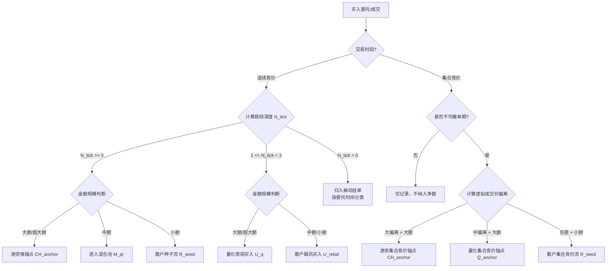

买入资金判断方法细则

文档版本：V1.0
适用范围：实时连续竞价买入 + 集合竞价买入

1. 总则

1.1 标准化原则

由于不同股票的绝对价格、涨跌停幅度、流通市值存在显著差异，买入资金的判断不以固定价格差值（如0.03元）为标准，而采用以下相对维度：

维度 标准化方法 用途
价格偏离度 以最小变动价位（tick） 或 涨跌停价格的比例 为基准 判断买入攻击性
金额规模 以当日/历史平均每笔成交金额 或 流通市值比例 为基准 判断资金体量
时间长度 以绝对秒数为基准 判断挂单性质

1.2 核心判定逻辑

买入资金判断的核心指标：委托价与成交价的偏离程度（即买入攻击性），而非成交价本身。

· 买入委托价  P_{order} \ge P_{best\_ask} （卖一价），成交价  P_{trade} = P_{best\_ask} 
· 委托价差  \Delta_{bid} = P_{order} - P_{trade} \ge 0 
·  \Delta_{bid}  越大，代表买入意图越强烈，越倾向于游资/主力行为

2. 连续竞价买入资金判断

2.1 判断维度定义

维度 符号 定义 计算方法
买入跳档深度  N_{tick}  委托价高于卖一价的最小变动价位（tick）数量  N_{tick} = \lfloor (P_{order} - P_{best\_ask}) / tick\_size \rfloor 
成交金额规模  V  单笔买入成交金额 直接从逐笔成交获取
相对金额等级  R_V  相对该股历史分布的分位等级  R_V = \text{Percentile}(V, \text{历史30日分布}) 

2.2 买入跳档深度分级

等级  N_{tick}  范围 买入攻击性 典型行为
跳档买入（急迫）  N_{tick} \ge 3  极高 不计成本抢筹，典型游资/主力行为
跳档买入（普通）  1 \le N_{tick} < 3  中等 有一定紧迫性，但仍在控制范围内
贴价买入  N_{tick} = 0 （委托价 = 卖一价） 低 等待成交，不急于追价

2.3 成交金额规模分级

等级 判定标准 典型行为
超大额  V \ge 50  万元 或  R_V \ge 95\%  机构/游资级别
大额  10 \le V < 50  万元 或  70\% \le R_V < 95\%  大户/游资级别
中额  1 \le V < 10  万元 或  30\% \le R_V < 70\%  中户/量化
小额  V < 1  万元 或  R_V < 30\%  散户

2.4 综合判定矩阵（连续竞价买入）

买入跳档深度 金额规模 资金分类 变量赋值 PID作用 置信度
跳档买入（急迫， N_{tick} \ge 3 ） 超大额/大额 游资强锚点  \widehat{CH}_t \leftarrow \widehat{CH}_t + V  P（强冲击）+ I（强惯性） 高
跳档买入（急迫， N_{tick} \ge 3 ） 中额 游资弱锚点 进入混合池  \widehat{M}_{qr,t}  待方程组反解 中
跳档买入（急迫， N_{tick} \ge 3 ） 小额 散户种子流  R_{seed,t} \leftarrow R_{seed,t} + V  I（情绪惯性） 中
跳档买入（普通， 1 \le N_{tick} < 3 ） 超大额/大额 机构/量化常规买入 计入  U_q  基础项 P（中等冲击） 中
跳档买入（普通， 1 \le N_{tick} < 3 ） 中额/小额 散户正常买入 计入  U_{retail}  基础项 I（弱惯性） 低
贴价买入（ N_{tick} = 0 ） 任意金额 被动等待成交 归入被动挂单分类（见对手盘规则） D 按委托时间判定

2.5 涨跌停价格约束下的特殊处理

当股价接近涨停或跌停时，买入攻击性的判定标准需相应调整：

价格状态 判定调整 说明
价格  \ge 98\% \times P_{limit\_up} （临近涨停） 跳档深度以剩余涨停空间为基准，按百分比重新计算 剩余空间不足时，无法产生大的跳档，此时资金分类判定需降权
价格  \le 102\% \times P_{limit\_down} （临近跌停） 买入跳档判定条件放宽（ N_{tick} \ge 1  即可视为攻击性买入） 跌停板附近的大额抄底资金，1档跳价即具有极高攻击性

3. 集合竞价买入资金判断

3.1 集合竞价的分阶段

阶段 时间（A股） 特征 判定规则
开盘集合竞价（可撤单期） 09:15 - 09:20 可挂单可撤单 规则约束力弱，仅作为参考
开盘集合竞价（不可撤单期） 09:20 - 09:25 不可撤单 强规则约束，判定价值高
收盘集合竞价 14:57 - 15:00 不可撤单 强规则约束，判定价值高

建议：只将不可撤单期（09:20-09:25 和 14:57-15:00） 的资金纳入资金分类判定，可撤单期的委托仅作为定性参考。

3.2 集合竞价买入的核心判断指标

集合竞价期间，所有买入委托在同一价格撮合，无法区分“跳档”程度，因此核心判断指标为：

维度 符号 定义 计算方法
虚拟成交价偏离  \Delta_{virtual}  虚拟成交价相对于前收盘价或涨停价的偏离百分比  \Delta_{virtual} = (P_{virtual} - P_{prev\_close}) / P_{prev\_close} \times 100\% 
委托金额规模  V  集合竞价阶段的累计买入委托金额 从Level2集合竞价委托统计获取
相对金额等级  R_V  同上 同上

3.3 集合竞价买入综合判定矩阵

虚拟成交价偏离  \Delta_{virtual}  委托金额规模 资金分类 变量赋值 PID作用 置信度
大幅高开（ \Delta_{virtual} \ge 3\% ） 大额（≥50万） 游资集合竞价抢筹  \widehat{CH}_t \leftarrow \widehat{CH}_t + V  P（冲击）+ I（惯性） 高
大幅高开（ \Delta_{virtual} \ge 3\% ） 小额（<10万） 散户集合竞价追高  R_{seed,t} \leftarrow R_{seed,t} + V  I（情绪惯性） 中
中幅高开/平开（ -1\% \le \Delta_{virtual} < 3\% ） 大额（≥50万） 机构/量化集合竞价建仓  \widehat{Q}_t \leftarrow \widehat{Q}_t + V （弱锚点） P（中等冲击） 中
中幅高开/平开（ -1\% \le \Delta_{virtual} < 3\% ） 小额（<10万） 散户集合竞价正常挂单 进入混合池  \widehat{M}_{qr,t}  待方程组反解 低
大幅低开（ \Delta_{virtual} \le -3\% ）且买入委托异常放大 大额（≥50万） 游资集合竞价抄底/托举  \widehat{CH}_t \leftarrow \widehat{CH}_t + V  P（冲击） 高
大幅低开且买入委托萎缩 任意金额 观望/无攻击意图 不纳入资金分类 — 跳过

3.4 集合竞价“试盘”识别（定性特征）

定义：在可撤单期（09:15-09:20）挂出大量买入委托，推高虚拟成交价，随后在不可撤单期前（09:19-09:20）全部撤单。

特征 判定 处理方式
可撤单期出现大额买入委托（≥50万），不可撤单期完全消失 游资试盘/虚假挂单 定性标记，不计入净额，仅作为“异动提示”
可撤单期与不可撤单期买入委托保持一致 真实买入意图 正常纳入资金分类统计

4. 特征标准化方法

4.1 最小变动价位（tick_size）

价格区间 tick_size（A股）
价格 < 1元 0.001元
价格 ≥ 1元 0.01元

跳档深度  N_{tick}  的计算统一使用当前股票的 tick_size，确保跨股票的可比性：

N_{tick} = \left\lfloor \frac{P_{order} - P_{best\_ask}}{tick\_size} \right\rfloor

4.2 大额/小额阈值的动态调整

不同价格的股票，同样金额（如50万元）对应的手数完全不同：

· 贵州茅台（股价约1500元）：50万元 ≈ 333股
· 工商银行（股价约5元）：50万元 ≈ 100,000股

建议采用双重阈值：

V_{large} = \max(50\text{万元},\; 0.01\% \times \text{流通市值})

V_{small} = \min(10\text{万元},\; 0.002\% \times \text{流通市值})

即：固定金额阈值 + 相对流通市值阈值，取其大者/小者，适应不同股价水平下的资金规模差异。

5. 判断流程总览（买入资金）

6. 输出字段规范

输出字段 含义 来源
buy_ch_anchor 买入游资强锚点金额 连续竞价跳档买入（大额）+ 集合竞价大幅偏离（大额）
buy_q_anchor 买入量化锚点金额 连续竞价贴价买入（大额）+ 集合竞价中幅偏离（大额）
buy_retail_seed 买入散户种子金额 连续竞价跳档买入（小额）+ 集合竞价小额委托
buy_aggressiveness 买入攻击性综合评分 基于跳档深度与金额规模的加权得分

7. 参数配置表

参数 符号 默认值 说明
急迫买入跳档阈值  N_{aggressive}  3档 ≥3档视为急迫买入
普通买入跳档阈值  N_{normal}  1档 1-2档视为普通跳档买入
大额成交阈值（固定）  V_{large\_fixed}  50万元 固定金额阈值
小额成交阈值（固定）  V_{small\_fixed}  10万元 固定金额阈值
流通市值比例阈值（大额）  p_{large}  0.01% 动态大额阈值
流通市值比例阈值（小额）  p_{small}  0.002% 动态小额阈值
集合竞价大幅偏离阈值  \Delta_{large}  3% 虚拟价偏离≥3%为大幅偏离
集合竞价中幅偏离阈值  \Delta_{medium}  1% 虚拟价偏离1%-3%为中幅偏离

注：卖出资金的判断方法将依据对偶原则（镜像对称）独立制定。