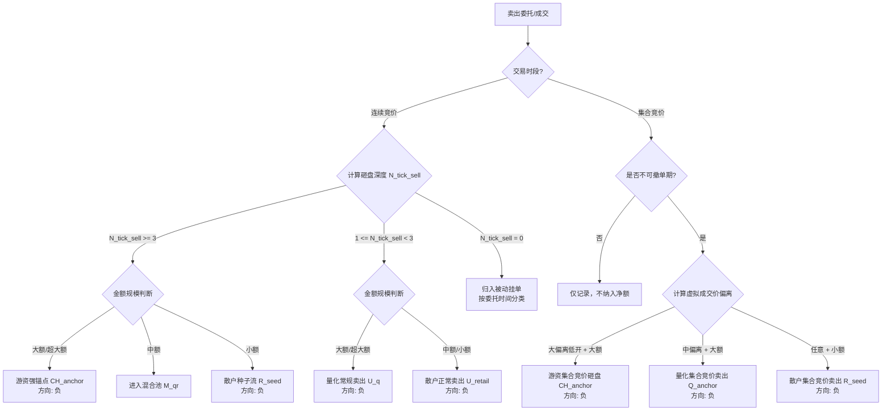

卖出资金判断方法细则

文档版本：V1.0
适用范围：实时连续竞价卖出 + 集合竞价卖出
前置文档：买入资金判断方法细则 V1.0

1. 总则

1.1 对偶原则

卖出资金的判断与买入资金遵循严格的对偶（镜像对称）关系：

维度 买入 卖出（对偶）
攻击方向 向上攻击（吃掉卖盘） 向下攻击（砸穿买盘）
委托价关系  P_{order} \ge P_{best\_ask}   P_{order} \le P_{best\_bid} 
委托价差  \Delta_{bid} = P_{order} - P_{trade} \ge 0   \Delta_{ask} = P_{trade} - P_{order} \ge 0 
攻击性指标 跳档深度（向上跳档买入） 砸盘深度（向下跳档卖出）

1.2 标准化原则（同买入）

采用相同的相对维度标准化方法：

· 价格偏离度：以最小变动价位（tick）或涨跌停比例为基准
· 金额规模：以历史每笔成交金额分布或流通市值比例为基准
· 时间长度：以绝对秒数为基准

2. 连续竞价卖出资金判断

2.1 判断维度定义

维度 符号 定义 计算方法
卖出砸盘深度  N_{tick}^{sell}  委托价低于买一价的tick数量  N_{tick}^{sell} = \lfloor (P_{best\_bid} - P_{order}) / tick\_size \rfloor 
成交金额规模  V  单笔卖出成交金额 从逐笔成交获取
相对金额等级  R_V  相对该股历史分布的分位等级 同买入标准

2.2 卖出砸盘深度分级

等级  N_{tick}^{sell}  范围 卖出攻击性 典型行为
深砸卖出（恐慌/急迫）  N_{tick}^{sell} \ge 3  极高 不计成本抛售，典型游资出货/恐慌踩踏
普通砸盘  1 \le N_{tick}^{sell} < 3  中等 有一定紧迫性，但仍在控制范围内
贴价卖出  N_{tick}^{sell} = 0 （委托价 = 买一价） 低 等待被动成交，不急于追价

2.3 成交金额规模分级（同买入）

等级 判定标准 典型行为
超大额  V \ge 50  万元 或  R_V \ge 95\%  机构/游资级别
大额  10 \le V < 50  万元 或  70\% \le R_V < 95\%  大户/游资级别
中额  1 \le V < 10  万元 或  30\% \le R_V < 70\%  中户/量化
小额  V < 1  万元 或  R_V < 30\%  散户

2.4 综合判定矩阵（连续竞价卖出）

卖出砸盘深度 金额规模 资金分类 变量赋值 PID作用 置信度
深砸卖出（ N_{tick}^{sell} \ge 3 ） 超大额/大额 游资强锚点（卖出）  \widehat{CH}_t \leftarrow \widehat{CH}_t - V  P（强冲击）+ I（强负惯性） 高
深砸卖出（ N_{tick}^{sell} \ge 3 ） 中额 游资弱锚点（卖出） 进入混合池  \widehat{M}_{qr,t}  待方程组反解 中
深砸卖出（ N_{tick}^{sell} \ge 3 ） 小额 散户种子流（卖出）  R_{seed,t} \leftarrow R_{seed,t} - V  I（恐慌惯性） 中
普通砸盘（ 1 \le N_{tick}^{sell} < 3 ） 超大额/大额 机构/量化常规卖出 计入  U_q  基础项 P（中等冲击） 中
普通砸盘（ 1 \le N_{tick}^{sell} < 3 ） 中额/小额 散户正常卖出 计入  U_{retail}  基础项 I（弱负惯性） 低
贴价卖出（ N_{tick}^{sell} = 0 ） 任意金额 被动等待成交 归入被动挂单分类 D 按委托时间判定

2.5 涨跌停价格约束下的特殊处理

当股价接近涨停或跌停时，卖出攻击性的判定标准需相应调整：

价格状态 判定调整 说明
价格  \le 102\% \times P_{limit\_down} （临近跌停） 砸盘深度以剩余跌停空间为基准重新计算 剩余空间不足时，无法产生深砸盘，此时资金分类判定需降权
价格  \ge 98\% \times P_{limit\_up} （临近涨停） 卖出砸盘判定条件放宽（ N_{tick}^{sell} \ge 1  即可视为攻击性卖出） 涨停板附近的巨量抛售，1档砸价即具有极高攻击性

3. 集合竞价卖出资金判断

3.1 集合竞价卖出判断框架

阶段 时间（A股） 特征 判定规则
开盘集合竞价（可撤单期） 09:15 - 09:20 可挂单可撤单 规则约束力弱，仅作为参考
开盘集合竞价（不可撤单期） 09:20 - 09:25 不可撤单 强规则约束，判定价值高
收盘集合竞价 14:57 - 15:00 不可撤单 强规则约束，判定价值高

3.2 集合竞价卖出的核心判断指标

维度 符号 定义 计算方法
虚拟成交价偏离  \Delta_{virtual}  虚拟成交价相对于前收盘价的偏离百分比  \Delta_{virtual} = (P_{virtual} - P_{prev\_close}) / P_{prev\_close} \times 100\% 
委托金额规模  V  集合竞价阶段的累计卖出委托金额 从Level2集合竞价委托统计获取

3.3 集合竞价卖出综合判定矩阵

虚拟成交价偏离  \Delta_{virtual}  委托金额规模 资金分类 变量赋值 PID作用 置信度
大幅低开（ \Delta_{virtual} \le -3\% ） 大额（≥50万） 游资集合竞价砸盘  \widehat{CH}_t \leftarrow \widehat{CH}_t - V  P（冲击）+ I（强负惯性） 高
大幅低开（ \Delta_{virtual} \le -3\% ） 小额（<10万） 散户集合竞价恐慌  R_{seed,t} \leftarrow R_{seed,t} - V  I（恐慌惯性） 中
中幅低开/平开（ -3\% < \Delta_{virtual} \le 1\% ） 大额（≥50万） 机构/量化集合竞价卖出  \widehat{Q}_t \leftarrow \widehat{Q}_t - V （弱锚点） P（中等冲击） 中
中幅低开/平开（ -3\% < \Delta_{virtual} \le 1\% ） 小额（<10万） 散户集合竞价正常卖出 进入混合池  \widehat{M}_{qr,t}  待方程组反解 低
大幅高开（ \Delta_{virtual} \ge 3\% ）且卖出委托异常放大 大额（≥50万） 游资集合竞价出货  \widehat{CH}_t \leftarrow \widehat{CH}_t - V  P（冲击） 高
大幅高开且卖出委托萎缩 任意金额 无卖出意图 不纳入资金分类 — 跳过

3.4 集合竞价“试盘/假摔”识别（定性特征）

特征 判定 处理方式
可撤单期出现大额卖出委托（≥50万），不可撤单期完全消失 游资虚假挂单/试盘 定性标记，不计入净额，仅作为“异动提示”
可撤单期与不可撤单期卖出委托保持一致 真实卖出意图 正常纳入资金分类统计

4. 买卖联合判定矩阵

买入与卖出的判定遵循对称逻辑，唯一差异在于方向符号：

行为类型 价格关系 攻击性指标 方向符号
买入  P_{order} \ge P_{best\_ask}  向上跳档深度  N_{tick}^{buy}  +（正贡献）
卖出  P_{order} \le P_{best\_bid}  向下砸盘深度  N_{tick}^{sell}  −（负贡献）

联合判定逻辑：

· 同一笔资金在买入时做正贡献（推升价格），在卖出时做负贡献（打压价格）
· 最终的资金贡献 = 买入贡献 + 卖出贡献（卖出为负值）

5. 判断流程总览（卖出资金）

6. 卖出资金输出字段规范

输出字段 含义 来源 方向
sell_ch_anchor 卖出游资强锚点金额 连续竞价深砸卖出（大额）+ 集合竞价大幅低开（大额） 负值
sell_q_anchor 卖出量化锚点金额 连续竞价贴价卖出（大额）+ 集合竞价中幅偏离（大额） 负值
sell_retail_seed 卖出散户种子金额 连续竞价深砸卖出（小额）+ 集合竞价小额委托 负值
sell_aggressiveness 卖出攻击性综合评分 基于砸盘深度与金额规模的加权得分 正值表示攻击性强

7. 参数配置表（补充卖出专用）

参数 符号 默认值 说明
急迫卖出砸盘阈值  N_{aggressive}^{sell}  3档 ≥3档视为急迫卖出
普通卖出砸盘阈值  N_{normal}^{sell}  1档 1-2档视为普通砸盘
集合竞价大幅低开阈值  \Delta_{large}^{sell}  -3% 虚拟价偏离≤-3%为大幅低开
集合竞价中幅偏离阈值  \Delta_{medium}^{sell}  -1% 虚拟价偏离-3%~-1%为中幅偏离
大额成交阈值（固定）  V_{large\_fixed}  50万元 同买入
小额成交阈值（固定）  V_{small\_fixed}  10万元 同买入
流通市值比例阈值（大额）  p_{large}  0.01% 同买入
流通市值比例阈值（小额）  p_{small}  0.002% 同买入

8. 买入与卖出判断对照表

维度 买入判断 卖出判断
核心指标 向上跳档深度  N_{tick}^{buy}  向下砸盘深度  N_{tick}^{sell} 
急迫阈值  N_{tick}^{buy} \ge 3   N_{tick}^{sell} \ge 3 
大额游资行为 跳档买入 → 游资抢筹 深砸卖出 → 游资砸盘/出货
大额正常行为 贴价/小跳档买入 → 量化建仓 贴价/小砸盘卖出 → 量化减仓
小额急迫行为 跳档买入 → 散户追涨 深砸卖出 → 散户恐慌
集合竞价大额 大幅高开 → 游资抢筹 大幅低开 → 游资砸盘
方向符号 正值（+） 负值（−）
PID作用 P（冲击）+ I（正惯性） P（冲击）+ I（负惯性）

9. 附录：与PID方程组的集成关系

结合买入和卖出的资金分类结果，汇总至统一的资金流变量：

资金流变量 组成 含义
 U_{ch}  买入游资锚点 + 卖出游资锚点（含方向） 游资净攻击力（正=净买入，负=净卖出）
 U_q  买入量化锚点 + 卖出量化锚点 量化净供给力（通常为负，提供流动性）
 U_{retail}  买入散户种子 + 卖出散户种子 散户净情绪流（正=追涨，负=恐慌）
 \widehat{M}_{qr}  中额买入/卖出 + 时间>10s被动单 量化+散户混合池（待方程组反解）

最终，所有资金变量进入状态空间模型（卡尔曼滤波+RTS平滑），通过三组关联方程反解出  CH_t, Q_t, R_t  的具体数值。