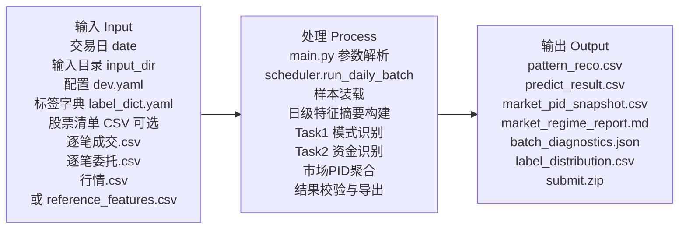
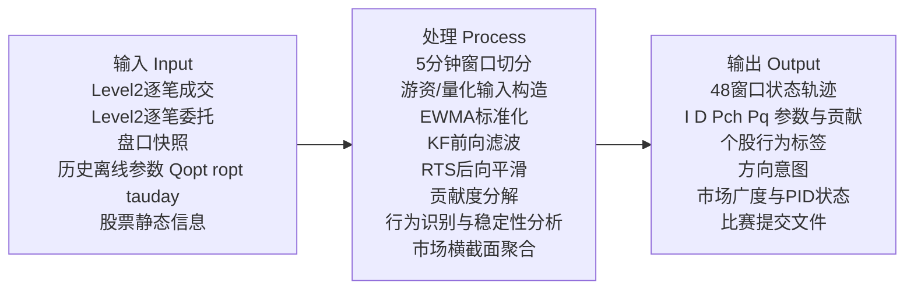
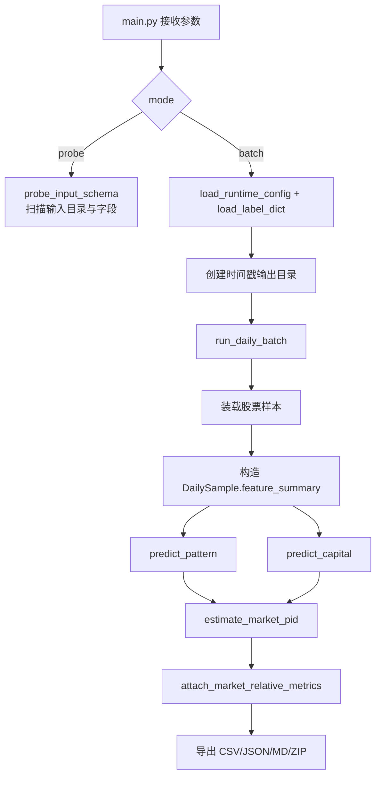

# 比赛系统 IPO 图

## 1. 文档目的

本文依据以下资料联合整理：

- `E:\2026OPC大赛\自动化交易\设计文档\详细设计.md`
- `E:\2026OPC大赛\自动化交易\设计文档\概要设计说明书.md`
- `E:\2026OPC大赛\自动化交易\比赛设计文档\比赛详细设计说明书.md`
- `E:\2026OPC大赛\自动化交易\比赛设计文档\比赛系统建设_check_list.md`
- `E:\2026OPC大赛\自动化交易\比赛设计文档\比赛概要设计说明书.md`
- 当前代码实现：`E:\2026OPC大赛\自动化交易\比赛系统\`

本文目标是给出当前比赛系统的：

1. 准确输入定义
2. 准确输出定义
3. 处理流程 IPO 图
4. 关键变换公式与原理
5. 当前代码实现与设计目标之间的对应关系

注意：本文以“当前代码真实实现链路”为主，另外补充“设计目标扩展链路”。其中 KF/RTS 状态空间引擎目前仍主要停留在设计文档中，尚未正式接入比赛系统主链路。

---

## 2. 系统范围

当前比赛系统定位为“收盘后日终批处理分析系统”，其核心职责是：

1. 读取指定交易日的逐笔成交、逐笔委托、行情数据
2. 为每只股票构造日级特征摘要
3. 生成 Task 1 交易模式识别结果 `pattern_reco.csv`
4. 生成 Task 2 资金类型与资金意图识别结果 `predict_result.csv`
5. 聚合市场 PID 快照并输出市场状态报告
6. 输出诊断文件和 `submit.zip`

不负责：

1. 盘中自动下单
2. 微秒级撮合重建
3. 高频实时 RTS 平滑
4. 完整训练态机器学习在线推理平台

---

## 3. 顶层 IPO 图

### 3.1 当前代码实现主链路 IPO 图

### 3.2 设计目标扩展链路 IPO 图

---

## 4. 输入定义

## 4.1 控制类输入

当前代码入口为 `main.py`，主要输入参数如下：

| 输入项 | 来源 | 类型 | 是否必填 | 定义 |
|---|---|---|---|---|
| `mode` | CLI | string | 是 | `probe` 或 `batch` |
| `date` | CLI | string | 是 | 交易日，格式示例 `20260130` |
| `input_dir` | CLI | path | 是 | 原始数据目录或参考特征目录 |
| `output_dir` | CLI | path | 否 | 输出基目录 |
| `report_dir` | CLI | path | 否 | schema 探针报告目录 |
| `config` | CLI | path | 否 | 运行配置，默认 `configs/dev.yaml` |
| `label_config` | CLI | path | 否 | 标签字典配置 |
| `stock_limit` | CLI | int | 否 | 限制处理股票数 |
| `stock_offset` | CLI | int | 否 | 股票目录偏移量 |
| `stock_list_file` | CLI | path | 否 | 指定股票清单 |
| `build_zip` | CLI | bool | 否 | 是否强制生成 `submit.zip` |

## 4.2 配置类输入

当前系统使用 `configs/dev.yaml`，核心字段如下：

| 字段 | 当前值 | 作用 |
|---|---:|---|
| `process_count` | 4 | 预留并发配置 |
| `window_minutes` | 5 | 设计窗口粒度 |
| `use_reference_feature_file` | true | 优先使用参考特征文件 |
| `use_state_feature_engine` | true | 设计上允许状态特征引擎接入 |
| `baseline_mode` | true | 当前为基线规则模式 |
| `pattern_distance_weights.dtw` | 0.5 | Task1 设计距离权重 |
| `pattern_distance_weights.wasserstein` | 0.3 | Task1 设计距离权重 |
| `pattern_distance_weights.summary` | 0.2 | Task1 设计距离权重 |
| `pattern_low_conf_threshold` | 0.15 | Task1 低置信回退阈值 |
| `pattern_margin_threshold` | 0.05 | Task1 第一第二候选分差阈值 |
| `capital_low_conf_threshold` | 0.55 | Task2 低置信阈值 |
| `intention_low_conf_threshold` | 0.45 | 资金意图低置信阈值 |
| `label_mode` | compressed | 输出压缩标签模式 |
| `enable_submit_zip` | true | 生成提交压缩包 |
| `enable_market_snapshot` | true | 生成市场快照 |

## 4.3 标签字典输入

`configs/label_dict.yaml` 定义了标签全集与提交口径，包括：

1. `capital_type_labels`：游资、量化、散户
2. `capital_intention_labels_fine`：买入、卖出、中性、T0交易、吸筹、试盘、拉升、出货、对倒、做市
3. `capital_intention_labels_submit`：买入、卖出、中性、T0交易
4. `pattern_labels_seed`：交易模式种子标签

## 4.4 数据文件输入

当前代码支持两种输入模式。

### 模式 A：按股票目录读取原始数据

单股票目录至少包含：

| 文件名 | 是否必需 | 用途 |
|---|---|---|
| `逐笔成交.csv` | 是 | 构造成交额、均笔成交、尾盘成交占比等 |
| `逐笔委托.csv` | 是 | 构造委托买卖比、撤单近似比例等 |
| `行情.csv` | 是 | 构造开收盘涨跌、振幅、收盘强度、盘口支撑/抛压、市场上涨/下跌家数等 |

### 模式 B：读取参考特征文件

候选文件名：

1. `reference_features.csv`
2. `features.csv`
3. `参考特征.csv`

当该文件存在时，系统按股票和交易日聚合日级样本。

---

## 5. 输出定义

## 5.1 标准比赛输出

### 5.1.1 `pattern_reco.csv`

字段严格为：

| 字段 | 类型 | 定义 |
|---|---|---|
| `stock_code` | string | 股票代码 |
| `transaction_date` | string | 交易日期 |
| `pattern_type` | string | 交易模式标签 |
| `pattern_explanation` | string | 交易模式解释文本 |

### 5.1.2 `predict_result.csv`

字段严格为：

| 字段 | 类型 | 定义 |
|---|---|---|
| `stock_code` | string | 股票代码 |
| `transaction_date` | string | 交易日期 |
| `capital_type` | string | 资金类型，当前代码可输出游资/量化/散户 |
| `capital_intention` | string | 资金意图，压缩输出为买入/卖出/中性/T0交易 |

注意：比赛正式提交若仅允许游资、量化两类，则需要在后续版本中对“散户”标签再做收敛映射；当前实现保留了内部识别态。

## 5.2 辅助输出

### 5.2.1 `market_pid_snapshot.csv`

字段为：

| 字段 | 定义 |
|---|---|
| `trade_date` | 交易日 |
| `up_count` | 市场上涨家数 |
| `down_count` | 市场下跌家数 |
| `breadth_ratio` | 市场上涨/下跌比 |
| `breadth_balance` | 市场涨跌平衡度 |
| `p_mean` `p_median` `p_std` | 市场 P 统计量 |
| `i_mean` `i_median` `i_std` | 市场 I 统计量 |
| `d_mean` `d_median` `d_std` | 市场 D 统计量 |
| `market_regime` | 市场状态标签 |

### 5.2.2 `market_regime_report.md`

输出市场状态摘要、PID 统计值和诊断信息。

### 5.2.3 `batch_diagnostics.json`

输出批次样本数、标签分布、市场快照摘要。

### 5.2.4 `label_distribution.csv`

输出 `pattern_type`、`capital_type`、`capital_intention` 的频数及占比。

### 5.2.5 `submit.zip`

压缩包中包含：

1. `pattern_reco.csv`
2. `predict_result.csv`

---

## 6. 处理流程详解

## 6.1 总体处理流程

## 6.2 样本装载流程

系统优先判断输入目录中是否存在参考特征文件：

1. 若存在，则按 `trade_date + symbol` 分组，直接构造 `DailySample`
2. 若不存在，则判断输入目录是否为单股票目录
3. 若也不是，则遍历该目录下每个股票子目录

因此当前系统的样本粒度是“股票-交易日”。

## 6.3 原始数据到日级摘要特征的变换

当前代码未正式构建完整 48 个 5 分钟窗口对象，而是直接从原始文件提取日级摘要特征。核心字段如下。

| 特征名 | 定义 | 来源 |
|---|---|---|
| `deal_amount` | 总成交额 | 逐笔成交价格 × 数量 求和 |
| `buy_amount` | 正方向成交额近似 | `max(net_direction,0) * deal_amount` |
| `sell_amount` | 负方向成交额近似 | `max(-net_direction,0) * deal_amount` |
| `net_direction` | 日内净方向 | `(close_price - reference_open) / prev_close` |
| `close_return` | 收盘涨跌幅 | `(close_price - prev_close) / prev_close` |
| `open_return` | 开盘涨跌幅 | `(open_price - prev_close) / prev_close` |
| `intraday_range` | 日内振幅 | `(high_price - low_price) / prev_close` |
| `close_strength` | 收盘强度 | `(close_price - low_price) / (high_price - low_price)` |
| `cancel_ratio` | 撤单近似比例 | 非空/非0 委托类型记录数 ÷ 委托记录数 |
| `burst_ratio` | 成交爆发度 | 最大时间桶成交额 ÷ 全日总成交额 |
| `price_impact` | 相对昨收价格冲击 | `abs(close_price - prev_close) / prev_close` |
| `bid_support` | 买盘支撑占比 | 十档买量 ÷ (十档买量 + 十档卖量) |
| `ask_pressure` | 卖盘抛压占比 | 十档卖量 ÷ (十档买量 + 十档卖量) |
| `tail_ratio` | 尾盘成交占比 | 14:30 后成交额 ÷ 全日成交额 |
| `last15_return` | 尾盘 15 分钟涨跌 | 尾盘报价首尾差 ÷ 昨收 |
| `avg_trade_size` | 平均单笔成交额 | 总成交额 ÷ 成交笔数 |
| `order_buy_ratio` | 买向委托占比 | 买委托数 ÷ (买委托数 + 卖委托数) |
| `directional_efficiency` | 趋势效率 | `min(abs(close_return-open_return)/intraday_range,1)` |
| `reversal_strength` | 反转强度 | `close_return - open_return` |
| `up_count_market` | 市场上涨家数 | 从行情末条记录读取 |
| `down_count_market` | 市场下跌家数 | 从行情末条记录读取 |
| `flat_count_market` | 市场平盘家数 | 从行情末条记录读取 |

---

## 7. Task 1 处理细节与公式原理

## 7.1 目标

Task 1 输出单只股票单个交易日的：

1. `pattern_type`
2. `pattern_explanation`

## 7.2 当前实现原理

当前实现不是聚类模型在线推理，而是“显式规则 + 打分排序 + 低置信回退”的基线方案。

### 第一步：显式强规则识别

若某些模式特别明显，则直接赋标签。例如：

1. `close_return >= 0.035` 且 `close_strength >= 0.62` 且 `deal_amount >= 3e8`，判为“大单吸筹”
2. `last15_return >= 0.0025` 且 `tail_ratio >= 0.10` 且 `close_strength >= 0.68`，判为“尾盘突袭”
3. `abs(close_return) <= 0.012` 且 `intraday_range >= 0.035`，判为“日内套利”

### 第二步：候选标签评分

当前代码对 10 类模式计算候选分数，取最高者作为结果。其本质是将交易行为映射为一组标准化分量后线性加权。

先定义若干归一化得分：

$$
\text{amount\_score} = clip\left(\frac{deal\_amount}{10^9},0,1\right)
$$

$$
\text{range\_score} = clip\left(\frac{intraday\_range}{0.08},0,1\right)
$$

$$
\text{up\_score} = clip\left(\frac{close\_return}{0.05},0,1\right)
$$

$$
\text{down\_score} = clip\left(\frac{-close\_return}{0.05},0,1\right)
$$

$$
\text{tail\_flow\_score} = clip\left(\frac{tail\_ratio-0.08}{0.10},0,1\right)
$$

$$
\text{buy\_bias\_score} = clip\left(\frac{order\_buy\_ratio-0.50}{0.18},0,1\right)
$$

然后对各候选标签做加权。例如“尾盘突袭”：

$$
S_{\text{尾盘突袭}} =
0.34 \cdot tail\_up\_score +
0.22 \cdot tail\_flow\_score +
0.22 \cdot close\_top\_score +
0.12 \cdot up\_score +
0.10 \cdot amount\_score
$$

“大单吸筹”：

$$
S_{\text{大单吸筹}} =
0.25 \cdot up\_score +
0.20 \cdot buy\_bias\_score +
0.20 \cdot close\_top\_score +
0.20 \cdot large\_order\_score +
0.15 \cdot amount\_score
$$

“日内套利”：

$$
S_{\text{日内套利}} =
0.35 \cdot range\_score +
0.30 \cdot neutral\_close\_score +
0.20 \cdot mid\_close\_score +
0.15 \cdot order\_balance\_score
$$

其中：

$$
order\_balance\_score = 1 - clip\left(\frac{|order\_buy\_ratio-0.5|}{0.2},0,1\right)
$$

### 第三步：低置信回退

若最高分过低，或最高分与第二名分差不足，则回退到更稳健的规则标签：

$$
score < pattern\_low\_conf\_threshold
$$

或

$$
score - second\_score < pattern\_margin\_threshold
$$

当前默认阈值分别为：

1. `pattern_low_conf_threshold = 0.15`
2. `pattern_margin_threshold = 0.05`

## 7.3 Task 1 输出原理

`pattern_explanation` 并不是模板占位，而是根据标签返回一段固定业务解释，用于说明该模式代表的典型盘口与价格节奏。

---

## 8. Task 2 处理细节与公式原理

## 8.1 目标

Task 2 输出：

1. `capital_type`
2. `capital_intention`

## 8.2 当前实现原理

当前实现采用三类资金评分：

1. 散户分数 `retail_score`
2. 游资分数 `hot_money_score`
3. 量化分数 `quant_score`

最终选择得分最高者作为 `capital_type`。

## 8.3 资金类型评分公式

### 8.3.1 中间分量

$$
amount\_score = clamp\left(\frac{deal\_amount}{10^9}, 0, 1\right)
$$

$$
small\_order\_score = clamp\left(\frac{12000-avg\_trade\_size}{10000},0,1\right)
$$

$$
large\_order\_score = clamp\left(\frac{avg\_trade\_size-8000}{12000},0,1\right)
$$

$$
buy\_bias\_score = clamp\left(\frac{order\_buy\_ratio-0.50}{0.18},0,1\right)
$$

$$
sell\_bias\_score = clamp\left(\frac{0.50-order\_buy\_ratio}{0.18},0,1\right)
$$

$$
range\_score = clamp\left(\frac{intraday\_range}{0.08},0,1\right)
$$

### 8.3.2 散户分数

$$
\begin{aligned}
retail\_score =\,&
0.30 \cdot small\_order\_score
+ 0.15 \cdot (1-amount\_score)
+ 0.20 \cdot \left(1-\frac{|order\_buy\_ratio-0.5|}{0.18}\right) \\
&+ 0.15 \cdot range\_score
+ 0.10 \cdot (1-directional\_efficiency)
+ bonus_{low\_cancel}
\end{aligned}
$$

其中：

$$
bonus_{low\_cancel} =
\begin{cases}
0.10,& cancel\_ratio < 0.02 \\
0,& otherwise
\end{cases}
$$

### 8.3.3 游资分数

$$
\begin{aligned}
hot\_money\_score =\,&
0.25 \cdot amount\_score
+ 0.15 \cdot large\_order\_score
+ 0.18 \cdot \max(up\_score,down\_score) \\
&+ 0.15 \cdot range\_score
+ 0.12 \cdot directional\_efficiency
+ 0.10 \cdot \max(buy\_bias\_score,sell\_bias\_score) \\
&+ bonus_{tail}
+ bonus_{trend}
+ bonus_{large\_strong}
\end{aligned}
$$

其中：

$$
bonus_{tail} =
\begin{cases}
0.05,& |last15\_return| > 0.002 \\
0,& otherwise
\end{cases}
$$

$$
bonus_{trend} =
\begin{cases}
0.10,& |close\_return| > 0.03 \\
0,& otherwise
\end{cases}
$$

$$
bonus_{large\_strong} =
\begin{cases}
0.06,& deal\_amount>3\times10^8 \land close\_strength>0.6 \\
0,& otherwise
\end{cases}
$$

### 8.3.4 量化分数

$$
\begin{aligned}
quant\_score =\,&
0.18 \cdot \left(1-\frac{|close\_return|}{0.03}\right)
+ 0.18 \cdot \left(1-\frac{|order\_buy\_ratio-0.5|}{0.18}\right) \\
&+ 0.10 \cdot range\_score
+ 0.12 \cdot burst\_ratio
+ bonus_{small\_close} \\
&+ bonus_{balanced\_close}
+ bonus_{book\_pressure}
+ bonus_{cancel}
\end{aligned}
$$

其中：

1. `bonus_small_close`：`abs(close_return) < 0.008` 时加 `0.12`
2. `bonus_balanced_close`：`close_strength < 0.35 or > 0.65` 时加 `0.10`
3. `bonus_book_pressure`：`bid_support <= ask_pressure` 时加 `0.10`
4. `bonus_cancel`：`cancel_ratio >= 0.01` 时加 `0.10`

## 8.4 资金类型判定

取三者最大值：

$$
capital\_type = \arg\max(retail\_score, hot\_money\_score, quant\_score)
$$

并计算置信度：

$$
capital\_confidence = clamp(0.55 + margin/1.5, 0, 1)
$$

其中 `margin` 为第一名与第二名的分差。

额外修正规则：

若初判为散户，但同时满足：

1. `close_return > 0.025`
2. `close_strength > 0.65`

则上修为游资。

## 8.5 资金意图判定

资金意图按 `capital_type` 分支判定。

例如游资：

1. `close_return > 0.02 and close_strength > 0.65` 判为“拉升”
2. `order_buy_ratio > 0.56 and bid_support >= ask_pressure and close_return > 0` 判为“吸筹”
3. `close_return < -0.018 and close_strength < 0.35` 判为“出货”
4. `abs(close_return) < 0.008 and intraday_range > 0.03` 判为“试盘”

若输出模式为 `compressed`，则细粒度标签映射为提交标签：

| 细标签 | 压缩输出 |
|---|---|
| 吸筹、拉升 | 买入 |
| 出货 | 卖出 |
| 试盘 | 散户时映射为 T0交易，否则映射为中性 |
| 其他 | 中性 |

---

## 9. 市场 PID 处理细节与公式原理

## 9.1 核心思想

当前市场 PID 不是控制理论中的严格闭环 PID 控制器，而是借用 P/I/D 的解释框架，对市场横截面行为进行三维刻画：

1. `P`：市场推动强度
2. `I`：市场延续性
3. `D`：市场阻尼与扰动

## 9.2 单股票 PID 映射公式

对每只股票，代码从 `DailySample.feature_summary` 中计算：

### P 值

$$
P = clamp\left(
0.6 \cdot net\_direction +
0.25 \cdot \min\left(\frac{price\_impact}{0.02},1\right) +
0.15 \cdot tail\_ratio
,-1,1\right)
$$

含义：

1. `net_direction` 刻画全日方向推动
2. `price_impact` 刻画价格位移强度
3. `tail_ratio` 刻画尾盘推动占比

### I 值

$$
I = clamp\left(
0.55 \cdot burst\_ratio +
0.25 \cdot \max(net\_direction,0) +
0.20 \cdot tail\_ratio
,-1,1\right)
$$

含义：

1. `burst_ratio` 表示成交集中性
2. 正向 `net_direction` 表示趋势延续
3. 尾盘占比表示持续收束和延续意愿

### D 值

$$
D = clamp\left(
0.50 \cdot cancel\_ratio +
0.30 \cdot \max(ask\_pressure-bid\_support,0) +
0.20 \cdot (1-|net\_direction|)
,0,1\right)
$$

含义：

1. `cancel_ratio` 越高，说明扰动和试探越多
2. 卖压高于买撑，说明阻尼偏强
3. 趋势越不明确，阻尼项越大

## 9.3 市场横截面聚合公式

对于全部股票：

$$
breadth\_ratio = 
\begin{cases}
\frac{up\_count}{down\_count}, & down\_count > 0 \\
up\_count, & down\_count = 0 \land up\_count > 0 \\
0, & otherwise
\end{cases}
$$

$$
breadth\_balance = \frac{up\_count-down\_count}{up\_count+down\_count}
$$

市场 P/I/D 使用横截面统计量：

1. 均值 `mean`
2. 中位数 `median`
3. 总体标准差 `pstdev`

## 9.4 市场状态判定规则

当前规则如下：

1. 若 `breadth_balance > 0.30` 且 `p_median > 0.10` 且 `i_median > 0.20`，判为“强趋势上涨”
2. 若 `breadth_balance > 0.10` 且 `p_median >= 0.0`，判为“弱趋势上涨”
3. 若 `breadth_balance < -0.30` 且 `p_median < -0.10`，判为“风险偏好退潮”
4. 若 `breadth_balance < -0.10`，判为“弱趋势下跌”
5. 若 `d_median > 0.45`，判为“震荡中性”
6. 其他情况也判为“震荡中性”

## 9.5 个股相对市场指标

系统还会把每只股票映射到市场相对位置：

$$
p\_rel = \frac{p\_value - p\_median}{p\_std}
$$

$$
i\_rel = \frac{i\_value - i\_median}{i\_std}
$$

$$
d\_rel = \frac{d\_value - d\_median}{d\_std}
$$

趋势相对分数：

$$
trend\_score = 0.45 \cdot p\_rel + 0.35 \cdot i\_rel - 0.20 \cdot d\_rel
$$

该结果进入 `PredictResult.debug_info`，用于解释“强于市场 / 跟随市场 / 弱于市场 / 逆势强股 / 抗跌 / 高噪声扰动”。

---

## 10. 异常与降级机制

当前代码中的降级与兜底逻辑包括：

1. 当找不到样本时，仍输出带表头文件
2. 当指定股票清单中部分股票缺原始数据时，生成默认占位结果
3. 占位结果中：
   - `pattern_type` 默认输出“日内套利”
   - `capital_type` 默认输出“散户”
   - `capital_intention` 默认输出“中性”
4. 输出前执行字段数、表头顺序、空字段检查
5. `pattern_reco.csv` 与 `predict_result.csv` 行数必须一致

---

## 11. 设计目标与当前实现差异

## 11.1 已实现部分

当前比赛系统已经实现：

1. `main.py` 启动入口
2. schema 探针
3. 日终批处理调度
4. 原始逐笔/行情读入
5. 日级摘要特征构造
6. Task1 基线规则识别
7. Task2 基线规则识别
8. 市场 PID 聚合与报告
9. 标准提交文件导出与打包

## 11.2 尚未正式接入主链路的设计能力

设计文档中提出但当前代码未正式接入比赛主链路的能力包括：

1. 48 个 5 分钟窗口级特征对象
2. EWMA 自适应标准化
3. 离线超参数学习
4. KF 前向滤波
5. RTS 后向平滑
6. 贡献度分解 `I/D/Pch/Pq`
7. 稳定性检测与物理解释一致性修正

因此，在撰写答辩材料时应明确：

1. 当前代码是“比赛可运行基线系统”
2. 设计文档中的状态空间方案是“下一阶段可解释增强引擎”

---

## 12. 结论

从 IPO 视角看，当前比赛系统的真实主链路可以概括为：

1. 输入：交易日、配置、股票清单、逐笔成交/逐笔委托/行情或参考特征文件
2. 处理：日级摘要特征构造 + Task1 模式规则识别 + Task2 资金规则识别 + 市场 PID 聚合 + 导出校验
3. 输出：`pattern_reco.csv`、`predict_result.csv`、市场快照、诊断文件和 `submit.zip`

其原理核心不是黑盒预测，而是：

1. 将原始盘口与成交行为变换为方向、振幅、尾盘、盘口支撑、撤单、爆发度等可解释特征
2. 用显式线性加权和规则阈值构成模式与资金识别器
3. 用横截面聚合生成市场 PID 状态

这套链路已经具备比赛交付能力；而设计文档中的 KF/RTS 方案则为后续提高解释性、稳定性和学术完整性提供了明确演进方向。
