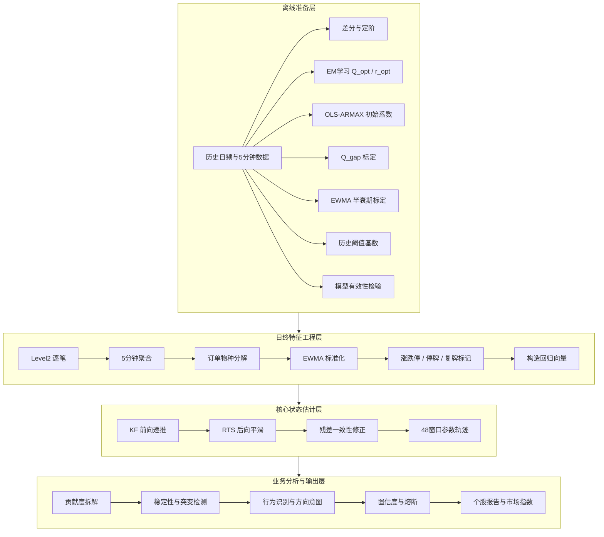

# 基于状态空间辨识与RTS平滑的股价运行状态分析系统

## 概要设计说明书

**文档版本：** V1.4  
**文档状态：** 修订稿 - 待复审确认后冻结  
**修订日期：** 2026-07-06

---

## 1. 引言

### 1.1 项目背景

传统量化模型通常将股价视为单纯的时间序列，重点放在预测精度，而较少显式刻画价格变化背后的驱动力结构。本项目将单只股票抽象为受多源外部输入驱动的时变参数系统，通过状态空间建模、卡尔曼滤波与RTS固定区间平滑，在收盘后恢复单日 48 个 5 分钟窗口的状态参数轨迹，用于刻画股价运行状态、识别主导参与者行为并输出风险控制辅助信息。

### 1.2 核心目标

| 目标 | 说明 |
|---|---|
| 物理映射 | 将价格波动拆解为惯性、阻尼、游资冲击、量化供给等可解释分量 |
| 博弈识别 | 在统一系统骨架下分离游资攻击力与量化稳定力的贡献度 |
| 状态判定 | 输出个股日内稳定性、结构突变、噪声混沌等状态标签 |
| 市场刻画 | 构建全市场扩散指数，辅助判断市场情绪与博弈气候 |
| 风控辅助 | 输出带置信度和熔断机制的行为识别结果，服务次日仓位与风控决策 |

### 1.3 设计原则

- 核心状态估计采用线性高斯状态空间模型、卡尔曼滤波和RTS固定区间平滑。
- 离线超参数学习采用 EM 算法，多起点验证以降低局部最优风险。
- 所有业务阈值优先采用数据驱动标定；个别订单分类阈值允许使用可配置种子规则，后续按流动性分层校准。
- 全流程严格满足时间因果性，任何标准化和特征构造均禁止使用未来信息。
- 极端行情、停牌、复牌、低流动性、低置信度场景必须具备显式降级和熔断处理。
- 输出结果必须可解释、可追溯、可复核，关键中间量需具备落库或日志留痕能力。

### 1.4 系统边界

本系统定位为**收盘后日终分析系统**，主要服务以下场景：

- 个股日内状态轨迹复盘
- 次日风控与仓位辅助
- 全市场情绪与参与者扩散分析

本系统**不属于**以下范畴：

- 盘中高频自动执行系统
- tick 级实时毫秒决策引擎
- 独立生成买卖指令的黑箱交易策略

### 1.5 非目标

当前版本不解决以下问题：

- 盘口级微秒撮合机理重建
- 完全无监督订单参与者身份识别
- 跨市场联动建模
- 盘中实时 RTS 平滑输出

---

## 2. 术语与符号说明

### 2.1 核心术语

| 术语 | 英文 | 说明 |
|---|---|---|
| 状态空间模型 | State Space Model, SSM | 用状态方程刻画隐状态演化，用观测方程连接状态与观测量的数学模型 |
| 卡尔曼滤波 | Kalman Filter, KF | 针对线性高斯系统的递推最小均方误差估计方法 |
| RTS 平滑 | Rauch-Tung-Striebel Smoother | 基于完整观测序列的后向固定区间平滑算法 |
| EM 算法 | Expectation-Maximization | 含隐变量模型的迭代参数估计方法 |
| EWMA | Exponentially Weighted Moving Average | 指数加权移动平均，用于均值和波动率的递推估计 |
| ARMAX | AutoRegressive Moving Average with eXogenous inputs | 含外生输入的自回归移动平均模型 |
| Level2 行情 | Level 2 Market Data | 包含逐笔成交、逐笔委托、买卖十档等深度行情数据 |
| IC | Information Coefficient | 因子值与未来收益的相关性指标，用于衡量解释力 |
| Ljung-Box 检验 | Ljung-Box Test | 检验残差序列是否存在显著自相关 |

### 2.2 符号对照表

| 符号 | 类型 | 说明 | 首次出现章节 |
|---|---|---|---|
| $\Delta P_t$ | 观测变量 | 第 $t$ 个 5 分钟窗口的对数收益率 | 4.1 |
| $U_{ch,t}$ | 观测变量 | 第 $t$ 个窗口的游资净攻击力，标准化后 | 4.1 |
| $U_{q,t}$ | 观测变量 | 第 $t$ 个窗口的量化净供给力，标准化后 | 4.1 |
| $\psi_t$ | 状态向量 | $[\phi_t,\beta_{ch,t},\beta_{q,t},\theta_t]^T$ | 6.1 |
| $\phi_t$ | 参数分量 | AR 项系数，对应惯性系数 `I_coef_t` | 6.1 |
| $\beta_{ch,t}$ | 参数分量 | 游资输入系数，对应冲击系数 `Pch_coef_t` | 6.1 |
| $\beta_{q,t}$ | 参数分量 | 量化输入系数，对应供给系数 `Pq_coef_t` | 6.1 |
| $\theta_t$ | 参数分量 | MA 项系数，对应阻尼系数 `D_coef_t` | 6.1 |
| $I^{contrib}_t$ | 贡献分量 | $\phi_t \cdot \Delta P_{t-1}$ | 8 |
| $P^{contrib}_{ch,t}$ | 贡献分量 | $\beta_{ch,t} \cdot U_{ch,t-1}$ | 8 |
| $P^{contrib}_{q,t}$ | 贡献分量 | $\beta_{q,t} \cdot U_{q,t-1}$ | 8 |
| $D^{contrib}_t$ | 贡献分量 | $\theta_t \cdot \hat{\varepsilon}_{t-1}$ | 8 |
| $\varepsilon_t$ | 观测噪声 | 观测方程残差，$\varepsilon_t \sim \mathcal{N}(0, r_t)$ | 6.1 |
| $\eta_t$ | 状态噪声 | 状态转移噪声，$\eta_t \sim \mathcal{N}(0, Q_t)$ | 6.1 |
| $Q_{opt}$ | 超参数 | 标准交易窗口状态噪声协方差矩阵，$4 \times 4$ | 5.2 |
| $Q_{gap}$ | 超参数 | 午间跳变窗口使用的不确定性增量协方差 | 6.2 |
| $r_{opt}$ | 超参数 | 基础观测噪声方差 | 5.2 |
| $\sigma^{EWMA}_{\Delta P,t}$ | 中间变量 | 基于收益率序列 EWMA 估计的当日波动率 | 4.2 |
| $\hat{\psi}_{t \mid t-1}$ | 中间变量 | 第 $t$ 步状态预测值 | 6.2 |
| $\hat{\psi}_{t \mid t}$ | 中间变量 | 第 $t$ 步状态更新值 | 6.2 |
| $P_{t \mid t-1}$ | 中间变量 | 第 $t$ 步状态预测协方差 | 6.2 |
| $P_{t \mid t}$ | 中间变量 | 第 $t$ 步状态更新协方差 | 6.2 |
| $\tilde{\varepsilon}_t$ | 衍生残差 | RTS 平滑后的最终残差 | 6.4 |
| $H$ | 衍生指标 | 日内能量熵 | 10.3 |
| $\text{Conf}_{Agent}$ | 衍生指标 | 主导参与者类型置信度，范围 $[0,100]$ | 10.2 |
| $\text{Conf}_{Dir}$ | 衍生指标 | 方向意图置信度，范围 $[0,100]$ | 10.4 |

### 2.3 命名约定

- 后缀 `_coef` 表示参数系数，反映模型对对应输入的敏感度。
- 后缀 `_contrib` 表示贡献值，反映该时刻对应分量对收益率的实际作用大小。
- 日内表中的 `time_bin` 取值范围为 `1..48`，对应 48 个 5 分钟窗口。
- 所有置信度类字段统一使用 `0~100` 百分制。

---

## 3. 总体系统架构

### 3.1 架构总览

系统分为四层：

1. 离线准备层
2. 日终特征工程层
3. 核心状态估计层
4. 业务分析与输出层



### 3.2 流程输入输出

| 层级 | 输入 | 输出 | 说明 |
|---|---|---|---|
| 离线准备层 | 历史日频、历史 5 分钟频、历史 Level2 | $Q_{opt}$、$r_{opt}$、$\tau_{day}$、$k_{opt}$、OLS 初值、阈值基数 | 周期性更新 |
| 日终特征层 | 当日 Level2 | $\Delta P_t$、$U_{ch,t}$、$U_{q,t}$、缺失与有效标记 | 当日收盘后执行 |
| 核心估计层 | 特征向量与离线参数 | 48 窗口参数轨迹、平滑残差、观测噪声调整值 | 日终批处理 |
| 输出层 | 估计结果 | 个股标签、市场扩散指数、落库结果、报告文件 | 面向风控和复盘 |

---

## 4. 特征工程模块

### 4.1 输入特征构造

| 特征 | 符号 | 定义 | 当前规则 | 后续标定方向 |
|---|---|---|---|---|
| 价格变化 | $\Delta P_t$ | $\ln(VWAP_t)-\ln(VWAP_{t-1})$ | 5 分钟 VWAP 收益率 | 无 |
| 游资净攻击力 | $U_{ch,t}$ | 主动买入减主动卖出净额 | 种子规则：单笔金额 $\ge 50$ 万，挂单存活 $<500$ ms | 按流动性分层、成交额分位数校准 |
| 量化净供给力 | $U_{q,t}$ | 主动买入减主动卖出净额 | 种子规则：单笔金额 $<10$ 万，挂单存活 $>3$ s | 按活跃度和换手率分层校准 |

说明：

- `50万 / 10万 / 500ms / 3s` 为当前版本的**可配置种子阈值**，用于首版建模。
- 详细设计阶段须补充阈值重标定实验，并按市值、换手率、成交额对个股进行分层。
- 对订单金额类特征先执行 1% 缩尾，再进入标准化流程。

### 4.2 EWMA 自适应标准化

对单个特征序列 $x_t$，定义：

$$
\mu_t = \lambda \mu_{t-1} + (1-\lambda)x_t
$$

$$
\sigma_t^2 = \lambda \sigma_{t-1}^2 + (1-\lambda)(x_t-\mu_{t-1})^2
$$

标准化输出：

$$
x_t^{norm} = \frac{x_t-\mu_{t-1}}{\sqrt{\sigma_{t-1}^2} + 10^{-8}}
$$

半衰期的量纲定义如下：

- $\tau_{day}$：以交易日为单位的 EWMA 半衰期
- $\tau_{bin}=48 \cdot \tau_{day}$：换算到 5 分钟窗口后的半衰期
- $\lambda = \exp(\ln(0.5) / \tau_{bin})$

严格时间因果约束：

1. 标准化只能使用 $t-1$ 时刻的统计量。
2. 更新顺序必须是“先标准化，后更新”。
3. 不允许使用全日样本方差、滚动未来窗口等未来函数。

伪代码如下：

```python
x_norm = (x_t - mu_prev) / (sqrt(sigma_sq_prev) + eps)
mu_t = lam * mu_prev + (1 - lam) * x_t
sigma_sq_t = lam * sigma_sq_prev + (1 - lam) * (x_t - mu_prev) ** 2
```

### 4.3 EWMA 状态持久化与容错

EWMA 状态需跨日持久化，存储格式建议为 JSON：

```json
{
  "schema_version": "1.0",
  "trade_date": "2026-07-06",
  "ticker": "000001.SZ",
  "mu": {"delta_p": 0.0, "u_ch": 0.0, "u_q": 0.0},
  "sigma_sq": {"delta_p": 0.0, "u_ch": 1.0, "u_q": 1.0},
  "tau_day": 20,
  "last_update_time": "2026-07-06T15:05:00",
  "checksum": "sha256:..."
}
```

容错规则：

- 缺失 1 个交易日：沿用前一状态，并做 $\lambda^{48}$ 衰减。
- 缺失 2 个交易日：沿用前一状态，并做 $\lambda^{96}$ 衰减，同时下调标准化可信度。
- 缺失 $\ge 3$ 个交易日：回退冷启动，使用默认 $\tau_{day}=20$，并标记 `norm_confidence_degraded = TRUE`。
- 存储采用 `Redis + 本地文件双写`，加载时需校验 checksum、schema_version 和日期连续性。

### 4.4 半衰期离线标定

候选集合定义为：

$$
\tau_{day} \in \{10, 20, 40, 60\}
$$

评估流程：

1. 将候选半衰期换算为 $\tau_{bin}=48 \cdot \tau_{day}$。
2. 在训练集上完成完整特征标准化。
3. 以平滑残差 RMSE 最小为主目标，以稳定性和异常率为辅目标。
4. 选择最优 $\tau_{day}^{opt}$ 作为离线参数。

冷启动默认值：

$$
\tau_{day}^{default}=20
$$

### 4.5 缺失与极端行情处理

涨跌停三级处理：

| 级别 | 条件 | 处理方式 | `is_missing` |
|---|---|---|---|
| 正常 | $\rho_{limit} \le 20\%$ | 正常使用 | 0 |
| 部分有效 | $20\% < \rho_{limit} < 80\%$ | 仅使用非涨跌停窗口；下调置信度 | 2 |
| 完全缺失 | $\rho_{limit} \ge 80\%$ | 标记缺失；跳过观测更新 | 1 |

停牌与复牌规则：

- 停牌窗口：`is_missing = 1`，KF 跳过更新。
- 复牌后前 3 个有效窗口：`is_missing = 2`，并将 $r_t^{eff}$ 放大 10 倍。
- 若跨日停牌，复牌日初始协方差增加：

$$
P_{0 \mid 0}^{reopen} = P_{0 \mid 0}^{pre} + n_{suspend} \cdot Q_{opt}
$$

---

## 5. 离线结构辨识与超参数学习

### 5.1 系统定阶

定阶流程分为两步：

1. 使用过去 2 年日频数据确认差分阶数 $d$。
2. 使用过去 1 年 5 分钟频数据确认 $p,q$ 候选，并在 5 分钟频残差上做复核。

规则如下：

- 若对数价格一阶差分通过 ADF 检验，则固定 $d=1$。
- 在 5 分钟频率上对候选 $(p,q) \in \{(1,1),(1,2),(2,1)\}$ 做 AIC/BIC 比较。
- 若 ARMAX(1,1) 同时满足 AIC/BIC 不劣于备选且 Ljung-Box 残差检验通过，则采用 ARMAX(1,1)。

当前版本默认模型骨架为：

$$
\text{ARMAX}(1,1)
$$

高阶备选方案：

- 4 维状态方案：当前版本，MA 项通过残差回归向量进入观测方程。
- 5 维状态方案：将残差显式内化为状态分量，作为详细设计阶段的重点备选。

详细设计阶段的决策门：

- 条件数 $\operatorname{cond}(F) < 10^6$
- 单股单日耗时增加不超过 50%
- 平滑残差 RMSE 降低超过 5%

满足以上条件时优先采用 5 维方案，否则保留 4 维方案并加强监控。

### 5.2 EM 算法超参数学习

训练数据使用过去 1 年的 5 分钟频特征序列。

E 步：

- 给定当前 $(Q, r)$，运行 KF + RTS，得到状态平滑分布。

M 步：

$$
Q = \frac{1}{T} \sum_{t=1}^{T} \mathbb{E}\left[(\psi_t-\psi_{t-1})(\psi_t-\psi_{t-1})^T\right]
$$

$$
r = \frac{1}{T} \sum_{t=1}^{T} \mathbb{E}\left[(\Delta P_t - x_t^T \psi_t)^2\right]
$$

工程实现要求：

1. 初始值采用多起点网格：
   $$
   \alpha \in \{0.01, 0.03, 0.05, 0.08, 0.1\}
   $$
2. 初始矩阵：
   $$
   Q_0 = \operatorname{diag}\left(\alpha \operatorname{Var}(\phi_{ols}), \alpha \operatorname{Var}(\beta_{ch,ols}), \alpha \operatorname{Var}(\beta_{q,ols}), \alpha \operatorname{Var}(\theta_{ols})\right)
   $$
3. 连续 5 次迭代对数似然增量小于 $10^{-4}$ 时停止。
4. 每轮更新后的 $Q$ 须进行对称化和半正定投影，避免数值漂移。
5. 保留全部轨迹日志：`alpha / iteration / loglik / converged / final_r / final_Q_diag`。
6. 以最终对数似然最大的轨迹作为 $(Q_{opt}, r_{opt})$。
7. 若多轨迹对数似然或关键参数差异超过 20%，标记 `param_unstable = TRUE`，不进入生产股票池。

### 5.3 OLS 初值与残差先验

使用过去 2 年 5 分钟频数据拟合固定系数 OLS-ARMAX(1,1)：

$$
\Delta P_t = \phi_{ols}\Delta P_{t-1} + \beta_{ch,ols}U_{ch,t-1} + \beta_{q,ols}U_{q,t-1} + \theta_{ols}e_{t-1} + e_t
$$

输出如下：

- 初始状态均值：$[\phi_{ols}, \beta_{ch,ols}, \beta_{q,ols}, \theta_{ols}]^T$
- 初始残差：$\hat{\varepsilon}_0 = e_0^{ols}$
- 初始方差建议：$P_{0 \mid 0} = 10 \cdot I_4$

### 5.4 模型有效性检验

模型有效性由以下条件共同决定：

1. RTS 最终残差通过 Ljung-Box 检验，`p > 0.05`
2. 关键因子解释力满足：
   $$
   IC = \operatorname{Corr}(I^{coef}_t, R_{t+1})
   $$
   且 `IC > 0.05`、`p < 0.05`
3. EM 轨迹收敛稳定，无 `param_unstable`

字段定义：

- `model_valid`：离线模型层是否有效
- `valid_flag`：当日输入数据是否足以支撑当日输出

---

## 6. 核心算法

### 6.1 状态空间模型定义

状态向量：

$$
\psi_t = [\phi_t,\beta_{ch,t},\beta_{q,t},\theta_t]^T \in \mathbb{R}^4
$$

观测向量：

$$
x_t = [\Delta P_{t-1}, U_{ch,t-1}, U_{q,t-1}, \hat{\varepsilon}_{t-1}]^T
$$

观测方程：

$$
\Delta P_t = x_t^T \psi_t + \varepsilon_t, \qquad \varepsilon_t \sim \mathcal{N}(0, r_t)
$$

状态转移方程：

$$
\psi_t = \psi_{t-1} + \eta_t, \qquad \eta_t \sim \mathcal{N}(0, Q_t)
$$

其中：

- 对普通交易窗口，$Q_t = Q_{opt}$
- 对午间跨段窗口 $t=25$，$Q_t = Q_{gap} = k_{opt} \cdot Q_{opt}$

### 6.2 正向卡尔曼滤波

单日窗口定义为 $t=1,2,\dots,48$。

初始化：

$$
\hat{\psi}_{0 \mid 0} = [\phi_{ols},\beta_{ch,ols},\beta_{q,ols},\theta_{ols}]^T
$$

$$
P_{0 \mid 0} = 10 \cdot I_4
$$

$$
\hat{\varepsilon}_0 = e_0^{ols}
$$

当日自适应观测噪声使用收益率 EWMA 波动率进行缩放：

$$
r_t^{eff} = r_{opt} \cdot \left(\frac{\sigma_{hist}}{\sigma^{EWMA}_{\Delta P,t} + 10^{-8}}\right)^2
$$

其中：

$$
\sigma_{hist} = \sqrt{r_{opt}}
$$

递推步骤：

1. 状态预测
   $$
   \hat{\psi}_{t \mid t-1} = \hat{\psi}_{t-1 \mid t-1}
   $$
2. 协方差预测
   $$
   P_{t \mid t-1} = P_{t-1 \mid t-1} + Q_t
   $$
3. 观测方差
   $$
   S_t = x_t^T P_{t \mid t-1} x_t + r_t^{eff}
   $$
4. 卡尔曼增益
   $$
   K_t = P_{t \mid t-1} x_t / S_t
   $$
5. 状态更新
   $$
   \hat{\psi}_{t \mid t} = \hat{\psi}_{t \mid t-1} + K_t(\Delta P_t - x_t^T\hat{\psi}_{t \mid t-1})
   $$
6. 协方差更新
   $$
   P_{t \mid t} = (I_4 - K_t x_t^T)P_{t \mid t-1}
   $$
7. 滤波残差
   $$
   \hat{\varepsilon}_t = \Delta P_t - x_t^T\hat{\psi}_{t \mid t}
   $$

缺失观测处理：

- 若 `is_missing = 1`，跳过步骤 3 至 7，仅保留预测值。
- 若 `is_missing = 2`，执行完整更新，但将 $r_t^{eff}$ 乘以降级系数。

### 6.3 RTS 固定区间平滑

固定区间平滑范围为单日全部 48 个窗口。

后向递推：

$$
G_t = P_{t \mid t}(P_{t+1 \mid t})^{-1}
$$

$$
\hat{\psi}_{t \mid 48} = \hat{\psi}_{t \mid t} + G_t(\hat{\psi}_{t+1 \mid 48} - \hat{\psi}_{t+1 \mid t})
$$

$$
P_{t \mid 48} = P_{t \mid t} + G_t(P_{t+1 \mid 48} - P_{t+1 \mid t})G_t^T
$$

数值稳定性要求：

- 矩阵求逆前需加入最小扰动 $\delta I$，其中 $\delta = 10^{-8}$。
- 若 `cond(P_{t+1|t})` 超过阈值，需记录告警并切换到广义逆。

### 6.4 平滑残差一致性修正

当前 4 维方案中的 MA 项通过回归向量进入观测方程，因此 RTS 平滑后的 $\theta_t$ 可能存在一致性偏差。本节定义的修正属于**工程修正**，不宣称其为严格最优解。

步骤如下：

1. 计算初步平滑残差
   $$
   \tilde{\varepsilon}_t^{(1)} = \Delta P_t - x_t^T \hat{\psi}_{t \mid 48}
   $$
2. 估计残差自相关修正量
   $$
   \delta_\theta = \frac{\sum_{t=2}^{48}\tilde{\varepsilon}_{t-1}^{(1)}\tilde{\varepsilon}_{t}^{(1)}}{\sum_{t=2}^{48}(\tilde{\varepsilon}_{t-1}^{(1)})^2 + 10^{-8}}
   $$
3. 生成修正后的阻尼系数
   $$
   \theta_t^{final} = \theta_t + \delta_\theta
   $$
4. 同步缩放对应协方差
   $$
   R^2 = \max\left(0,\min\left(1,\frac{\left(\sum \tilde{\varepsilon}_{t-1}^{(1)}\tilde{\varepsilon}_t^{(1)}\right)^2}{\sum(\tilde{\varepsilon}_{t-1}^{(1)})^2 \cdot \sum(\tilde{\varepsilon}_t^{(1)})^2 + 10^{-8}}\right)\right)
   $$
   $$
   P_{\theta}^{new} = \max(10^{-8}, P_{\theta}^{old}(1-R^2))
   $$

强制校验：

- 修正前后都要保留 Ljung-Box 检验结果。
- 若修正后残差白噪声水平未改善，则标记 `theta_fix_ineffective = TRUE`。
- 详细设计阶段必须完成 4 维方案与 5 维方案对比实验。

---

## 7. 稳定性检验与突变检测

所有动态阈值默认基于最近 120 个交易日滚动统计，并在详细设计阶段开展 60 / 90 / 120 / 180 日敏感度分析。

### 7.1 单元内参数漂移

$$
CV_I = \frac{\sigma(I^{coef})}{|\bar{I}^{coef}| + 10^{-6}}
$$

- 阈值：历史 120 日 $CV_I$ 的 95% 分位数
- 触发：`stability_flag = 1`

### 7.2 上午下午结构突变

$$
\Delta I = |\bar{I}^{coef}_{am} - \bar{I}^{coef}_{pm}|
$$

- 阈值：历史 120 日 $\Delta I$ 的 90% 分位数
- 若同时发生阻尼系数符号反转，则 `stability_flag = 2`

### 7.3 噪声混沌检测

$$
noise\_ratio_t = \frac{|\tilde{\varepsilon}_t|}{|\Delta P_t| + |\tilde{\varepsilon}_t| + 10^{-8}}
$$

- 使用连续 6 步滑动均值
- 阈值：历史 120 日对应序列的 95% 分位数
- 连续 6 步超过阈值时，`stability_flag = 3`

### 7.4 压力测试要求

详细设计前需补充以下材料：

- 2015 年异常波动期回测
- 2020 年疫情冲击期回测
- 2024 年微盘股风格切换期回测
- 窗口长度与分位数敏感度曲线

---

## 8. 归因与贡献度拆解

### 8.1 单窗口贡献定义

| 分量 | 系数定义 | 贡献公式 | 业务含义 |
|---|---|---|---|
| 惯性 | $I^{coef}_t = \phi_t$ | $I^{contrib}_t = \phi_t \cdot \Delta P_{t-1}$ | 前一窗口价格惯性传递 |
| 游资冲击 | $Pch^{coef}_t = \beta_{ch,t}$ | $P^{contrib}_{ch,t} = \beta_{ch,t} \cdot U_{ch,t-1}$ | 短线资金主动攻击 |
| 量化供给 | $Pq^{coef}_t = \beta_{q,t}$ | $P^{contrib}_{q,t} = \beta_{q,t} \cdot U_{q,t-1}$ | 程序化供给或对冲 |
| 阻尼 | $D^{coef}_t = \theta_t$ | $D^{contrib}_t = \theta_t \cdot \hat{\varepsilon}_{t-1}$ | 对上一期偏差的修正 |
| 噪声 | 无 | $\tilde{\varepsilon}_t$ | 未被模型解释的部分 |

### 8.2 主导标签生成

以各贡献分量的绝对值占比进行比较，取最大者作为该窗口的主导标签。

若噪声贡献占比最大且超过 50%，则直接标记为 `chaotic_window = TRUE`。

---

## 9. 全市场气候温度计

### 9.1 三大扩散指数

样本范围：

- 沪深 A 股
- 剔除 ST、*ST、停牌、上市不足 60 日个股
- 仅纳入 `valid_flag = TRUE` 且 `model_valid = TRUE` 的个股

| 指数 | 计算方式 | 业务含义 |
|---|---|---|
| 情绪热度 | 全市场 $I^{coef}$ 的中位数 | 市场正反馈强弱 |
| DDDI | 全市场中 $D^{coef} < 0$ 的个股占比 | 理性回归和阻尼强度 |
| HMAI | 全市场中 `agent_type = 游资主导型` 的个股占比 | 题材炒作扩散程度 |

异常处理：

- 若有效样本数低于当日全市场可交易股票数的 50%，则不输出市场指数。
- 更新频率为每日收盘后一次。

### 9.2 分位数冷启动降级

| 级别 | 条件 | 分位点来源 |
|---|---|---|
| 一级 | 上市天数 $\ge 250$ | 自身历史分位点 |
| 二级 | $100 \le$ 上市天数 $< 250$ | 同行业样本中位数分位点 |
| 三级 | 上市天数 $<100$ | 相对平移降级法 |

---

## 10. 行为识别、方向意图与信号熔断

### 10.1 日内状态聚合

| 状态 | 判定条件 |
|---|---|
| 强攻击态 | 游资贡献占比高于过去 60 日全市场 75% 分位数，且 $\beta_{ch,t} > 0$ |
| 强阻尼态 | 量化贡献占比高于过去 60 日全市场 75% 分位数，且 $\beta_{q,t} < 0$ |
| 混沌随机态 | 噪声占比高于个股过去 120 日 95% 分位数 |

### 10.2 参与者类型判定

| 类型 | 判定逻辑 |
|---|---|
| 游资主导型 | 强攻击态时长高于过去 60 日 75% 分位数，且日均 $I^{coef}$ 高于个股 50% 分位数 |
| 量化主导型 | 强阻尼态时长高于过去 60 日 75% 分位数，且日均 $D^{coef}$ 低于个股 50% 分位数 |
| 混合博弈型 | 强攻击态与强阻尼态时长均高于过去 60 日 40% 分位数，且二者占比差绝对值小于 10% |
| 混沌无效型 | 混沌时长高于过去 60 日 50% 分位数，或日内噪声中位数高于 80% 分位数 |

置信度定义：

$$
\text{Conf}_{Agent} = 100 \cdot \max\left(0, 1 - \frac{noise\_ratio^{median}}{0.8}\right) \cdot \max\left(0, 1 - \frac{share_{secondary}}{share_{primary} + 10^{-8}}\right)
$$

### 10.3 能量熵与低流动性警告

为避免固定下限导致横盘股熵值虚高，采用自适应下限裁剪：

1. 若
   $$
   \sum_{t=1}^{48} |\Delta P_t| < 10^{-6}
   $$
   直接标记为 `liquidity_dry = TRUE`
2. 定义动态下限
   $$
   floor = \operatorname{percentile}(|\Delta P_t|, 5\%)
   $$
3. 裁剪后能量
   $$
   a_t = \max(|\Delta P_t|, floor)
   $$
4. 概率归一化
   $$
   p_t = \frac{a_t}{\sum_{i=1}^{48} a_i}
   $$
5. 能量熵
   $$
   H = -\sum_{t=1}^{48} p_t \ln(p_t + 10^{-10})
   $$
6. 零能量窗口占比
   $$
   zero\_ratio = \frac{\#\{|\Delta P_t| < floor\}}{48}
   $$
7. 当 `zero_ratio > 30%` 时，强制增加 `low_liquidity_warning = TRUE`

### 10.4 方向意图判定

方向意图取值枚举：

- `upward`
- `downward`
- `neutral`
- `unclear`

规则：

- 若 $I^{contrib}$ 与 $P_{ch}^{contrib}$ 同向且两者合计贡献占比超过 50%，则按其符号判断 `upward/downward`。
- 若阻尼和量化供给贡献占主导且压制方向一致，则输出 `neutral` 或 `downward`。
- 若噪声主导、贡献分散或熔断触发，则输出 `unclear`。

方向置信度定义：

$$
\text{Conf}_{Dir} = 100 \cdot dominant\_share \cdot (1 - noise\_ratio^{median})
$$

### 10.5 信号熔断

任一条件满足时触发熔断：

- `Conf_Agent < 50`
- `Conf_Dir < 50`
- `noise_ratio_median > 0.5`
- `valid_flag = FALSE`
- `model_valid = FALSE`

熔断后的输出覆盖规则：

- `agent_type = 混沌无效型`
- `direction_intent = unclear`
- `system_advice = 空仓观望`
- `signal_fused = TRUE`

### 10.6 动态阈值冷启动降级

| 级别 | 条件 | 输出范围 |
|---|---|---|
| 一级 | 上市天数 $\ge 60$ | 正常输出全部指标 |
| 二级 | $20 \le$ 上市天数 $< 60$ | 行为识别使用全市场代理阈值 |
| 三级 | 上市天数 $< 20$ | 仅输出参数系数和基础质量标记，不输出行为结论 |

### 10.7 输出字段字典

| 字段 | 类型 | 取值范围 | 含义 |
|---|---|---|---|
| `valid_flag` | 布尔 | `TRUE/FALSE` | 当日数据质量是否满足输出要求 |
| `model_valid` | 布尔 | `TRUE/FALSE` | 离线模型是否通过有效性检验 |
| `signal_fused` | 布尔 | `TRUE/FALSE` | 是否触发熔断覆盖 |
| `agent_type` | 枚举 | 游资主导型 / 量化主导型 / 混合博弈型 / 混沌无效型 | 主导参与者分类 |
| `direction_intent` | 枚举 | `upward/downward/neutral/unclear` | 方向意图 |
| `agent_confidence` | 数值 | `0~100` | 参与者识别置信度 |
| `direction_confidence` | 数值 | `0~100` | 方向意图置信度 |
| `confidence_score` | 数值 | `0~100` | 日内窗口级综合置信度 |

---

## 11. 数据存储结构

### 11.1 日终汇总表 `daily_stock_gene_summary`

```sql
CREATE TABLE daily_stock_gene_summary (
    trade_date DATE NOT NULL,
    stock_code VARCHAR(10) NOT NULL,
    i_coef_mean DECIMAL(18,8),
    d_coef_mean DECIMAL(18,8),
    pch_coef_mean DECIMAL(18,8),
    pq_coef_mean DECIMAL(18,8),
    i_contrib_mean DECIMAL(18,8),
    d_contrib_mean DECIMAL(18,8),
    pch_contrib_mean DECIMAL(18,8),
    pq_contrib_mean DECIMAL(18,8),
    noise_ratio_median DECIMAL(18,8),
    agent_type VARCHAR(20),
    agent_confidence DECIMAL(5,2),
    direction_intent VARCHAR(20),
    direction_confidence DECIMAL(5,2),
    energy_entropy DECIMAL(18,8),
    zero_ratio DECIMAL(18,8),
    signal_fused BOOLEAN,
    stability_flag TINYINT,
    valid_flag BOOLEAN,
    model_valid BOOLEAN,
    reopen_flag BOOLEAN,
    low_liquidity_warning BOOLEAN,
    phys_warning VARCHAR(100),
    PRIMARY KEY (trade_date, stock_code),
    INDEX idx_stock_date (stock_code, trade_date)
) PARTITION BY RANGE (YEAR(trade_date)) (
    PARTITION p2026 VALUES LESS THAN (2027),
    PARTITION p2027 VALUES LESS THAN (2028),
    PARTITION p_future VALUES LESS THAN MAXVALUE
);
```

说明：

- 日表按年分区，适合长期保留与历史回溯。
- 系数与贡献显式分开落库，避免“参数”和“贡献”混淆。

### 11.2 日内轨迹表 `intraday_stock_gene`

```sql
CREATE TABLE intraday_stock_gene (
    trade_date DATE NOT NULL,
    stock_code VARCHAR(10) NOT NULL,
    time_bin TINYINT NOT NULL,
    i_coef DECIMAL(18,8),
    d_coef DECIMAL(18,8),
    pch_coef DECIMAL(18,8),
    pq_coef DECIMAL(18,8),
    i_contrib DECIMAL(18,8),
    d_contrib DECIMAL(18,8),
    pch_contrib DECIMAL(18,8),
    pq_contrib DECIMAL(18,8),
    noise_ratio DECIMAL(18,8),
    confidence_score DECIMAL(5,2),
    is_missing TINYINT,
    r_eff DECIMAL(18,8),
    dominant_label VARCHAR(20),
    PRIMARY KEY (trade_date, stock_code, time_bin),
    INDEX idx_stock_date (stock_code, trade_date)
) PARTITION BY RANGE COLUMNS(trade_date) (
    PARTITION p202607 VALUES LESS THAN ('2026-08-01'),
    PARTITION p202608 VALUES LESS THAN ('2026-09-01'),
    PARTITION p_future VALUES LESS THAN (MAXVALUE)
);
```

说明：

- 日内表按月分区，便于归档和历史回收。
- `confidence_score` 统一使用百分制。

### 11.3 生命周期管理

| 对象 | 分区策略 | 保留策略 | 归档策略 |
|---|---|---|---|
| 日内轨迹表 | 按月分区 | 保留 1 年 | 超过 1 年压缩归档 |
| 日终汇总表 | 按年分区 | 长期保留 | 按年度备份 |
| EWMA 状态文件 | 按交易日 | 保留 90 天 | 超期删除 |

---

## 12. 工程部署架构

### 12.1 并行计算策略

- 单股内部的 KF/RTS 为时序递推，不做时间维并行。
- 日终批处理采用多股并行。
- 建议以股票为最小并行单元，按市值或行业分组派发。

性能目标：

- 单股 48 窗口 KF+RTS 耗时 `< 0.1s`
- 全市场 5000 股在 64 并发下总耗时 `< 15min`
- 单股耗时 `> 0.5s` 时触发性能告警

### 12.2 数据写入策略

- 计算进程将结果推入 `WriteQueue`
- 单独写入进程批量写库
- 建议批量大小：`1000` 条或 `3` 秒触发一次
- 对同一表维持较低连接数，减少锁竞争

### 12.3 监控与告警

实时监控项：

- 处理进度
- 股票成功率
- 平均耗时和尾部耗时
- 熔断触发率
- `model_valid` 覆盖率
- EM 收敛异常数

### 12.4 数据质量与验收

必须监控的数据质量项：

- Level2 丢包率
- 委托与成交时间戳错位率
- 无成交窗口占比
- 停牌和复牌标记准确率
- 每日有效窗口数

建议的上线验收门槛：

- `valid_flag = TRUE` 的股票覆盖率大于 90%
- 单日批处理成功率大于 99%
- 离线 EM 收敛率大于 95%

---

## 13. 技术栈建议

| 组件 | 推荐库 | 说明 |
|---|---|---|
| KF / RTS | `FilterPy` 或自实现 | 标准线性卡尔曼与 RTS 平滑 |
| EM 学习 | `NumPy` + 自实现 | 需要多起点、对数似然日志和 PSD 投影 |
| 定阶检验 | `statsmodels` | ADF、ACF、PACF、Ljung-Box |
| 特征工程 | `Pandas` / `Polars` | 聚合、缩尾、标准化 |
| 并行调度 | `multiprocessing` / `joblib` / `Dask` | 多股并行 |
| 存储 | MySQL / PostgreSQL + Redis | 结构化结果与跨日状态 |

---

## 14. 实施步骤与里程碑

| 阶段 | 任务 | 输入 | 输出 |
|---|---|---|---|
| S1 | 离线准备 | 2 年日频 + 1 年 5 分钟频 | 定阶结论、$Q_{opt}$、$r_{opt}$、$k_{opt}$、$\tau_{day}^{opt}$ |
| S2 | 特征工程 | 当日 Level2 | 48 窗口特征与缺失标记 |
| S3 | 有效性过滤 | 特征向量 | `valid_flag`、有效窗口计数 |
| S4 | KF + RTS | 特征 + 离线参数 | 48 窗口参数轨迹、平滑协方差 |
| S5 | 残差修正 | 平滑轨迹 | $\tilde{\varepsilon}_t$、$\theta_t^{final}$ |
| S6 | 归因与识别 | 参数 + 贡献 + 残差 | 个股标签、方向意图、置信度 |
| S7 | 指数与落库 | 全部结果 | 日内表、日终表、市场扩散指数 |
| S8 | 验收与复审 | 实验报告 | 详细设计输入材料 |

阶段性交付物要求：

- EM 收敛诊断报告
- 4 维 / 5 维方案对比报告
- 阈值敏感度和压力测试报告
- DDL 与查询性能测试结果

---

## 15. 当前评审闭环情况

| 关切点 | V1.4 处理结果 | 后续动作 |
|---|---|---|
| “无迭代”表述不准确 | 已改为“在线估计用 KF+RTS，离线学习用 EM” | 无 |
| 48 窗口与午间分段口径不一致 | 已统一为 `t=1..48`，并显式定义 `Q_gap` | 详细设计验证数值稳定性 |
| 参数与贡献混淆 | 已拆分为 `_coef` 和 `_contrib` | 无 |
| EWMA 半衰期量纲不一致 | 已区分 `tau_day` 与 `tau_bin` | 无 |
| 订单阈值与“无硬编码”冲突 | 已改为“可配置种子规则 + 后续标定” | 详细设计补实验 |
| KF 章节公式断裂 | 已完整重写 | 无 |
| 输出字段定义不完整 | 已新增字段字典 | 无 |
| 表分区策略不一致 | 已明确日表按年、日内表按月 | 无 |
| RTS 修正属于启发式 | 已明确声明并要求 4/5 维对比实验 | 详细设计必须完成 |

---

## 16. 修订记录

| 版本 | 日期 | 说明 |
|---|---|---|
| V1.2 | 2026-07-06 | 初版评审稿 |
| V1.3 | 2026-07-06 | 增补容错、冷启动、扩散指数等内容 |
| V1.4 | 2026-07-06 | 统一核心口径，补全公式、输出契约、表结构和系统边界 |

