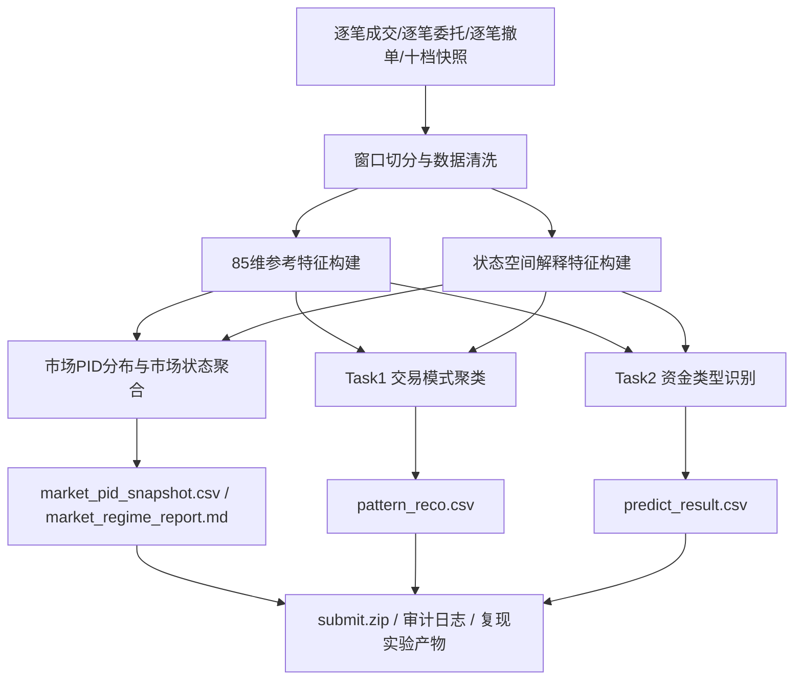

# 天池赛题一：市场参与者交易行为识别与资金流向分析

## 比赛概要设计说明书

**文档版本：** V1.6  
**文档状态：** 修订稿 - 待评审  
**修订日期：** 2026-07-13  
**适用目录：** `E:\2026OPC大赛\自动化交易\比赛设计文档`
**模型依据：** `PID算法与实现.md`、`金融领域的物理学概念模型.md`

---

## 1. 文档定位

### 1.1 设计目标

本概要设计面向天池赛题一“市场参与者交易行为识别与资金流向分析”的比赛交付要求，构建一套**可日终自动运行、可导出标准提交文件、可复现审核**的竞赛系统。

本设计不是单纯的分析原型，而是面向以下交付目标：

1. 每个交易日收盘后，基于当日 Level2 数据自动完成单股分析
2. 输出 `Task 1` 所需的交易模式结果 `pattern_reco.csv`
3. 输出 `Task 2` 所需的参与者类型与资金意图结果 `predict_result.csv`
4. 输出当日全市场 PID 分布快照与市场状态判断结果
5. 支持 `main.py` 一键启动、相对路径读写、可复现实验与代码审核

### 1.2 设计依据

本设计参考以下资料形成：

1. 天池赛题官方信息页  
   `https://tianchi.aliyun.com/competition/entrance/532489/information`
2. 本地赛题背景材料目录  
   `E:\2026OPC大赛\自动化交易\背景知识介绍`
3. 资金类型与 PID 主口径文档  
   `统一资金类型判断规范.md`、`PID算法与实现.md`、`金融领域的物理学概念模型.md`

### 1.3 统一口径说明

为避免规则层、PID 层、Task 输出层对同一概念使用不同字段，本项目统一采用以下口径：

1. 规则层只识别三类行为代理流：`CH_rule / Q_rule / R_seed`。
2. PID 层只负责价格闭合、状态估计与外力贡献计算：
   - 外力贡献来自 `beta_* U_*`
   - 系统响应来自 `phi / theta`
3. `capital_ch / capital_q / capital_retail` 只能表示 PID 外力贡献，不能直接用规则层字段覆盖。
4. `phi / theta` 只用于市场惯性、阻尼、模式与状态诊断，不反解为某一类资金身份。
5. 默认稳健运行模式为 `baseline_4d`：
   - `U_ch = CH_rule`
   - `U_mix = Q_rule + R_seed`
6. 当 5 维输入质量、D 项有效性与可辨识性验证通过后，才进入 `diag_5d / full_5d`：
   - `U_ch = CH_rule`
   - `U_q = Q_rule`
   - `U_retail = R_seed`
7. PID 实现结构固定为“入口选择器 + shared 公共骨架 + 4D 独立文件 + 5D 独立文件”，上层模块统一通过选择入口调用，不直接耦合模式内部实现。
8. 理论时间轴统一采用“交易时间”口径：离散成交量窗口序号或累计成交量进度可视为内部时间 `q`，价格写作 `P_state(q)`。
9. `P_wv_window` 仅作为成交量域窗口诊断价格；实时状态、预测和提交统一使用 `P_state`。
10. `Delta_q P_state` 是观测价格差分，模型预测值单独记为 `y_hat` 或 `v_hat_q`，不得覆盖观测字段。
11. `Delta_q^2 P_state` 与高阶链式法则仅用于离线解释或诊断，不作为默认实时高权重特征。
12. `beta_norm` 与 `m_eff` 必须使用同一 `U_*_mv_ratio` 口径；截断或不确定性过高时不得进入跨股排名。
13. 实时估计使用先验/滤波量；RTS、HP 和全样本平滑只用于离线复盘。

### 1.4 赛题目标解读

根据赛题说明，系统需覆盖两项核心任务：

#### Task 1：交易模式识别

- 基于数据特征聚类出不同的交易模式
- 输出字段：`stock_code / transaction_date / pattern_type / pattern_explanation`
- 评估重心：类内聚合度与类间区分度

#### Task 2：交易模式归类及资金类型识别

- 识别游资、量化、散户三类行为代理资金类型
- 输出资金方向与意图
- 输出字段：`stock_code / transaction_date / capital_type / capital_intention`
- 评估重心：加权 F1 Score

### 1.5 比赛约束

系统必须满足以下约束：

1. 结果必须能够在**当天收盘后**跑出，不允许手工硬编码
2. 项目启动入口必须为 `main.py`
3. 输出文件名和字段顺序必须严格符合赛题要求
4. 代码结构要能与设计文档对应，便于复现审核
5. 数据来源以 Level2 原始逐笔与盘口快照为核心，允许盘后信息用于校验与修正，但不能替代盘中高频行为建模

---

## 2. 总体设计原则

### 2.1 竞赛导向原则

- 优先保证提交结果可产出、可复现、可审核
- 优先建设日终批处理链路，而非盘中高频撮合执行
- 所有输出必须能映射到赛题要求的提交文件

### 2.2 双引擎原则

系统采用“**统计特征引擎 + 可解释状态引擎**”双引擎方案：

1. **统计特征引擎**  
   以赛题提供的 85 个参考特征体系为主体，覆盖订单规模、节奏、撤单、盘口压力、价格发现、价格冲击等维度。
2. **可解释状态引擎**  
   采用参数状态递推、Kalman filter 与严格的实时/离线边界，生成游资冲击、量化供给、阻尼惯性等解释型特征，用于辅助分类、增强可解释性；RTS/HP 仅用于离线复盘。

### 2.3 模块解耦原则

- `Task 1` 与 `Task 2` 在建模上解耦，但共享同一套底层数据和特征
- 市场横截面分析与单股分析共享同一套日级样本，但输出物与评分逻辑独立
- 聚类原型库、分类模型、阈值配置相互独立版本管理
- 提交导出模块与建模模块分离，保证赛题格式升级时改动最小

### 2.4 可降级原则

当原始数据存在缺口时，系统必须显式降级，而不是静默失败：

- 缺少 `order_lifetime_ms` 或等效委托存活时间时，主动成交按金额阈值低置信回退；被动成交若无法恢复 `order_age_minutes`，不得输出高置信散户
- 缺少部分盘口快照时，盘口压力类特征置为缺失并单独记录
- 某些模型未就绪时，可用规则引擎作为短期兜底，但必须写入审计日志
- 零成交窗口、PID 不稳定、运行超预算或任一泄漏检查失败时，必须按预先固定的降级策略处理，不得静默切换。

---

## 3. 系统边界

### 3.1 本系统负责

1. 读取逐笔委托、逐笔成交、逐笔撤单、十档盘口快照及参考特征
2. 进行统一时间窗口切分与特征构建
3. 产出日级交易模式、资金类型、资金意图结果
4. 生成赛题要求的 CSV 提交文件
5. 生成中间诊断结果与复现所需日志

### 3.2 本系统不负责

1. 盘中自动下单执行
2. 微秒级撮合模拟
3. 多市场联动策略
4. 基于人工主观判断的后验打标

---

## 4. 业务架构

### 4.1 总体架构

系统划分为八层：

1. 数据接入层
2. 窗口切分与基础特征层
3. 行为统计特征层
4. 可解释状态估计层
5. 市场横截面聚合层
6. 任务建模层
7. 提交导出层
8. 调度与复现层



### 4.2 模块划分

| 模块 | 名称 | 主要职责 |
|---|---|---|
| M0 | 数据接入模块 | 读取原始逐笔/撤单/盘口快照及参考特征文件 |
| M1 | 窗口特征模块 | 统一时间窗口、构建基础聚合特征与 85 维参考特征 |
| M2 | 状态解释模块 | 运行状态空间模型，输出解释型动态特征 |
| M3 | 市场状态模块 | 聚合全市场上涨/下跌家数、市场 PID 分布与市场状态标签 |
| M4 | 交易模式模块 | 生成交易模式聚类结果与模式解释 |
| M5 | 参与者识别模块 | 识别 `capital_type` 与 `capital_intention` |
| M6 | 结果导出模块 | 生成 `pattern_reco.csv`、`predict_result.csv`、市场状态文件与 `submit.zip` |
| M7 | 调度复现模块 | 提供 `main.py` 入口、批处理、日志、版本与配置管理 |

---

## 5. 数据与特征设计

### 5.1 原始输入

系统面向四类核心原始数据：

1. 逐笔成交
2. 逐笔委托
3. 逐笔撤单
4. 十档盘口快照

此外允许读取赛题背景材料中定义的参考特征集，作为快速建模输入或对照基准。

在正式编码前，必须先完成一次**数据 schema 探针验证**，输出以下结论：

1. 四类原始数据的真实文件格式与命名规则
2. 字段命名是否与设计契约一致
3. `order_lifetime_ms` 是否真实可得
4. 85 维参考特征是赛题直接提供还是需要本地重算
5. 十档盘口快照是否能稳定映射为订单簿压力与价格发现特征

### 5.2 时间窗口设计

比赛主流程采用**固定 48 个 5 分钟窗口**作为统一观测粒度，同时补充两个派生聚合窗口：

这些窗口除了服务于工程聚合，也承担离散交易时间 `q` 的采样作用。后续所有窗口级价格变化、惯性延续与阻尼修正，默认都解释为相邻交易时间步之间的变化，而不是把自然时钟秒数直接代入理论主方程。

1. 开盘 30 分钟窗口
2. 收盘前 10 分钟窗口

设计理由：

- 与现有状态空间设计保持一致
- 适合构建日内时序特征
- 便于 Task 1 中做时序聚类
- 可兼容赛题背景资料中对窗口依赖特征的定义

窗口配置必须同时冻结 `q_type`、`delta_q`、`zero_trade_policy` 和
`submission_requires_complete_windows`。默认采用 `q_type = window_index`、
`delta_q = 1`；零成交窗口不得读取未来窗口数据补值。

### 5.3 特征分层

系统特征分为四层：

#### 第一层：参考行为特征

优先纳入赛题背景资料的 85 维参考特征，重点包括：

- 订单与成交统计
- 订单规模分布
- 订单节奏与拆分
- 撤单行为
- 主动买卖特征
- 订单簿压力
- 价格发现
- 价格冲击

#### 第二层：解释型动态特征

继承现有状态空间设计中的解释型特征：

- 规则层三类流：`CH_rule / Q_rule / R_seed`
- 状态参数：`phi / theta / beta_ch / beta_q / beta_mix / beta_retail`
- 一级 PID 贡献：`c_p / c_i / c_d / eps`
- 外力贡献：`capital_ch / capital_q / capital_retail`
- 观测/预测字段：`y_observed / y_hat_next / v_q_observed / v_hat_q_next`
- 诊断指标：`noise_ratio / explain_ratio / capital_anchor_error / rule_error_q / rule_error_retail`
  `price_basis_error_ratio / closure_impl_error / model_residual`
- 稳定性与审计：`param_stability_flag / m_eff_uncertainty_flag / m_eff_rank_eligible`
  `data_leakage_check / code_build_hash`

#### 第三层：日级摘要特征

对窗口级特征做日级聚合，形成用于 Task 1/Task 2 的统一样本向量：

- 均值 / 中位数 / 分位数
- 开盘段、上午、下午、尾盘分段统计
- 峰值时间位置
- 连续性、单边性、反转性、爆发性

#### 第四层：市场横截面特征

基于当日全市场全部股票的日级样本，构造市场级先验：

- 上涨家数 / 下跌家数比值 `ADR`
- 市场广度 `Breadth = (上涨家数 - 下跌家数) / (上涨家数 + 下跌家数)`
- 市场 PID 横截面分布：`P / I / D` 的均值、中位数、标准差、分位数
- 市场风格占比：游资 / 量化、吸筹 / 出货 / 尾盘突袭 / 高撤单试盘等模式占比
- 市场分歧度、尾盘强化占比、高撤单占比、高冲击占比

### 5.4 市场 PID 设计

口径补充：

1. 市场 PID 是单股票窗口级结果的横截面聚合层，不替代单股 PID。
2. 当个股 PID 结果可用时，优先使用个股 `c_p / c_i / c_d` 与相关诊断字段参与市场聚合。
3. `phi / theta / beta_*` 属于个股状态参数，可作为市场 diagnostics 或相对市场解释特征，但不直接替代市场 P/I/D 主聚合口径。
4. 任何市场层输出都不得把 `Q_rule / R_seed` 直接当作 `capital_q / capital_retail`。
5. 市场聚合只使用通过时序、稳定性和泄漏检查的结果；`offline_smooth` 结果不得进入实时或提交口径。

系统将市场视为一个聚合状态体，在收盘后对全市场横截面估计市场 PID 参数分布：

- **市场 P**：市场推动强度，重点反映净买方向、上涨广度、强势模式占比
- **市场 I**：市场延续性，重点反映窗口间方向持续性、趋势惯性
- **市场 D**：市场阻尼与分歧，重点反映高撤单、冲高回落、分布离散度

市场 PID 的用途包括：

1. 输出市场当日状态标签，如 `强趋势上行 / 震荡中性 / 风险偏好退潮`
2. 作为单股分析的市场先验，而不是替代单股模型
3. 为个股生成相对市场偏离指标：`P_rel / I_rel / D_rel`

个股趋势判断不只依赖个股绝对 PID，还要结合：

- `P_stock` 相对市场分布所处位置
- `I_stock` 相对市场延续性的偏强或偏弱
- `D_stock` 相对市场阻尼的偏高或偏低

---

## 6. Task 1 交易模式识别设计

### 6.1 任务目标

对每只股票每个交易日输出：

- `pattern_type`
- `pattern_explanation`

### 6.2 设计思路

采用“**离线发现 + 在线归类**”两阶段方案：

1. **离线发现阶段**
   - 使用历史 stock-day 样本做交易模式聚类
   - 综合时序形态、行为结构、尾盘特征、撤单风格等构建模式原型库
2. **在线归类阶段**
   - 对当日样本计算到原型库的相似度
   - 分配最近模式标签
   - 基于关键窗口与主导特征生成 `pattern_explanation`

为降低聚类不稳定风险，Task 1 增加两层稳态约束：

1. **原型稳定性约束**  
   仅当某一模式在滚动样本上连续出现且簇内统计稳定时，才允许进入正式原型库。
2. **低置信回退约束**  
   当最近原型距离差不足、样本质量过低或模式解释冲突时，回退到规则型模式判定器。

### 6.3 距离设计

为贴近赛题评估方式，Task 1 距离函数采用融合形式：

$$
D = w_1 \cdot D_{DTW} + w_2 \cdot D_{Wasserstein} + w_3 \cdot D_{summary}
$$

其中：

- `D_DTW`：衡量窗口级时序形态差异
- `D_Wasserstein`：衡量分布型特征差异
- `D_summary`：衡量日级摘要特征差异

### 6.4 模式标签体系

首版模式标签采用可扩展字典，不在代码中写死股票级规则。建议首版候选包括：

- 大单吸筹
- 日内套利
- 尾盘突袭
- 震荡对倒
- 单边拉升
- 单边出货
- 量化做市
- 高撤单试盘

最终标签库由离线聚类结果与人工审核共同固化。

---

## 7. Task 2 资金类型与意图识别设计

### 7.1 输出目标

对每只股票每个交易日输出：

- `capital_type`
- `capital_intention`

### 7.2 参与者类型设计

系统统一输出三类行为代理资金类型：

1. 游资
2. 量化
3. 散户

本系统采用“**规则层种子 + PID 外力贡献 + 分类模型校验**”三段式方案：

1. 按 `统一资金类型判断规范.md` 生成 `CH_rule / Q_rule / R_seed`
2. 按 `PID算法与实现.md` 用 `beta_* U_*` 计算 `capital_ch / capital_q / capital_retail`
3. 用参考特征、状态解释特征和分类模型对异常结果做一致性校验与置信度修正

输出边界：

- `capital_type` 的主口径优先来自 `capital_ch / capital_q / capital_retail` 的外力贡献主导项。
- `Q_rule / R_seed` 不能直接覆写为 `capital_q / capital_retail`。
- `rule_base` 模式只能输出低置信规则近似值，并设置 `is_structural_output = false`。
- 若 4 维混合输入存在高强度符号冲突，输出 `capital_type = mixed` 或 `unknown`，不得用诊断分摊强行判为量化/散户。

### 7.3 资金意图设计

`capital_intention` 设计为可配置标签空间，首版建议支持：

- 买入
- 卖出
- 中性
- T0交易
- 吸筹
- 试盘
- 拉升
- 出货
- 对倒
- 做市

其中：

- 面向提交文件时，输出标签必须与当前训练标签空间一致
- 若赛题阶段只需要较粗标签，可通过配置映射压缩为 `买入/卖出/T0交易/中性`

### 7.4 置信度与熔断

当以下场景发生时，结果进入低置信或回退态：

1. Level2 数据缺失严重
2. 十档盘口快照不足
3. `order_lifetime_ms` 或等效委托存活时间缺失导致被动成交量化/散户拆分降置信
4. 聚类距离不显著，最近原型分数差过小
5. 参与者类型与解释型信号强冲突
6. PID 联合稳定性检查失败、`m_eff` 截断或置信区间过宽
7. `feature_engineering_leakage_check`、`rule_layer_leakage_check` 或 `data_leakage_check` 失败

---

## 8. 提交文件与交付设计

### 8.1 标准输出文件

系统每天至少生成两个文件：

#### `pattern_reco.csv`

字段固定为：

1. `stock_code`
2. `transaction_date`
3. `pattern_type`
4. `pattern_explanation`

#### `predict_result.csv`

字段固定为：

1. `stock_code`
2. `transaction_date`
3. `capital_type`
4. `capital_intention`

### 8.3 市场状态输出文件

除比赛提交文件外，系统增加两个内部分析产物：

#### `market_pid_snapshot.csv`

字段建议至少包含：

1. `trade_date`
2. `up_count`
3. `down_count`
4. `breadth_ratio`
5. `breadth_balance`
6. `p_mean / p_median / p_std`
7. `i_mean / i_median / i_std`
8. `d_mean / d_median / d_std`
9. `market_regime`

#### `market_regime_report.md`

用于输出：

- 当日市场广度判断
- 市场 PID 分布摘要
- 市场风格占比

内部诊断文件建议增加：

1. `pid_window_diag.csv`：窗口级观测/预测、PID 贡献、双域映射、稳定性和泄漏字段
2. `pid_daily_diag.csv`：日级配置快照、模型版本、运行预算、构建哈希和提交阻断原因

诊断文件与比赛提交文件分离，不能用诊断字段替换赛题规定的正式字段。
- 市场状态解释文本
- 个股相对市场强弱分析说明模板

### 8.4 启动入口

项目运行入口固定为：

`main.py`

标准行为：

1. 读取配置
2. 加载指定日期的数据
3. 执行 Task 1 和 Task 2
4. 写出两个 CSV
5. 可选打包 `submit.zip`

### 8.5 目录约束

首版建议项目目录结构如下：

```text
project_solution/
  main.py
  init_env.sh
  configs/
  data/
  src/
  outputs/
    pattern_reco.csv
    predict_result.csv
  reports/
  logs/
```

---

## 9. 工程与调度设计

### 9.1 日终计划任务

建议每日计划任务如下：

1. `15:05` - 数据完整性检查
2. `15:10` - 原始数据装载与窗口切分
3. `15:20` - 参考特征与解释特征构建
4. `15:35` - Task 1 聚类归类
5. `15:45` - Task 2 参与者识别与意图识别
6. `15:55` - 生成提交文件与日志
7. `16:00` - 人工抽检与二次提交窗口准备

### 9.2 性能目标

性能目标采用“两阶段口径”，避免首版目标过于激进：

| 指标 | 基线版目标 | 优化版目标 |
|---|---|---|
| 单股单日全流程 | < 1.0 秒 | < 0.5 秒 |
| 5000 股全市场日终批处理 | < 35 分钟 | < 20 分钟 |
| 市场 PID 聚合与状态报告 | < 2 分钟 | < 1 分钟 |
| 提交文件生成 | < 30 秒 | < 15 秒 |
| 重跑指定单日结果 | < 15 分钟 | < 10 分钟 |

说明：

- **基线版目标**用于保证“先能提交、再优化”
- **优化版目标**用于冲击更高稳定性和更快复跑速度
- 若原始 Level2 数据为文本格式且需全量重算 85 维特征，首版默认按基线版目标验收
- PID 单窗口计算必须记录 `compute_budget_ms`；超预算时按固定回退策略处理，不得调用离线平滑追赶时延。

### 9.3 可复现要求

系统必须保留以下内容：

- 运行配置快照
- 特征版本号
- 模型版本号
- 聚类原型库版本号
- 市场 PID 口径版本号
- 当日数据缺失与降级日志
- 输出文件 md5
- `q_type`、`zero_trade_policy`、`u_source_type`
- `estimator_method`、`m_slow_method`、`lookback_days`
- `normalization_fit_cutoff`
- `data_leakage_check` 及其分项结果
- `code_build_hash`

---

## 10. 风险与闭环项

### 10.1 当前关键风险

1. 十档盘口快照字段契约尚未在现有设计中完全落地
2. 交易模式标签体系需要结合历史样本固化
3. 资金意图标签空间需根据样例集进一步校正
4. `order_lifetime_ms` 可得性仍需真实数据验证
5. Task 1 的聚类稳定性需通过多日样本回测确认
6. 市场 PID 与个股 PID 的统一尺度仍需通过真实样例校准
7. 首版开发周期偏紧，需避免在聚类调参阶段挤压测试时间
8. 规则层三类流与 PID 外力贡献字段若混用，会造成 Task 2 标签口径漂移
9. 观测字段与预测字段混用，会导致回测指标和提交时序失真
10. `P_wv_window`、`P_state` 和 `q_type` 口径不一致，会导致跨股比较失真
11. `m_eff` 截断或不确定性未隔离，会导致无效质地排名

### 10.2 编码前必须闭环

1. 明确四类原始数据文件结构
2. 明确参考特征是“直接读取”还是“本地重算”
3. 明确 Task 1 模式字典初始版本
4. 明确 Task 2 标签字典与映射规则
5. 明确输出 CSV 字段检查器
6. 形成首份 `schema_probe_report`
7. 确定基线版优先级：先交付 `predict_result.csv`，再强化 `pattern_reco.csv`
8. 明确市场上涨/下跌家数口径与停牌、ST、上市未满 60 日样本是否剔除
9. 冻结 `q_type`、零成交策略、实时滤波方法、`lookback_days` 和泄漏检查字段
10. 明确 `y_observed / y_hat_next / v_q_observed / v_hat_q_next` 的字段边界

### 10.3 风险闭环策略

针对当前风险，采用以下闭环策略：

| 风险 | 闭环动作 | 交付物 |
|---|---|---|
| 数据 schema 不确定 | 先做数据探针和字段映射实验 | `schema_probe_report.md` |
| 聚类稳定性不足 | 先上简单聚类基线，再迭代 HDBSCAN/KMedoids 原型库 | `pattern_stability_report.md` |
| 市场 PID 尺度不稳定 | 先按当日横截面分位数做标准化，再补充分层市场基线 | `market_pid_validation_report.md` |
| 开发周期偏紧 | 采用“基线优先”里程碑，先保提交能力 | `milestone_burnup.md` |
| 性能目标偏乐观 | 先按基线版目标验收，再做并行与向量化优化 | `performance_baseline_report.md` |
| 规则/PID 字段混用 | 明确规则流、一级贡献、外力贡献三层字段边界 | `state_feature_contract.md` |
| 时序或特征泄漏 | 固定截止时间、标准化拟合边界、规则层白名单并执行未来数据注入测试 | `pid_daily_diag.csv`、`leakage_audit_report.md` |
| PID 不稳定或等效质量不确定 | 执行特征根/Jury、截断标记、置信区间和固定回退 | `pid_window_diag.csv`、`pid_stability_report.md` |

---

## 11. 与现有设计文档关系

本比赛概要设计与现有目录 `E:\2026OPC大赛\自动化交易\设计文档` 的关系如下：

1. 现有“参数状态辨识与 Kalman filter”设计继续保留，定位为**解释型子引擎**；
   RTS/HP 平滑仅用于离线复盘，不得进入实时预测或比赛提交
2. 本文档新增的核心能力是：
   - Task 1 交易模式聚类
   - Task 2 比赛提交口径
   - 市场 PID 横截面聚合与市场状态识别
   - main.py 与提交文件导出
   - 十档盘口、撤单与 85 维参考特征的竞赛化集成

换言之，旧设计可复用，但不能直接替代比赛系统设计。

---

## 12. 修订记录

| 版本 | 日期 | 说明 |
|---|---|---|
| V1.0 | 2026-07-06 | 基于天池赛题要求、背景知识材料和现有分析系统文档，重构比赛导向概要设计 |
| V1.1 | 2026-07-06 | 参考可行性分析补充 schema 探针、Task 1 稳态约束、分阶段性能目标与风险闭环策略 |
| V1.2 | 2026-07-06 | 新增市场 PID 横截面聚合层、市场状态输出文件、个股相对市场 PID 偏离设计与对应风险闭环 |
| V1.3 | 2026-07-10 | 对齐统一资金类型与 PID 外力贡献口径，将 Task 2 明确为游资/量化/散户三类行为代理识别 |
| V1.4 | 2026-07-10 | 将三类资金贡献口径修正为 `beta_* U_*` 外力贡献，`phi / theta` 仅作为系统响应诊断 |
| V1.5 | 2026-07-11 | 补充统一口径说明，明确 `baseline_4d / diag_5d / full_5d` 边界与市场 PID 聚合口径 |
| V1.6 | 2026-07-13 | 对齐 PID 与金融物理模型最新口径，补充观测/预测分离、双域诊断、稳定性回退、泄漏审计和运行预算约束 |
