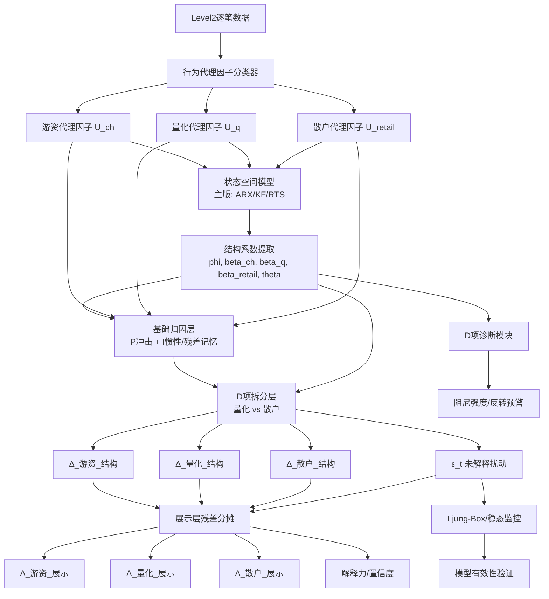

基于状态空间辨识的三类行为代理因子贡献度拆解算法

算法设计说明书

文档版本：1.1

文档状态：正式版本（唯一有效版本）

1. 引言

1.1 文档目的

本说明书定义一套面向比赛系统的三类行为代理因子贡献度拆解算法，将股价变动  \Delta P_t  分解为：

- 游资行为代理因子的结构性解释贡献
- 量化行为代理因子的结构性解释贡献
- 散户行为代理因子的结构性解释贡献
- 当期未解释扰动  \varepsilon_t

该算法定位为比赛系统中的解释型状态引擎，用于：

1. 为 Task 2 提供资金主导与方向判断的解释特征
2. 为 Task 1 提供模式解释素材
3. 为市场状态分析提供 P / I / D 结构特征与噪声置信度

1.2 设计定位

本算法不是“真实账户级资金归因器”，而是“基于高频行为代理变量的结构解释引擎”。为避免歧义，文档统一采用以下术语：

- 游资 / 量化 / 散户：均指行为代理因子，而非真实账户标签
- P / I / D：首先表示订单对价格形成的作用类型，而非账户身份标签
- 结构贡献：指模型对价格变动的可解释部分
- 展示贡献：指为满足业务闭合展示需要，在结构贡献基础上加入残差分摊后的工程口径

补充约定如下：

1. 同一类资金主体在不同窗口、不同订单上，可以分别起到 P、I、D 中不同的作用
2. 即使是机构、量化或游资账户，只要该笔订单的市场效果体现为情绪加速、追涨杀跌、托盘压盘或反向阻尼，也应归入相应的 I 或 D 作用解释
3. 因此，本系统识别的是“行为作用层贡献”，不是“账户身份证明”

1.3 系统原理假设

本系统从控制论视角提出以下基本假设：

1. 当日收盘价是该交易日价格系统的终局平衡点，而非外部预先给定的目标值
2. 盘中出现的价格变化、订单冲击、阻尼回补与情绪反转，均可视为系统向终局收盘点位收敛的调节过程
3. 因而系统在终局时刻满足稳态误差为零：

\[
e_{ss} = 0
\]

4. 盘中任意窗口允许存在瞬时偏离，但这些偏离不被视为永久不可解释噪声，而被视为系统尚在吸收的暂态项

上述假设构成了本系统区别于传统 ARIMA 或随机游走建模的理论前提。

1.4 核心设计原则

| 原则 | 说明 |
| --- | --- |
| 分层解耦 | 结构识别层、建模归因层、展示层、诊断层严格分离，避免统计识别与业务展示相互污染 |
| 惯性项吸收历史残差 | 建模层中的  \(\phi_t\) 解释为惯性/自回归延续项，上一期未解释偏离  \(\varepsilon_{t-1}\)  作为积分记忆项进入 I 环节 |
| 作用优先于身份 | P / I / D 的定义按订单对价格的作用划分，不按真实账户身份划分 |
| D项服务于量化/散户拆分 | 微分环节（D）主要承载价格变化率、反转速度与盘口阻尼作用，并作为量化与散户拆分的关键阀门进入第二层归因 |
| 区分建模口径与展示口径 | 建模层保留未解释扰动  \(\varepsilon_t\)；展示层仅为业务展示执行统一残差分摊 |
| 先可验证再增强 | 先保证分类器可运行、状态模型可辨识、输出可解释，再考虑更复杂的 D 项参与式扩展 |

2. 核心逻辑架构

2.1 理论总模型

从理论层面看，本系统并不优先追问“谁下了单”，而是优先识别“该订单对价格产生了什么作用”。

定义当期价格净变化满足：

\[
\Delta_t = \Delta_{P,t} + \Delta_{I,t} + \Delta_{D,t}
\]

其中：

-  \( P \) ：正常推动股价变化的比例因子，表示顺势推进、方向确认与价格推动作用，主要由“量化 + 游资”这组行为承载
-  \( I \) ：情绪化因子，表示情绪放大、加速逼近目标价位的作用，主要由“游资 + 散户”这组行为承载
-  \( D \) ：反向滞后因子、惯性因子或阻尼因子，表示抄底逃顶、托盘压盘、回补均值与反向压制等作用，主要由“量化 + 散户”这组行为承载

据此定义三组作用联盟流：

\[
Z_{P,t} = U_{q,t} + U_{ch,t}
\]

\[
Z_{I,t} = U_{retail,t} + U_{ch,t}
\]

\[
Z_{D,t} = U_{q,t} + U_{retail,t}
\]

并定义理论层贡献：

\[
\Delta_{P,t} = P_t \cdot Z_{P,t-1}
\]

\[
\Delta_{I,t} = I_t \cdot Z_{I,t-1}
\]

\[
\Delta_{D,t} = D_t \cdot Z_{D,t-1}
\]

于是：

\[
\Delta_t = P_t Z_{P,t-1} + I_t Z_{I,t-1} + D_t Z_{D,t-1}
\]

该理论模型的核心含义如下：

1. P、I、D 是作用分类，不是账户分类
2. “量化 + 游资”“游资 + 散户”“量化 + 散户”是三组作用联盟，不是三类真实账户合并
3. 同一主体的不同订单，可以在不同时间分别落入 P、I、D 的不同作用解释
4. 当  \(C_{P,t}, C_{I,t}, C_{D,t}\)  已经计算出来时，可以反解三类行为代理贡献；该反解结果是资金解释与主导判定的主口径

示例如下：

- 即使是机构单，只要它推动价格加速奔向目标位，就可解释为 I 作用
- 即使是游资单，只要它顺势推进价格而非情绪反转，就可解释为 P 作用
- 即使是量化单，只要它承担托盘压盘、均值回归、阻尼回补，就可解释为 D 作用

2.2 当前工程模型与理论模型的关系

当前 1.1 版本并不直接以 3 个总系数 \(P_t, I_t, D_t\) 构成最小参数模型，而是将理论总模型展开为一套更便于工程落地和状态辨识的实现模型。

两者关系如下：

1. 理论层给出的是“P / I / D 三种作用”
2. 工程层先从 Level2 中抽取三类行为代理流  \(U_{ch}, U_q, U_{retail}\)
3. 再通过状态空间模型估计  \(\phi_t, \beta_{ch,t}, \beta_{q,t}, \beta_{retail,t}, \theta_t\)
4. 最后把这些工程系数重新映射回 P / I / D 的解释框架

两层之间的对应关系可概括为：

-  \(\beta_{ch}, \beta_q, \beta_{retail}\)  是三类代理流对价格的基础加载系数
-  \(\phi_t\)  更接近理论层中的 I 类延续/加速作用
-  \(\theta_t\)  更接近理论层中的 D 类阻尼/反向滞后作用
- P 类作用主要由“顺势冲击项 + 基础推进项”共同体现

因此，当前系统与“P总 + I总 + D总”的理论框架保持一致，只是在实现层面采用了展开式表达，而非直接估计 3 个总系数。

2.2.1 三组关联反解逻辑

根据三组作用联盟关系：

\[
C_{P,t} = Q_t + CH_t
\]

\[
C_{I,t} = CH_t + R_t
\]

\[
C_{D,t} = Q_t + R_t
\]

其中：

-  \(CH_t\)：游资行为代理贡献
-  \(Q_t\)：量化行为代理贡献
-  \(R_t\)：散户行为代理贡献

该线性方程组满秩，可唯一反解：

\[
CH_t = \frac{C_{P,t} + C_{I,t} - C_{D,t}}{2}
\]

\[
Q_t = \frac{C_{P,t} + C_{D,t} - C_{I,t}}{2}
\]

\[
R_t = \frac{C_{I,t} + C_{D,t} - C_{P,t}}{2}
\]

这组三类贡献是后续资金趋势判断的主依据。其解释口径如下：

1. 公式不区分买入公式和卖出公式，买入/卖出只由反解结果的符号表达
2. 正值表示该类行为代理在当前窗口体现为净买入、拉升、托举或顺势推动
3. 负值表示该类行为代理在当前窗口体现为净卖出、压制、出货或反向对冲
4. 绝对值表示该类行为代理在当前窗口中的解释强度
5. 三者加总满足：

\[
CH_t + Q_t + R_t = \frac{C_{P,t}+C_{I,t}+C_{D,t}}{2}
\]

由于每个 PID 联盟都由两类行为代理共同构成，三类反解贡献的加总不是直接等于  \(\Delta P_t\) ，而是联盟重叠口径下的行为代理强度。用于价格闭合时，仍以  \(C_{P,t}+C_{I,t}+C_{D,t}+\varepsilon_t\)  为准。

工程处理逻辑：

1. 大额主动买入或主动卖出的订单优先作为游资强锚点，形成  \(\widehat{CH}_t\)
2. 小额买入/卖出、被动买入/卖出、盘口回补和高频挂撤行为进入“量化 + 散户”混合池，形成  \(\widehat{M}_{qr,t}\)
3. 系统计算一级 PID 贡献  \(C_P/C_I/C_D\)
4. 使用  \(\widehat{M}_{qr,t}\)  与三组关联公式拆分  \(Q_t/R_t\)
5. 使用  \(\widehat{CH}_t\)  校验反解出的游资贡献是否可信
6. 最后结合游资强锚点、混合池规模、噪声比和展示偏离判断资金趋势置信度

2.3 算法总览



2.4 层次定义

| 层级 | 名称 | 输入 | 输出 | 用途 |
| --- | --- | --- | --- | --- |
| 第1层 | 行为代理因子分类器 | Level2逐笔数据 | \(U_{ch}, U_q, U_{retail}\) | 将订单流映射为三类行为代理变量 |
| 第2层 | 结构系数识别 | \(\Delta P, U_{ch}, U_q, U_{retail}\) | \(\beta_{ch}, \beta_q, \beta_{retail}, \phi, \theta\) | 提取时变结构系数与诊断特征 |
| 第3层 | 基础归因层 | 结构系数 + 行为代理因子 + \(\varepsilon_{t-1}\) | \(\Delta_{ch}^{base}, \Delta_q^{base}, \Delta_{retail}^{base}\) | 基于 P 冲击、I 惯性与残差记忆形成第一版贡献 |
| 第4层 | D项拆分层 | 基础归因结果 + \(\theta + D\_driver_t\) | \(\Delta_{ch}^{结构}, \Delta_q^{结构}, \Delta_{retail}^{结构}, \varepsilon_t\) | 使用 D 项增强量化与散户拆分 |
| 第5层 | 展示层归一化 | 建模层结果 | \(\Delta_{ch}^{展示}, \Delta_q^{展示}, \Delta_{retail}^{展示}, confidence\) | 形成业务展示口径并输出置信度 |
| 第6层 | 诊断层 | \(\theta, \varepsilon, explain\_ratio\) | 阻尼标签、混沌标签、熔断建议 | 形成风险判断与解释辅助 |

2.5 版本模式

为降低实现风险，文档定义以下两种实现模式：

| 模式 | 说明 | 使用时机 |
| --- | --- | --- |
| 主版（1.1版本） | D项只进入量化/散户拆分层，不直接主导游资归因 | 当前实现版本，强调区分量化与散户 |
| 扩展版（后续版本） | D项全面进入三类归因，并允许更复杂的行为系数 | 在完成可辨识性报告与对照实验后评估 |

说明：前序讨论已经明确，D 项的核心价值在于增强量化与散户的区分，而非仅作为旁观式诊断指标。因此，1.1 版本将 D 项限定在第二层拆分中使用，而不直接扩展到整套主归因。

2.6 1.1版本范围边界

为保证 1.1 版本能够稳定实现并满足比赛交付要求，本文明确以下范围边界：

1. 1.1 版本的目标是构建“行为作用层解释引擎”，而不是构建真实账户穿透级归因系统
2. 1.1 版本的目标是形成稳定、可闭合、可解释的窗口级与日终级输出，而不是追求所有细粒度交易意图的完全识别
3. 1.1 版本允许保留建模层未解释扰动  \(\varepsilon_t\) ，并在展示层执行统一分摊；这不视为理论缺陷，而是工程口径与建模口径分离的体现

1.1 版本明确不作为目标的事项包括：

- 不直接识别真实机构账户、真实游资席位或真实散户账户
- 不单独输出 `吸筹`、`试盘`、`对倒` 等更细粒度意图标签
- 不在本模块内部完成市场级横截面 PID 聚合
- 不将挂单生命周期字段作为 1.1 版本上线前提
- 不在 1.1 版本阶段追求 D 项全面耦合进入三类主归因公式

3. 第1层：行为代理因子分类器

3.1 分类目标

基于 Level2 逐笔成交、委托、撤单与盘口信息，构建三类行为代理流：

- 游资代理流：大额、快速、主动冲击价格的订单流
- 量化代理流：小额、高频、偏流动性供给或均值回归风格的订单流
- 散户代理流：零散、跟风、方向情绪化的订单流

1.1 版本的实际识别优先级为：

1. 先强识别游资代理流：大额主动买入、大额主动卖出、多档穿越和短时价格冲击
2. 再构造“量化 + 散户”混合池：被动成交、小额成交、盘口回补和高频挂撤行为
3. 量化与散户不完全依赖规则分类直接拆开，而是主要通过第 2.2.1 节的三组关联方程从  \(C_P/C_I/C_D\)  中反解
4. 若 Level2 字段足够丰富，可额外生成量化/散户种子流，用于验证和置信度增强，但不作为 1.1 版本主判定的唯一依据

3.2 分类规则（1.1版本）

1.1 版本分类器以“成交行为 + 盘口行为 + 撤单行为”为主，不将挂单存活时间设为硬依赖。

| 代理因子 | 筛选规则 | 资金变量 | 市场行为特征 |
| --- | --- | --- | --- |
| 游资代理因子 | 大额主动成交 + 明显穿越买一/卖一多档 + 短时价格冲击显著 | \(U_{ch,t}\) | 大额快速吃单，意图改变价格 |
| 量化+散户混合池 | 被动成交 + 小额成交 + 盘口回补 + 高频挂撤或零散跟风 | \(U_{mix,t}\) | 非游资强冲击的剩余主要行为池 |
| 量化种子代理因子 | 小额高频成交 + 高频撤单/回补 + 盘口恢复快 + 净方向性弱 | \(U_{q,t}^{seed}\) | 用于辅助验证量化反解结果 |
| 散户种子代理因子 | 零散小单 + 跟风追价 + 撤单组织性弱 + 无明显盘口修复特征 | \(U_{retail,t}^{seed}\) | 用于辅助验证散户反解结果 |

1.1 版本默认阈值建议：

- 大额主动成交阈值：单笔成交额 >= 50 万元
- 小额成交阈值：单笔成交额 < 10 万元
- 多档穿越阈值：相对买一/卖一穿越 >= 2 档
- 高频撤单/回补阈值：按个股历史分布或当日分位数标定

3.3 挂单时间字段的定位

若 Level2 数据能够恢复 `order_lifetime_ms` 或等效订单生命周期字段，可将其作为增强特征使用，但这不是 1.1 版本分类器的必要条件。

可选增强方式：

1. 游资增强：大额主动成交且生命周期极短，可提高游资置信度
2. 量化增强：小额高频挂撤且生命周期较长，可提高量化置信度
3. 散户增强：零散小单且生命周期无组织性，可提高散户置信度

说明：编码前仍需完成数据 schema 探针，但其目标已从“确认是否必须依赖挂单时间”调整为“确认可使用的增强特征，并验证在不含挂单时间时 1.1 版本模型的精度”。

3.4 建议增强维度

为提升分类器区分度，后续可增加以下特征：

- 金额分位数：相对个股历史成交额分位数，而非绝对金额
- 时间分位数：若可恢复生命周期，则使用订单存活时间在该股历史分布中的位置
- 行为维度：主动/被动、撤单率、拆单一致性、持续性
- 盘口维度：价差穿越、档位偏离、订单簿压力恢复速度

3.5 窗口聚合公式

对每个 5 分钟窗口，三类代理因子的净额计算为：

U_{ch,t} = \sum_{i \in \text{游资订单}_t} (\text{主动买入}_i - \text{主动卖出}_i)

U_{mix,t} = \sum_{i \in \text{非游资混合池订单}_t} (\text{买入方向金额}_i - \text{卖出方向金额}_i)

若可生成辅助种子流，则额外计算：

U_{q,t}^{seed} = \sum_{i \in \text{量化种子订单}_t} (\text{买入方向金额}_i - \text{卖出方向金额}_i)

U_{retail,t}^{seed} = \sum_{i \in \text{散户种子订单}_t} (\text{买入方向金额}_i - \text{卖出方向金额}_i)

说明：

1.  \(U_{ch,t}\)  是强锚点，优先来自大额主动买入/卖出
2.  \(U_{mix,t}\)  是量化与散户共同构成的混合池，不在分类器层强行拆分
3.  \(U_q^{seed}\)  与  \(U_{retail}^{seed}\)  只用于校验反解结果和置信度，不作为最终资金数值的主来源

3.5.1 规则锚点统计口径

为配合后续三组关联方程求解，分类器层必须输出两个规则统计量：

1. 游资强锚点  \(\widehat{CH}_t\)
2. 量化+散户混合池  \(\widehat{M}_{qr,t}\)

定义大额主动成交集合：

\[
\mathcal{A}_{ch,t} =
\{i \mid amount_i \ge A_{large},\ active_i=1,\ cross\_level_i \ge L_{cross}\}
\]

其中  \(A_{large}\)  默认 50 万元， \(L_{cross}\)  默认 2 档。

游资强锚点按有符号净额统计：

\[
\widehat{CH}_t =
\sum_{i \in \mathcal{A}_{ch,t}}
side_i \cdot amount_i
\]

其中  \(side_i=+1\)  表示主动买入， \(side_i=-1\)  表示主动卖出。

定义非游资混合池集合：

\[
\mathcal{M}_{qr,t} =
\{i \mid i \notin \mathcal{A}_{ch,t},\ (amount_i < A_{large}) \lor (active_i=0)\}
\]

量化+散户混合池按有符号净额统计：

\[
\widehat{M}_{qr,t} =
\sum_{i \in \mathcal{M}_{qr,t}}
side_i^{eff} \cdot amount_i
\]

其中：

- 对主动成交， \(side_i^{eff}\)  直接取主动买入/主动卖出方向
- 对被动成交， \(side_i^{eff}\)  可按成交价相对盘口、tick rule 或盘口压力变化恢复方向
- 若被动方向不可恢复，该笔只进入混合池规模统计，不进入有符号净额，并降低置信度

该统计口径的含义是：

1. 大额主动买入/卖出直接锚定游资方向与强度
2. 小额买入/卖出和被动买入/卖出不直接区分量化与散户，先合并为  \(\widehat{M}_{qr,t}\)
3. 后续通过三组关联方程从  \(\widehat{M}_{qr,t}\)  中拆出  \(Q_t\)  与  \(R_t\)

预处理：所有  U  序列在进入模型前执行：

1. 1% 缩尾
2. 缺失值补零
3. EWMA 自适应标准化（半衰期  \tau  默认 20 日）

3.6 编码前待确认项

正式编码前，应完成以下最小确认集：

1. Level2 数据 schema 探针  
   目标：确认逐笔成交、委托、撤单、盘口快照字段是否完整，确认是否可恢复增强特征
2. 代理流可计算性验证  
   目标：确认 `U_ch / U_mix` 在单股单日 48 窗口下可稳定生成，且不存在大面积空窗；`U_q_seed / U_retail_seed` 作为可选增强验证
3. 阈值初值回放  
   目标：验证 `50万 / 10万 / 2档穿越` 这组 1.1 版本初值是否具有基本区分度
4. 状态模型可辨识性预检  
   目标：确认 `phi / beta / theta` 的 1.1 版本状态结构在样本上可稳定收敛

若上述任一项无法满足，应先回退并修正输入定义，再进入实现阶段。

4. 第2层：结构系数识别

4.1 状态向量

1.1 版本状态向量定义为：

规则锚定主流程：

\[
\psi_t^{anchor} = [\phi_t,\ \beta_{ch,t},\ \beta_{mix,t},\ \theta_t]^T
\]

种子流扩展流程：

\psi_t = [\phi_t,\ \beta_{ch,t},\ \beta_{q,t},\ \beta_{retail,t},\ \theta_t]^T

其中：

-  \phi_t ：情绪延续/惯性系数，是理论层 I 作用的工程载体
-  \beta_{ch,t} ：游资代理流加载系数
-  \beta_{mix,t} ：量化+散户混合池加载系数
-  \beta_{q,t} ：量化代理流加载系数
-  \beta_{retail,t} ：散户代理流加载系数
-  \theta_t ：阻尼诊断系数，是理论层 D 作用的工程载体

4.2 推荐观测方程

为降低循环依赖与可辨识性风险，1.1 版本推荐采用不含滞后残差的 ARX 主观测结构。上一期未解释扰动  \(\varepsilon_{t-1}\)  不进入 D 项，而作为积分记忆在归因层处理；D 项在主观测方程中由价格变化率驱动项  \(D\_driver_t\)  承载。

在“规则锚定求解模式”下，主输入采用游资强锚点与量化+散户混合池：

\[
x_t^{anchor} = [\Delta P_{t-1},\ U_{ch,t-1},\ U_{mix,t-1},\ D\_driver_t]^T
\]

\[
\Delta P_t =
\phi_t \Delta P_{t-1}
+ \beta_{ch,t} U_{ch,t-1}
+ \beta_{mix,t} U_{mix,t-1}
+ \theta_t D\_driver_t
+ \varepsilon_t
\]

其中  \(U_{mix}\)  表示量化+散户混合池，不要求在进入主模型前拆成量化与散户。

若量化/散户种子流质量通过验证，可使用扩展观测方程：

x_t = [\Delta P_{t-1},\ U_{ch,t-1},\ U_{q,t-1},\ U_{retail,t-1},\ D\_driver_t]^T

\Delta P_t = \phi_t \Delta P_{t-1} + \beta_{ch,t} U_{ch,t-1} + \beta_{q,t} U_{q,t-1} + \beta_{retail,t} U_{retail,t-1} + \theta_t D\_driver_t + \varepsilon_t

\varepsilon_t \sim \mathcal{N}(0, r_t^{eff})

说明：

1. 前序解释稿中保留了  \hat{\varepsilon}_{t-1}  输入项，这更接近 ARMAX 风格扩展；
2. 该扩展存在额外反馈与可辨识性风险，因此不作为 1.1 版本默认结构；
3. 如后续实验表明 ARMAX 版本更优，可在扩展版中单独维护。
4. 当前 1.1 版本中  \theta_t  不再依赖  \(\varepsilon_{t-1}\)  间接解释，而是通过  \(D\_driver_t\)  在主观测方程中获得直接观测约束。
5. 1.1 默认定义  \(D\_driver_t = \Delta P_{t-1} - \Delta P_{t-2}\) ；若盘口数据可用，可在扩展特征中加入盘口恢复速度、价差收敛速度、撤单回补强度等微观结构 D 驱动项。
6. 主流程优先使用规则锚定观测方程；扩展观测方程只在量化/散户种子流稳定时启用。

4.3 状态转移方程

主版采用随机游走：

\psi_t = \psi_{t-1} + \eta_t, \quad \eta_t \sim \mathcal{N}(0, Q_{opt})

4.4 系数物理映射

说明：本表中的“游资 / 量化 / 散户系数”是对代理流的工程加载，不等价于“某类账户天然属于某个 P / I / D 类型”。P / I / D 的真实含义，仍应回到“该订单对价格产生了什么作用”这一判定标准。

| 数学符号 | 系数名称 | 建模含义 | 业务解释 |
| --- | --- | --- | --- |
| \(\phi_t\) | 惯性系数 | AR(1) 情绪延续/加速项 | 上一窗口价格变化对当前窗口的净延续作用，可映射为理论层 I 作用 |
| \(\beta_{ch,t}\) | 游资代理流加载系数 | 游资代理流的瞬时价格加载 | 大单流是否在当前窗口承担顺势推进或情绪推动作用 |
| \(\beta_{q,t}\) | 量化代理流加载系数 | 量化代理流的瞬时价格加载 | 小额高频流是否在当前窗口承担推进、支撑或压制作用 |
| \(\beta_{retail,t}\) | 散户代理流加载系数 | 散户代理流的瞬时价格加载 | 跟风流是否在当前窗口承担追涨、杀跌或尾部反转作用 |
| \(\theta_t\) | 阻尼系数 | 价格变化率/反转速度加载系数 | 用于区分量化阻尼与散户恐慌反转，并映射理论层 D 作用 |

4.5 卡尔曼滤波与 RTS 平滑

初始化：

\hat{\psi}_{0|0} = [\phi_{ols},\ \beta_{ch,ols},\ \beta_{q,ols},\ \beta_{retail,ols},\ \theta_{ols}]^T

P_{0|0} = 10 \cdot I_5

递推窗口：全天 48 个 5 分钟窗口。

建议实现步骤：

1. 构造 5 维主回归向量 `x_main_t`
2. 其中 `D_driver_t` 默认取 `delta_P[t - 1] - delta_P[t - 2]`
3.  \theta_t  进入主观测方程，并通过 `D_driver_t` 获得直接观测约束
4.  \varepsilon_{t-1}  不进入 D 项，而在第3层基础归因中作为 I 环节的残差记忆项处理
5. 记录滤波态、预测协方差、平滑态与残差序列

1.1 版本默认策略：

- 1.1 版本默认采用显式 D 驱动项方案，即 `theta` 通过 `D_driver_t` 进入观测方程
- 仍建议对  \(Q_{55}\)  做保守约束，避免  \(\theta_t\)  对短期噪声过度追随
- 建议取  Q_{55} = Q_{11} \times 0.05  到  Q_{11} \times 0.5
- 若 `D_driver_t` 在样本上接近常数、长期为零或与  \(\Delta P_{t-1}\)  高度共线，应回退到 4 维模型或替换 D 驱动特征，而不是重新把  \(\varepsilon_{t-1}\)  放回 D 项

4.6 噪声协方差标定要求

本系统中的  Q_{opt}  与  r_{opt}  不应长期采用手工固定值。正式实现前应至少满足以下之一：

1. 基于历史样本使用 EM 算法进行标定
2. 基于回放样本通过交叉验证或网格搜索选取稳定组合
3. 针对不同行情状态建立分层噪声基线

若 1.1 版本必须使用经验初值，则需在配置中显式保留：

- `q_process_diag`
- `r_observation_base`
- `q_gap_multiplier`
- `kappa_i`

并在验证报告中记录这些参数对结果稳定性的影响。

4.7 可辨识性验证要求

编码前必须完成：

1. 模拟数据上的参数恢复实验
2. 参数协方差矩阵与条件数检查
3. 与 3 维/4 维简化版的稳定性对照

其中，`theta` 仍是 1.1 版本的重要可辨识性风险点，但风险来源已从“无直接观测约束”调整为“D 驱动项是否足够有效”。`model_identifiability_report.md` 必须至少覆盖以下内容：

1. 在模拟数据中固定真实 `theta` 序列，并构造已知 `D_driver`，检验 KF/RTS 是否能够恢复方向、波动区间与相对强弱
2. 对比 4 维模型（不含 `theta`）与 5 维模型的预测残差、稳定性和日终主导结论差异
3. 检查 `D_driver` 与其他输入项的相关性、状态协方差矩阵条件数、`theta` 方差膨胀和多起点初始化下的收敛一致性
4. 给出 `Q_{55}` 取值从 `Q_{11} * 0.05` 到 `Q_{11} * 0.5` 的敏感性结果

通过门槛建议如下：

| 验证项 | 通过标准 |
| --- | --- |
| `theta` 恢复稳定性 | 模拟样本中方向识别和强弱排序具有一致性，不出现长期单边漂移 |
| D 驱动有效性 | `D_driver` 有足够波动，且不与 \(\Delta P_{t-1}\) 或代理流高度共线 |
| 4维/5维对照 | 5 维模型不显著恶化残差与主导判定稳定性 |
| 协方差稳定性 | 条件数、方差膨胀处于可解释范围，多起点结果无明显分叉 |
| 业务影响 | 引入 `theta` 后量化/散户拆分更清晰，且日终结论不过度敏感 |

若上述门槛无法满足，应回退到 4 维主状态模型，即状态向量仅保留：

\[
\psi_t^{(4)} = [\phi_t,\ \beta_{ch,t},\ \beta_{q,t},\ \beta_{retail,t}]^T
\]

在回退模式下，D 项不参与结构贡献拆分，仅作为诊断层或规则层的旁路指标保留，直到新的 D 驱动特征通过可辨识性验证。

建议输出：`model_identifiability_report.md`

4.7.1 D 驱动项有效性判定

评估报告指出，虽然  \(\theta_t\)  已通过  \(D\_driver_t\)  进入主观测方程，但如果  \(D\_driver_t\)  与  \(\Delta P_{t-1}\)  高度共线，5 维模型仍会退化为“形式上可观测、实质上难区分”。因此阶段B必须单独检查 D 驱动项有效性。

建议采用以下量化门槛：

| 检查项 | 建议门槛 | 未通过处理 |
| --- | --- | --- |
| 非零覆盖率 | `abs(D_driver) > eps` 的窗口占比 >= 30% | 不启用 5 维 D 拆分 |
| 与惯性项相关性 | `abs(corr(D_driver, delta_P_lag1)) < 0.85` | 引入盘口增强特征或回退 4 维 |
| 与代理流相关性 | 与任一代理流输入的绝对相关系数 < 0.85 | 检查特征共线，必要时降维 |
| 方差占比 | `std(D_driver) / std(delta_P_lag1)` 处于 0.1 到 10 之间 | 重新标准化或替换 D 驱动 |
| 多起点稳定性 | `theta` 多起点估计方向一致 | 回退到 `diag_5d` 或 `fallback_4d` |

如果价格差分 D 驱动未通过，但 Level2 盘口字段可用，可尝试构造增强驱动项：

\[
D\_driver_t^{enhanced} =
a_1 \cdot \Delta^2 P_t
+ a_2 \cdot book\_recovery_t
+ a_3 \cdot spread\_converge_t
+ a_4 \cdot cancel\_replenish_t
\]

其中  \(a_i\)  在 1.1 版本不建议通过复杂模型自由学习，优先采用标准化后等权或少量网格搜索。若增强驱动仍无法通过上述门槛，D 项不得参与结构拆分。

增强驱动项权重标定口径：

1. 首版默认使用等权，若启用 4 个增强分量，则  \(a_1=a_2=a_3=a_4=0.25\)
2. 若仅启用部分增强分量，则对可用分量等权归一化
3. 若等权版本未通过第 4.7.1 节门槛，可在  \(\{0.1, 0.2, 0.3, 0.4\}\)  上做小规模网格搜索
4. 约束条件为  \(\sum_i a_i = 1\)  且  \(a_i \ge 0\)
5. 优化目标优先选择与  \(\Delta P_{t-1}\)  相关性更低、`theta` 多起点更稳定的组合，而不是残差最小的组合

4.8 午间热启动

上午单元（窗口 1-24）结束后保存：

-  \hat{\psi}_{24|24}
-  P_{24|24}

下午单元（窗口 25-48）先验：

\hat{\psi}_{25|24}^{下午} = \hat{\psi}_{24|24}^{上午}

P_{25|24}^{下午} = P_{24|24}^{上午} + Q_{gap}

其中  Q_{gap} = k_{opt} \cdot Q_{opt}

1.1 版本默认：

-  k_{opt} = 3.0

标定建议：

- 经验范围可先取 2.0 - 5.0
- 后续通过“上午收盘到下午开盘”预测误差回放，反推最优  k_{opt}

4.9 参数命名口径

为降低理论层与工程层之间的理解偏差，本文档统一采用以下双口径解释：

- 理论口径：`P / I / D`
- 工程口径：`beta_* / phi / theta`

具体映射关系如下：

- `beta_ch / beta_q / beta_retail`：代理流基础加载项，主要承接 P 类作用
- `phi`：情绪延续项，主要承接 I 类作用
- `theta`：阻尼诊断项，主要承接 D 类作用

说明：工程实现中的参数命名暂不强制改名，但在代码注释、配置说明和验收文档中，应显式保留这一映射关系。

4.10 配置化原则

正式实现时，以下参数均应通过配置文件或统一参数管理模块注入，不应散落在业务逻辑中硬编码：

- 分类阈值：如大额成交阈值、小额成交阈值、多档穿越阈值
- 状态噪声参数：如 `Q_opt`、`r_opt`、`q_gap_multiplier`
- D 项拆分参数：如 `lambda_ch`、`lambda_q`、`lambda_retail`
- 主导判定参数：如 `c_min`、`gamma_dom`
- 展示层阈值：如 `high / medium / low` 的 explain_ratio 分界值

建议配置文件至少区分以下层级：

1. `data_schema`
2. `classifier`
3. `state_model`
4. `d_split`
5. `display`
6. `validation`

5. 第3层：基础归因层

5.1 理论层到工程层的展开关系

理论层希望表达的是：

\[
\Delta_t = \Delta_{P,t} + \Delta_{I,t} + \Delta_{D,t}
\]

其中：

\[
\Delta_{P,t} = P_t \cdot (U_{q,t-1} + U_{ch,t-1})
\]

\[
\Delta_{I,t} = I_t \cdot (U_{retail,t-1} + U_{ch,t-1})
\]

\[
\Delta_{D,t} = D_t \cdot (U_{q,t-1} + U_{retail,t-1})
\]

但在工程实现上，1.1 版本并不直接估计单一的 \(P_t, I_t, D_t\) 三个总系数，而是先估计代理流加载系数，再进行组合解释。这样处理主要有三点原因：

1. 便于利用 Level2 构造可观测输入
2. 便于进行卡尔曼滤波与参数平滑
3. 便于将 D 项单独用于“量化 vs 散户”的二层拆分

因此，当前 1.1 版本可视为“理论总模型的工程展开版”，而非另一套彼此冲突的体系。

5.2 权重定义

定义三类行为代理因子在上一窗口总流量中的占比：

w_{ch,t} = \frac{|U_{ch,t-1}|}{|U_{ch,t-1}| + |U_{q,t-1}| + |U_{retail,t-1}| + \delta}

w_{q,t} = \frac{|U_{q,t-1}|}{|U_{ch,t-1}| + |U_{q,t-1}| + |U_{retail,t-1}| + \delta}

w_{retail,t} = \frac{|U_{retail,t-1}|}{|U_{ch,t-1}| + |U_{q,t-1}| + |U_{retail,t-1}| + \delta}

性质： w_{ch,t} + w_{q,t} + w_{retail,t} = 1

5.3 一级 PID 贡献计算

P / I / D 三项是资金解释的一级依据，必须在结构贡献拆分前显式计算。为避免与价格变化  \(\Delta P_t\)  混淆，本文档将一级 PID 贡献记为：

-  \(C_{P,t}\)：P 项推进贡献
-  \(C_{I,t}\)：I 项惯性/积分贡献
-  \(C_{D,t}\)：D 项阻尼/反转贡献

1.1 版本定义如下：

规则锚定模式下：

\[
C_{P,t} =
\beta_{ch,t} U_{ch,t-1}
+ \beta_{mix,t} U_{mix,t-1}
\]

其中  \(U_{mix}\)  是量化+散户混合池。若启用量化/散户种子流扩展模式，则可展开为：

\[
C_{P,t} =
\beta_{ch,t} U_{ch,t-1}
+ \beta_{q,t} U_{q,t-1}
+ \beta_{retail,t} U_{retail,t-1}
\]

\[
C_{I,t} =
\phi_t \Delta P_{t-1}
+ \kappa_I \varepsilon_{t-1}
\]

\[
D\_driver_t = \Delta P_{t-1} - \Delta P_{t-2}
\]

\[
C_{D,t} =
\theta_t D\_driver_t
\]

于是一级 PID 解释闭合关系为：

\[
\Delta P_t = C_{P,t} + C_{I,t} + C_{D,t} + \varepsilon_t
\]

其中：

1.  \(C_{P,t}\)  由三类代理流的即时加载项构成，对应顺势推进和价格冲击
2.  \(C_{I,t}\)  由上一窗口价格延续与上一期残差记忆构成，对应惯性和积分吸收
3.  \(C_{D,t}\)  由 D 驱动项与  \(\theta_t\)  构成，对应变化率、阻尼和反转速度
4.  \(\varepsilon_t\)  是当期未解释扰动，不属于 P / I / D 三项

一级 PID 贡献应作为模型的直接输出字段：

| 输出字段 | 数学符号 | 含义 |
| --- | --- | --- |
| `c_p` | \(C_{P,t}\) | P 项推进贡献 |
| `c_i` | \(C_{I,t}\) | I 项惯性/积分贡献 |
| `c_d` | \(C_{D,t}\) | D 项阻尼/反转贡献 |
| `eps` | \(\varepsilon_t\) | 未解释扰动 |

5.4 三类资金代理反解公式

三组关联方程是系统后续判断资金趋势的主求解约束。1.1 版本优先采用“规则锚定反解口径”：先由交易规则统计游资强锚点  \(\widehat{CH}_t\)  和量化+散户混合池  \(\widehat{M}_{qr,t}\) ，再结合一级 PID 贡献拆分量化与散户。

定义：

-  \(CH_t\)：游资反解贡献
-  \(Q_t\)：量化反解贡献
-  \(R_t\)：散户反解贡献

根据：

\[
C_{P,t}=Q_t+CH_t,\quad
C_{I,t}=CH_t+R_t,\quad
C_{D,t}=Q_t+R_t
\]

得到：

\[
CH_t = \frac{C_{P,t}+C_{I,t}-C_{D,t}}{2}
\]

\[
Q_t = \frac{C_{P,t}+C_{D,t}-C_{I,t}}{2}
\]

\[
R_t = \frac{C_{I,t}+C_{D,t}-C_{P,t}}{2}
\]

上述是纯 PID 反解口径。当规则锚点可用时，优先使用以下规则锚定反解：

由于：

\[
Q_t + R_t \approx \widehat{M}_{qr,t}
\]

且由三组关联可得：

\[
C_{P,t} - C_{I,t} = Q_t - R_t
\]

因此：

\[
Q_t^{anchor} =
\frac{\widehat{M}_{qr,t} + C_{P,t} - C_{I,t}}{2}
\]

\[
R_t^{anchor} =
\frac{\widehat{M}_{qr,t} - C_{P,t} + C_{I,t}}{2}
\]

游资贡献优先采用规则锚点：

\[
CH_t^{anchor} = \widehat{CH}_t
\]

并计算由 PID 联盟反推的游资校验值：

\[
CH_t^{pid} =
\frac{C_{P,t}+C_{I,t}-\widehat{M}_{qr,t}}{2}
\]

一致性误差：

\[
err_{ch,t} =
\frac{|CH_t^{anchor} - CH_t^{pid}|}
{\max(|CH_t^{anchor}|, |CH_t^{pid}|, \delta)}
\]

若  \(err_{ch,t}\)  较低，则说明“规则锚点 + PID 联盟”一致，资金解释置信度提高；若误差较高，应降低资金主导结论置信度，必要时回退到纯 PID 反解或规则兜底。

这三个数值作为资金趋势判断的主口径，输出字段为：

| 输出字段 | 数学符号 | 含义 |
| --- | --- | --- |
| `capital_ch` | \(CH_t^{anchor}\) 或 \(CH_t\) | 游资贡献，优先采用规则锚点 |
| `capital_q` | \(Q_t^{anchor}\) 或 \(Q_t\) | 量化贡献 |
| `capital_retail` | \(R_t^{anchor}\) 或 \(R_t\) | 散户贡献 |
| `capital_anchor_error` | \(err_{ch,t}\) | 游资锚点与 PID 联盟一致性误差 |

符号解释：

1. 公式统一适用于买入与卖出，不为买入/卖出分别设计两套公式
2. 正值表示该类行为代理的净买入、拉升、托举或顺势推动贡献
3. 负值表示该类行为代理的净卖出、压制、出货或反向对冲贡献
4. 主导资金类型按  \(|CH_t|, |Q_t|, |R_t|\)  的相对大小判断
5. 资金方向由主导项符号决定：正值为买入/拉升方向，负值为卖出/压制方向
6. 若  `noise_ratio`  过高或一级 PID 闭合质量不足，不输出高置信度资金主导结论

口径选择规则：

| 条件 | 使用口径 | 说明 |
| --- | --- | --- |
| \(\widehat{CH}_t\) 与 \(\widehat{M}_{qr,t}\) 均可稳定统计，且 `err_ch < 0.4` | 规则锚定反解 | 作为 1.1 主口径 |
| 游资锚点可用，但混合池方向恢复不稳定 | 游资规则锚点 + 纯 PID 反解辅助 | 量化/散户降置信度 |
| 游资锚点缺失或 `err_ch >= 0.4` | 纯 PID 反解或规则兜底 | 不输出高置信资金趋势 |
| `noise_ratio >= 0.6` | 规则兜底/中性 | 不进行强解释 |

5.5 基础贡献公式

基础层先以“顺势推进项 + 情绪延续项 + 残差记忆项”形成第一版贡献。其基本含义是：先近似承接理论层中的 P 与 I，其中上一期未解释偏离  \(\varepsilon_{t-1}\)  明确归入 I 环节的误差记忆，而不是归入 D 环节。

\Delta_{ch,t}^{base} =
\beta_{ch,t} U_{ch,t-1}
+ C_{I,t} \cdot w_{ch,t}

\Delta_{q,t}^{base} =
\beta_{q,t} U_{q,t-1}
+ C_{I,t} \cdot w_{q,t}

\Delta_{retail,t}^{base} =
\beta_{retail,t} U_{retail,t-1}
+ C_{I,t} \cdot w_{retail,t}

对应解释如下：

1. 第一项  \(\beta_* \cdot U_*\)  主要承载基础推进作用，可视作理论层 P 的工程展开
2. 第二项  \(C_{I,t} \cdot w_{*,t}\)  主要承载情绪延续、积分记忆与误差吸收
3. 理论层 D 不使用  \(\varepsilon_{t-1}\)  作为输入，而在下一层通过  \(C_{D,t}\)  单独处理

因此，从理论框架看，当前系统并非“不含 P/I/D”，而是采用了以下展开方式：

- 基础层先展开 P + I
- 拆分层再显式加入 D

5.6 惯性项的实现解释

建模实现中，I 环节由两部分组成：

\phi_t \cdot \Delta P_{t-1} \cdot w_{*,t}

\kappa_I \cdot \varepsilon_{t-1} \cdot w_{*,t}

其中：

-  \(\Delta P_{t-1}\)  是上一时刻已观测的净价格变化，承载趋势延续与情绪惯性
-  \(\varepsilon_{t-1}\)  是上一时刻未被结构项解释的偏离，承载积分记忆与误差吸收
-  \(\kappa_I\)  是残差记忆强度，1.1 版本建议先作为配置参数，不作为状态变量估计

1.1 版本默认  \(\kappa_I = 0.5\) ，验证范围建议取 0 到 1。若残差记忆项导致展示层与结构层偏离过大，优先降低  \(\kappa_I\)  或降级置信度，而不是将  \(\varepsilon_{t-1}\)  重新移入 D 项。

6. 第4层：D项拆分层

6.1 设计目的

基于前序关于“散户与量化区分”的讨论，1.1 版本明确采用“双层次”结构：

1. 第一层：先通过状态空间模型反推  \phi,\beta,\theta
2. 第二层：在基础贡献之上，使用由  \(D\_driver_t\)  驱动的 D 项将“变化率/阻尼/反转贡献”重点分配给量化与散户

D 项的核心用途不是增强游资解释，也不是吸收上一期残差，而是将理论层中的“变化率、反向速度、盘口阻尼作用”单独抽出，并增强“量化 vs 散户”的可分性。

6.2 D项拆分变量

定义 D 项驱动变量：

\[
D\_driver_t = \Delta P_{t-1} - \Delta P_{t-2}
\]

当前窗口阻尼/反转项直接采用第 5.3 节定义的一级 D 项贡献：

\[
C_{D,t} = \theta_t \cdot D\_driver_t
\]

说明：

1.  \(\varepsilon_{t-1}\)  已在第3层作为 I 环节的残差记忆项处理，不再进入 D 项
2.  \(D\_driver_t\)  表示价格变化率的变化，近似刻画反转速度或趋势加速度
3. 若 Level2 盘口特征可用，可将  \(D\_driver_t\)  扩展为“价格变化率 + 盘口恢复速度 + 价差收敛速度 + 撤单回补强度”的组合特征

定义三类 D 项参与权重：

s_{ch,t} = \frac{\lambda_{ch} \cdot w_{ch,t}}{\lambda_{ch} w_{ch,t} + \lambda_q w_{q,t} + \lambda_{retail} w_{retail,t} + \delta}

s_{q,t} = \frac{\lambda_q \cdot w_{q,t}}{\lambda_{ch} w_{ch,t} + \lambda_q w_{q,t} + \lambda_{retail} w_{retail,t} + \delta}

s_{retail,t} = \frac{\lambda_{retail} \cdot w_{retail,t}}{\lambda_{ch} w_{ch,t} + \lambda_q w_{q,t} + \lambda_{retail} w_{retail,t} + \delta}

其中：

-  \lambda_{ch}  ：游资对阻尼项的参与度，默认极低
-  \lambda_q  ：量化对阻尼项的参与度，默认最高
-  \lambda_{retail}  ：散户对阻尼项的参与度，中等

1.1 版本默认参数：

-  \lambda_{ch} = 0.05
-  \lambda_q = 1.00
-  \lambda_{retail} = 0.40

说明：这些参数并非“真实账户真值”，而是行为代理层面的拆分先验，后续应通过历史样本标定。正式实现时不应在代码中硬编码，而应以下列配置项形式暴露：

- `lambda_ch`
- `lambda_q`
- `lambda_retail`

并通过 `lambda_sensitivity_report.md` 记录敏感性分析结果。

6.2.1  \lambda  参数验证计划

1.1 版本按默认值实现后，应补充如下验证：

1. 固定  \lambda_{ch}=0.05 ，在 [0.5, 2.0] 范围内扫描  \lambda_q
2. 固定  \lambda_q=1.00 ，在 [0.1, 1.0] 范围内扫描  \lambda_{retail}
3. 评估指标：
   - 量化/散户的日内主导窗口一致性
   - D项诊断与人工抽检标签的吻合度
   - 日终主导判定对参数扰动的稳定性
4. 收敛标准建议：
   - 当  \lambda  在默认值上下浮动 20% 时，日终主导判定变化比例 < 10%

参数标定数据来源按优先级采用：

1. 历史样本的人工抽检标签
2. 若人工标签不足，则使用规则种子的高置信度样本作为代理真值
3. 若两者均不足，则只允许采用保守默认值，并在输出中降低 D 项拆分置信度

若敏感性扫描显示日终主导结论对 `lambda` 过度敏感，应优先缩小 `lambda_q / lambda_retail` 的扰动范围，或将 D 项拆分降级为诊断辅助，不应在未验证情况下把 `lambda` 调成追求单日拟合效果的自由参数。

6.3 D项拆分后的结构贡献公式

主结构贡献采用第 5.4 节的三组关联反解结果。若规则锚点可用且一致性误差通过门槛，则采用规则锚定反解；否则回退纯 PID 反解或低置信度规则兜底：

\Delta_{ch,t}^{结构} = capital\_ch_t

\Delta_{q,t}^{结构} = capital\_q_t

\Delta_{retail,t}^{结构} = capital\_retail_t

同时保留代理流辅助分摊口径，用于校验反解结果与输入锚点是否一致：

\tilde{\Delta}_{ch,t}^{alloc} = \Delta_{ch,t}^{base} + C_{D,t} \cdot s_{ch,t}

\tilde{\Delta}_{q,t}^{alloc} = \Delta_{q,t}^{base} + C_{D,t} \cdot s_{q,t}

\tilde{\Delta}_{retail,t}^{alloc} = \Delta_{retail,t}^{base} + C_{D,t} \cdot s_{retail,t}

说明：

1.  \(\Delta^{结构}\)  是资金趋势判断主口径
2.  \(\tilde{\Delta}^{alloc}\)  是代理流辅助分摊口径，用于检查游资强锚点、量化/散户种子流与反解结果是否一致
3. 若两套口径方向严重冲突，应降低置信度，而不是强行覆盖反解结果

6.4 为什么 D 项主要区分量化与散户

业务含义如下：

- 量化更倾向于承担均值回归、盘口回补、流动性供给带来的阻尼
- 散户更倾向于在趋势尾部以恐慌盘、获利盘、跟风反转方式体现滞后阻尼
- 游资通常是冲击价格的一方，对阻尼项参与度最低

因此，D 项进入第二层拆分后，主要改善的是量化与散户之间的区分，而不是游资主冲击的识别。

需要进一步说明的是：

1. 这里的“量化 / 散户 / 游资”依旧指行为代理流，而非账户身份证明
2. 某笔订单是否被解释为 D 作用，取决于它是否承担了变化率收敛、托盘压盘、回补均值、尾部反转等市场效果
3. 因此，D 的归因属于“作用归因”，而不是“账户出身归因”

6.5 与解释版的关系

前序解释稿曾将 D 项直接并入三类归因主公式；当前 1.1 版本保留了其核心思想，同时增加了一层更明确的结构约束：

1. 先做基础归因，再做 D 项拆分
2. D 项拆分权重必须显式归一化
3. D 项对游资的默认参与度保持极低

这样既保留了“D 用于区分量化和散户”的设计意图，也避免所有贡献公式在初始层面完全耦合。

6.6 建模层闭合性

一级 PID 对价格变化闭合：

\[
\Delta P_t = C_{P,t} + C_{I,t} + C_{D,t} + \varepsilon_t
\]

三类资金代理反解对三组联盟闭合：

\[
Q_t + CH_t = C_{P,t}
\]

\[
CH_t + R_t = C_{I,t}
\]

\[
Q_t + R_t = C_{D,t}
\]

辅助分摊口径满足：

\[
\tilde{\Delta}_{ch,t}^{alloc} + \tilde{\Delta}_{q,t}^{alloc} + \tilde{\Delta}_{retail,t}^{alloc}
= C_{P,t} + C_{I,t} + C_{D,t}
\]

注意：由于 P/I/D 三组联盟存在重叠，反解得到的  \(CH_t, Q_t, R_t\)  是行为代理贡献强度，不要求满足  \(CH_t + Q_t + R_t = C_P + C_I + C_D\) 。用于价格闭合时，以一级 PID 闭合为准。

说明：

1. 一级 PID 贡献用于解释价格变化
2. 三类资金代理反解用于判断资金趋势
3. 辅助分摊口径用于检查输入代理流与反解结果的一致性

6.7 结构解释力指标

定义：

noise\_ratio_t = \frac{|\varepsilon_t|}{\max(|\Delta P_t|, \delta)}

explain\_ratio_t = 1 - \min(noise\_ratio_t, 1)

判定规则：

- 若  noise\_ratio_t < 0.4 ，该窗口结构解释有效
- 若  noise\_ratio_t \ge 0.4 ，该窗口标记为“混沌期”

7. 第5层：展示层归一化

7.1 展示层定位

展示层不改变模型识别结果，仅为满足比赛展示中“三类贡献之和严格等于 \(\Delta P_t\)”的业务要求而执行统一残差分摊。

注意：三组关联反解得到的  \(CH/Q/R\)  是资金趋势判断口径，因联盟重叠不能直接用于展示层三项相加闭合。展示层闭合使用代理流辅助分摊口径  \(\tilde{\Delta}^{alloc}\) 。

7.2 展示层公式

\Delta_{ch,t}^{展示} = \tilde{\Delta}_{ch,t}^{alloc} + \varepsilon_t \cdot w_{ch,t}

\Delta_{q,t}^{展示} = \tilde{\Delta}_{q,t}^{alloc} + \varepsilon_t \cdot w_{q,t}

\Delta_{retail,t}^{展示} = \tilde{\Delta}_{retail,t}^{alloc} + \varepsilon_t \cdot w_{retail,t}

7.3 闭合性

\Delta_{ch,t}^{展示} + \Delta_{q,t}^{展示} + \Delta_{retail,t}^{展示} = \Delta P_t

7.4 展示层附加输出

为避免业务误读，展示层必须同时输出：

| 字段 | 含义 |
| --- | --- |
| `noise_ratio` | 当前窗口噪声占比 |
| `explain_ratio` | 当前窗口解释力 |
| `confidence_level` | 高 / 中 / 低置信度 |
| `regime_flag` | `normal / mixed / weak / chaos` |

推荐规则：

- `high`: explain_ratio >= 0.8
- `medium`: 0.6 <= explain_ratio < 0.8
- `low`: explain_ratio < 0.6

7.5 展示层使用约束

展示层输出用于比赛提交、可视化展示和业务解释，但不应反向替代建模层判断。具体约束如下：

1. 若需要做模型有效性分析，应优先查看一级 PID 贡献、资金反解贡献与  \(\varepsilon_t\)
2. 若需要做比赛提交或前端展示，可使用展示层闭合结果
3. 若展示层与资金反解口径结论出现明显偏离，应优先排查噪声占比、窗口空值、游资强锚点与 D 项拆分参数，而不是直接修改展示公式

7.6 展示层偏离判定

为避免“展示闭合”掩盖建模不稳定，定义展示层与辅助分摊口径的偏离指标：

\[
display\_shift_t = \frac{\max_i |\Delta_{i,t}^{展示} - \tilde{\Delta}_{i,t}^{alloc}|}{\max(|\Delta P_t|, \delta)}
\]

其中  \(i \in \{ch,q,retail\}\) 。

推荐判定规则：

| 条件 | 处理方式 |
| --- | --- |
| `display_shift < 0.2` 且 `noise_ratio < 0.4` | 展示层与辅助分摊口径一致，可正常输出 |
| `0.2 <= display_shift < 0.5` 或 `0.4 <= noise_ratio < 0.6` | 标记为中置信度，解释文本中提示残差分摊占比较高 |
| `display_shift >= 0.5` 或 `noise_ratio >= 0.6` | 标记为低置信度，主导结论进入规则兜底或中性输出 |

该指标只用于输出置信度与排查，不反向修改结构贡献公式。

8. D项诊断模块

8.1 职能定位

\theta_t  既参与量化/散户拆分，也作为独立诊断指标：

| \(\theta_t\) 范围 | 诊断结论 | 风控建议 |
| --- | --- | --- |
| \(\theta_t < -0.3\) | 强阻尼状态 | 量化/做市商压制较强，价格难以突破 |
| \(-0.3 \le \theta_t \le 0.1\) | 正常阻尼 | 市场健康，归因结果相对可信 |
| \(\theta_t > 0.1\) | 正反馈加速 | 趋势极强，无有效刹车 |

说明：以上阈值为 1.1 版本默认值，正式上线前应结合历史 60 日横截面分位数重新标定。

8.1.1 诊断阈值标定口径

若已完成 `theta` 可辨识性验证，诊断阈值优先采用历史 60 日横截面分位数标定：

| 诊断标签 | 推荐分位数口径 | 说明 |
| --- | --- | --- |
| 强阻尼状态 | `theta <= P10(theta)` | 仅在 `theta` 可辨识通过后启用 |
| 正常阻尼 | `P10(theta) < theta < P90(theta)` | 作为默认健康区间 |
| 正反馈加速 | `theta >= P90(theta)` | 需要结合趋势强度和噪声比确认 |

若历史样本不足或 `theta` 未通过可辨识性验证，则不使用分位数标签做强判定，只保留默认阈值作为弱提示，并将 `confidence_level` 至少降一级。

8.2 与拆分层的协同解释

当 D 项拆分层已运行时，可按以下方式解释：

- 若  \theta_t < -0.3  且  w_q  高：解释为“量化阻尼占优”
- 若  \theta_t < -0.3  且  w_{retail}  突增：解释为“散户恐慌反转”
- 若  \theta_t > 0.1 ：解释为“阻尼失效，趋势加速”

即，D 项既承担“量化/散户拆分阀门”的角色，也承担“阻尼诊断”的角色。

9. 主导力量判定规则

9.1 窗口级主导判定

定义：

C_t = [CH_t,\ Q_t,\ R_t]

记  a_t = \arg\max |C_t|  为绝对贡献最大者，次大绝对贡献为  b_t 。

判定顺序：

1. 若  noise\_ratio_t \ge 0.4 ，标记为“混沌不可测”
2. 若  |C_{a_t}| < c_{min} ，标记为“弱信号窗口”
3. 若  |C_{a_t}| / \max(|C_{b_t}|, \delta) < \gamma_{dom} ，标记为“混合主导”
4. 否则由最大绝对贡献对应因子作为主导标签

方向解释：

- 若主导贡献为正，解释为该类资金买入、拉升、托举或顺势推动
- 若主导贡献为负，解释为该类资金卖出、压制、出货或反向对冲
- 若三类贡献绝对值接近，解释为混合主导，不做强资金趋势判断

1.1 版本默认参数：

-  c_{min} = 0.1 \times \sigma(\Delta P)
-  \gamma_{dom} = 1.2

建议后续实验同时测试  \gamma_{dom} = 1.5  与持续性约束版本。

9.2 日终主导统计

| 日终结论 | 判定条件 |
| --- | --- |
| 游资主导型单边市 | 游资主导窗口 > 历史60日75%分位数，且 \(\phi\) 日均值偏高 |
| 量化控盘震荡市 | 量化主导窗口 > 历史60日75%分位数，且 \(\theta\) 日均值偏低 |
| 散户情绪踩踏市 | 散户主导窗口 > 历史60日75%分位数 |
| 混沌无效市 | 混沌窗口 > 历史60日50%分位数，或噪声比中位数 > 50% |

10. 模型有效性验证

10.1 残差白噪声检验

对平滑后残差执行 Ljung-Box 检验：

Q = n(n+2) \sum_{k=1}^{m} \frac{\hat{\rho}_k^2}{n-k}, \quad m = \min(10, \lfloor n/4 \rfloor)

检验通过标准：

- 单次检验采用 5% 显著性水平，即 `p_value > 0.05` 视为残差白噪声检验通过
- 第 10.3 节中的 Ljung-Box 检验通过率 60%-80%，指回放样本中 `p_value > 0.05` 的窗口或样本占比
- 未通过窗口不直接等价于模型失效，而是标记为“残差可能存在自相关”
- 若连续多个窗口未通过，应结合第 10.2 节稳态残差监控触发告警或降级

10.2 稳态误差收敛监控

滚动监控 20 个窗口残差均值：

| 条件 | 系统状态 | 处理方式 |
| --- | --- | --- |
| \(|\bar{\varepsilon}_{20}| < 0.001\) | 稳态收敛 | 模型可继续使用 |
| \(0.001 \le |\bar{\varepsilon}_{20}| < 0.005\) | 轻微漂移 | 降低仓位并提高告警等级 |
| \(|\bar{\varepsilon}_{20}| \ge 0.005\) | 明显失稳 | 触发复位或切换规则兜底 |

10.3 建议验收标准

| 验收项 | 标准 | 验证方法 |
| --- | --- | --- |
| 行为代理因子分类准确率 | 85% | 与人工标注对比 |
| 结构系数收敛性 | 多起点 EM 差异 < 20% | 5 条轨迹对比 |
| Ljung-Box 检验通过率 | 60%-80% | 分阶段评估，全市场回测 |
| 展示层闭合误差 | < 1e-10 | 数值验证 |
| 稳态残差收敛 | \(|\bar{\varepsilon}_{20}| < 0.005\) | 单股验证 |

说明：此处“多起点 EM”是指在不同初始状态向量、不同 \(Q/r\) 初值下，对同一批样本进行重复标定，并比较其收敛结果差异。

10.4 1.1版本验收通过条件

在进入正式集成前，建议以以下条件作为 1.1 版本通过门槛：

1. 分类器能够稳定输出 48 窗口代理流，且空值窗口占比可控
2. Level2 schema 已确认逐笔成交方向、委托/成交关联和盘口快照对齐方式可支撑代理流生成
3. 状态模型在回放样本上不存在持续发散或参数爆炸
4. `model_identifiability_report.md` 已证明 5 维模型中的 `theta` 具备可用稳定性；若未通过，已明确切换到 4 维回退模式
5. `lambda_sensitivity_report.md` 已证明 D 项拆分对 `lambda` 小幅扰动不过度敏感
6. 展示层闭合关系恒成立
7. `theta` 的时间序列具有可解释波动，而非无约束随机漂移
8. 日终主导结论对小幅参数扰动不过度敏感

10.5 风险与回退机制

若 1.1 版本实现过程中出现以下风险，应采用对应回退策略：

| 风险 | 影响范围 | 闭环动作 | 交付物 | 回退策略 |
| --- | --- | --- | --- | --- |
| Level2 schema 不确定或关键字段缺失 | 第1层分类器、全部模型输入 | 完成 schema 探针；验证单股单日 48 窗口代理流可稳定生成 | `schema_probe_report.md` | 分类器降级为更简单的阈值版本，优先保证代理流连续性 |
| 分类器区分度不足 | 三类代理流可信度 | 回放验证 `50万 / 10万 / 2档穿越` 初值区分度；抽检高置信样本 | `classifier_validation_report.md` | 保留三类代理流框架，但降低阈值复杂度 |
| `theta` 长期漂移或 `D_driver` 不可解释 | D 项拆分、量化/散户区分、诊断层 | 模拟参数恢复；4维/5维对照；D 驱动有效性、协方差与条件数检查 | `model_identifiability_report.md` | 回退到 4 维状态模型，D 项仅作为弱诊断提示，不参与结构拆分 |
| D 项拆分对日终结论过度敏感 | 第4层拆分结果、日终主导判定 | 扫描 `lambda_q / lambda_retail`；评估人工标签或高置信代理真值吻合度 | `lambda_sensitivity_report.md` | 缩小 `lambda` 扰动范围，或以更保守默认值完成 1.1 版本 |
| 展示层与结构层偏离过大 | 比赛展示口径、置信度 | 排查残差占比、输入空窗和状态噪声参数 | `integration_acceptance_report.md` | 不直接修改展示闭合公式，先降低置信度并触发规则兜底 |
| 午间热启动后参数跳变明显 | 下午窗口稳定性 | 回放标定 `k_opt`，比较上午/下午连续估计与独立估计 | `integration_acceptance_report.md` | 重新标定 `k_opt`，必要时临时退回上午/下午独立估计模式 |

11. 算法输出到比赛提交字段的映射

11.0 输出层级约定

算法输出分为两级：

| 层级 | 字段 | 用途 |
| --- | --- | --- |
| 一级 PID 贡献 | `c_p / c_i / c_d / eps` | 判断价格变化由推进、惯性/积分、阻尼/反转还是未解释扰动主导 |
| 二级资金代理贡献 | `delta_ch_struct / delta_q_struct / delta_retail_struct` | 判断游资、量化、散户三类行为代理对结构贡献的分摊 |

资金解释必须先检查一级 PID 贡献，再检查二级资金代理贡献。若 `abs(eps)` 或 `noise_ratio` 过高，即使某类资金代理贡献最大，也不得给出高置信度强解释。

11.1 Task 2 映射

| 算法输出 | 提交字段 | 映射逻辑 |
| --- | --- | --- |
| 主导力量判定（窗口级/日终） | `capital_type` | 游资/量化/散户直接映射 |
| 资金反解主导项符号 | `capital_intention` | 主导项正值映射买入/拉升，负值映射卖出/出货，接近零映射中性 |
| `confidence_level` | `confidence_level` | `low` 置信度触发规则兜底或保守输出 |
| `theta` 诊断 + `noise_ratio` 辅助校验 | 组合解释字段 | 强阻尼 + 量化主导可映射做市/中性；混沌期强制降为中性或低置信 |

说明：`吸筹`、`试盘`、`对倒` 等细粒度意图不由本算法单独输出，应结合统计特征引擎与规则层共同判定。

11.2 Task 1 映射

| 算法输出 | 提交字段 | 映射逻辑 |
| --- | --- | --- |
| 日终主导统计 | `pattern_type` | 游资主导型单边市 / 量化控盘震荡市 / 散户情绪踩踏市 / 混沌无效市 |
| 窗口级主导时序 + D项诊断 + 噪声比 | `pattern_explanation` | 使用模板化文本生成解释，如“量化主导，阻尼偏强，噪声占比低” |

11.3 市场 PID 衔接

本模块输出单股级的：

- 48窗口  \phi,\beta_{ch},\beta_q,\beta_{retail},\theta  时序
- 日终主导判定
- 噪声与解释力指标

市场级 PID 聚合由独立的 `market_pid.py` 或对应市场模块完成，不在本算法模块内部做横截面聚合。

11.3.1 StateFeature 映射确认

若比赛详细设计中的 `StateFeature` 采用 `i_coef / d_coef / pch_coef / pq_coef` 字段，可按以下方式映射：

| StateFeature 字段 | 算法输出 | 说明 |
| --- | --- | --- |
| `i_coef` | `phi` | 惯性/积分延续系数 |
| `d_coef` | `theta` | D 驱动项加载系数 |
| `pch_coef` | `beta_ch` | 游资代理流加载系数 |
| `pq_coef` | `beta_mix` 或 `beta_q` | 主流程为量化+散户混合池加载系数；扩展模式下可映射量化种子流加载系数 |
| `pretail_coef` | `beta_retail` | 仅扩展模式输出；若详细设计暂无该字段，建议补充 |
| `noise_ratio` | `noise_ratio` | 噪声占比 |
| `stability_flag` | Ljung-Box + 稳态监控结果 | 模型稳定性标记 |

若当前比赛字段只能保留 `pq_coef` 一个字段，主流程建议将其定义为 `beta_mix`，即量化+散户混合池加载系数。量化与散户的最终数值应使用 `capital_q / capital_retail`，不应仅依赖 `pq_coef` 拆分。

11.3.2 market_pid.py 接口契约

算法模块向市场级 PID 聚合模块输出的单股结构建议如下：

```python
class WindowPidFeature:
    window_id: int
    start_time: str
    end_time: str
    phi: float
    theta: float
    beta_ch: float
    beta_q: float
    beta_retail: float
    c_p: float
    c_i: float
    c_d: float
    eps: float
    noise_ratio: float
    explain_ratio: float
    dominant_type: str
    confidence_level: str


class SingleStockPidOutput:
    symbol: str
    trade_date: str
    mode: str
    window_features: list[WindowPidFeature]
    daily_dominant: str
    confidence_level: str
    fallback_reason: str | None
```

市场级模块只消费上述输出，不反向修改单股级参数；若市场级聚合发现横截面异常，应通过置信度或告警字段反馈，而不是覆盖单股结构贡献。

11.4 非输出项说明

以下信息不属于本模块的直接输出范围：

- 真实账户身份
- 席位级资金来源
- 精细操盘动作标签
- 个股间横截面联动解释

这些内容如确有需要，应由外部规则层、统计特征引擎或市场级模块补充完成。

12. 实施顺序建议

建议按阶段推进实现，避免在数据与可辨识性尚未闭环时过早耦合复杂模块：

| 阶段 | 目标 | 关键任务 | 通过门槛 | 产出 |
| --- | --- | --- | --- | --- |
| 阶段A：数据验证 | 确认输入可用 | Level2 schema 探针；单股单日代理流生成；阈值初值回放 | 48 窗口可稳定产出，关键字段与对齐方式明确 | `schema_probe_report.md`、`classifier_validation_report.md` |
| 阶段B：模型可辨识性验证 | 确认状态模型可信 | 模拟数据参数恢复；4维 vs 5维模型对照；协方差与条件数检查 | `theta` 可稳定恢复；若不可恢复，明确采用 4 维回退模式 | `model_identifiability_report.md` |
| 阶段C：核心链路实现 | 完成主归因闭环 | ARX + KF/RTS；基础归因层；结构层闭合校验 | 结构层贡献 + 残差可严格闭合，残差无持续发散 | 核心模型回放结果 |
| 阶段D：D项拆分验证 | 验证量化/散户拆分可靠性 | D 项拆分层；`lambda` 参数敏感性扫描；人工或高置信代理样本吻合度评估 | `lambda` 默认值上下浮动 20% 时，日终主导判定变化比例 < 10% | `lambda_sensitivity_report.md` |
| 阶段E：集成与验收 | 对接比赛字段 | 展示层闭合；主导判定；Task 1/2 字段映射；午间热启动验证；全链路压测 | 展示层闭合误差 < 1e-10，置信度与回退规则完整 | `integration_acceptance_report.md` |

阶段 gate 规则：

1. 阶段A 未通过，不进入状态模型编码，只保留数据探针与分类器简化版本
2. 阶段B 未通过，不启用 5 维 `theta` 结构拆分，直接采用 4 维回退模式
3. 阶段D 未通过，不将 D 项作为量化/散户拆分主依据，仅保留诊断输出
4. 阶段E 未通过，不提交自动化强判定结果，转为低置信度或规则兜底输出

12.0.1 基线版交付策略

评估报告建议优先构建可运行基线版，以保证比赛系统具备最低提交能力。本文采纳该建议，并将实现路径拆分为“基线可用”和“增强可信”两层：

| 版本 | 启用条件 | 模型能力 | 用途 |
| --- | --- | --- | --- |
| `baseline_rule` | 阶段A 完成，代理流可稳定生成 | 阈值分类 + 展示层规则兜底，不启用状态空间模型 | 保证最小提交能力 |
| `baseline_4d` | 阶段A 通过，阶段B 中 5 维未通过 | 4 维 ARX/KF/RTS + I 残差记忆，不启用 D 结构拆分 | 形成稳定解释特征 |
| `enhanced_5d` | 阶段A/B/D 均通过 | 5 维状态模型 + D 驱动拆分 + λ 敏感性通过 | 作为正式增强版本 |

工程实现顺序上，阶段A结束后即可实现 `baseline_rule`；阶段B中即使 `theta` 或  \(D\_driver\)  未通过，也应保留 `baseline_4d`，避免因追求完整 PID 结构而影响整体交付。

12.1 风险闭环优先级

结合 2026-07-08 可行性分析，本算法整体可行，但工程推进顺序必须优先闭环以下 3 个风险。它们不是普通优化项，而是决定 1.1 版本能否进入正式编码与集成的前置门槛。

| 优先级 | 风险项 | 风险等级 | 必须闭环的问题 | 通过后允许动作 | 未通过时处理 |
| --- | --- | --- | --- | --- | --- |
| P0 | `theta` 与 D 驱动项可辨识性 | 高 | `D_driver` 是否有效、`theta` 是否存在长期漂移、初值敏感或方差膨胀 | 启用 D 项参与量化/散户结构拆分 | 回退 4 维模型，`theta` 仅保留为诊断旁路 |
| P1 | Level2 schema 可用性 | 中 | 逐笔成交方向、委托/成交关联、盘口快照对齐是否足以稳定生成 48 窗口代理流 | 启动分类器与主状态模型编码 | 分类器降级为阈值简版，优先保证代理流连续 |
| P1 | `lambda` 敏感性 | 中 | `lambda_ch / lambda_q / lambda_retail` 小幅扰动是否导致日终主导判定大幅变化 | 启用 D 项拆分结果参与日终主导判定 | D 项只用于解释与诊断，主导判定降级为基础归因口径 |
| P2 | `kappa_i` 残差记忆强度 | 中低 | I 环节残差记忆是否导致结构层过度吸收噪声 | 启用 I 残差记忆默认值 | 固定为 0 或降低置信度 |

其中 `theta` 与 `D_driver` 的可辨识性为最高优先级。只要 `model_identifiability_report.md` 未通过，就不应把 5 维状态输出作为结构拆分的强依据，也不应在比赛提交中依赖 D 项结论给出强判定。

`kappa_i` 不属于 P0 风险，但不得作为单日拟合调参旋钮。若 `kappa_i` 扫描显示残差下降但 `display_shift` 上升、主导判定更不稳定，应优先选择更小的 `kappa_i`。

12.2 最小实验闭环清单

为避免设计停留在理论层，编码前建议至少完成以下最小实验：

| 实验 | 输入样本 | 关键指标 | 建议产出 |
| --- | --- | --- | --- |
| Schema 探针 | 单股单日 Level2 原始数据 | 字段完整率、成交方向可恢复率、快照对齐误差、空窗比例 | `schema_probe_report.md` |
| 分类器阈值回放 | 多股多日历史样本 | 三类代理流覆盖率、极端窗口占比、人工抽检一致率 | `classifier_validation_report.md` |
| `theta` 参数恢复 | 人工生成模拟数据 + 回放样本 | `D_driver` 有效性、方向恢复、强弱排序、条件数、方差膨胀、多起点一致性 | `model_identifiability_report.md` |
| 4维/5维对照 | 同一批回放样本 | 残差差异、主导判定差异、稳定性差异 | 并入 `model_identifiability_report.md` |
| `kappa_i` 扫描 | 通过阶段B的回放样本 | 取值 0 到 1 时残差收敛、展示偏离、主导判定稳定性 | 并入 `model_identifiability_report.md` |
| `lambda` 扫描 | 通过阶段B的回放样本 | 默认值上下浮动 20% 时，日终主导变化比例 < 10% | `lambda_sensitivity_report.md` |
| 午间热启动回放 | 有上午/下午连续行情的样本 | 下午参数跳变、残差突增、`k_opt` 敏感性 | 并入 `integration_acceptance_report.md` |

若暂无人工标签，分类器与 `lambda` 的验证可先采用“高置信规则种子”作为代理真值，但报告中必须明确该口径不是最终真值，只能用于早期工程筛选。

12.3 回退模式定义

为保证比赛交付稳定性，1.1 版本需要在配置层显式支持以下模式：

| 模式 | 启用条件 | 状态向量 | D 项用途 | 提交策略 |
| --- | --- | --- | --- | --- |
| `full_5d` | 阶段A/B/D 均通过 | \([\phi,\beta_{ch},\beta_q,\beta_{retail},\theta]\) | 参与量化/散户结构拆分和诊断 | 可输出正常置信度 |
| `diag_5d` | `theta` 与 `D_driver` 基本稳定但 D 拆分不稳 | \([\phi,\beta_{ch},\beta_q,\beta_{retail},\theta]\) | 仅用于阻尼诊断，不参与结构拆分 | D 相关结论降权 |
| `fallback_4d` | `theta` 不可辨识、长期漂移或 `D_driver` 失效 | \([\phi,\beta_{ch},\beta_q,\beta_{retail}]\) | 不参与结构拆分，仅由规则层旁路补充 | 主导判定使用基础归因，置信度保守 |
| `rule_base` | schema 或代理流生成不稳定 | 无状态空间模型 | 不启用 | 仅输出规则兜底结果 |

模式切换必须可追踪。每个交易日或回放批次应记录当前模式、触发原因、关键指标和回退时间，避免后续评估时混淆“模型能力不足”和“输入数据不可用”。

模式切换日志建议结构如下：

```json
{
  "timestamp": "2026-07-08T14:30:00",
  "symbol": "000001.SZ",
  "trade_date": "2026-07-08",
  "mode_from": "enhanced_5d",
  "mode_to": "baseline_4d",
  "trigger_reason": "theta_identifiability_failed",
  "key_metrics": {
    "d_driver_coverage": 0.15,
    "d_driver_corr_lag1": 0.91,
    "theta_drift_max": 0.8,
    "condition_number": 2500,
    "noise_ratio_median": 0.47
  },
  "rollback_time": "2026-07-08T14:30:00"
}
```

其中 `trigger_reason` 建议使用枚举值，例如 `schema_invalid`、`agent_flow_unstable`、`theta_identifiability_failed`、`lambda_sensitive`、`display_shift_high`、`hot_start_unstable`。

12.4 待决问题

以下问题不阻塞文档定稿，但会影响编码阶段参数选择与验收口径：

1. `D_driver` 是否先采用价格变化率差分，还是同步加入盘口恢复速度、价差收敛速度等微观结构增强特征
2. `lambda` 标定优先采用人工抽检标签，还是先用高置信规则种子形成代理真值
3. 午间热启动的 `k_opt` 是否先使用默认值 3.0，再在历史回放中扫描 2.0 到 5.0
4. Task 1 模式聚类所需历史样本的来源、规模与更新频率
5. 细粒度意图标签（如吸筹、试盘、对倒）由规则层补充时，是否需要反向引用本算法的窗口级主导序列

13. 版本结论

本文件作为算法设计说明书 1.1 版本，已统一吸收此前各讨论稿和 2026-07-08 可行性分析中的有效结论，并作为当前唯一有效版本使用。总体判断是：算法在理论上可行、工程上可实现，但必须先完成数据可用性、`theta` 可辨识性和 `lambda` 敏感性三类风险闭环。

其核心结论如下：

1. 本系统从控制论角度假设单日价格增量系统终局无稳态误差，收盘价是自然平衡点；
2. Level2 为游资、量化、散户提供强弱不同的物理锚点，三量拆解必须结合结构方程而不能只靠规则分类；
3. P 项主要识别冲击，I 项主要识别惯性，D 项主要负责增强量化与散户的区分；
4. 正式归因采用“双层次结构”：先基础归因，再通过 D 项拆分量化与散户；
5. 展示层允许对暂态偏离执行统一分摊，从而满足业务口径上的严格闭合；
6. `theta` 与 `D_driver` 是 1.1 版本最关键的不确定点，必须通过 `model_identifiability_report.md` 证明其稳定性，否则应果断回退到 4 维模型；
7. `lambda` 敏感性扫描是 D 项拆分可信度的必要条件，不能用单日拟合效果替代稳健性验证；
8. 本算法定位为解释型辅助引擎，应与统计特征引擎、规则层和市场级聚合模块共同服务 Task 1/2，而不单独承担全部判定责任。

14. 专题讨论与决策建议

本节针对可行性分析中列出的具体问题给出当前建议决策口径。后续实现时，若实验结果与本节判断冲突，应以实验报告为准，并在版本记录中说明变更原因。

14.1 `theta` 与 D 驱动项可辨识性方案

讨论结论：

1. 编码前必须先做模拟数据参数恢复实验，不直接进入完整工程编码
2. 默认先验证价格差分 D 驱动项：`D_driver_t = delta_P[t - 1] - delta_P[t - 2]`
3. 若价格差分 D 驱动项与 `delta_P[t - 1]` 高度共线，或长期接近 0，应加入盘口恢复速度、价差收敛速度、撤单回补强度等微观结构增强特征
4. 若增强后的 D 驱动项仍不能稳定恢复 `theta`，直接采用 `fallback_4d`
5. `epsilon[t - 1]` 不再作为 D 项输入；它只能作为 I 环节的残差记忆项使用

可靠性判据：

| 判据 | 最低要求 |
| --- | --- |
| 方向恢复 | 模拟样本中 `theta` 方向判断一致，不出现长期反向 |
| D 驱动有效性 | `D_driver` 有足够波动，不与惯性项或代理流严重共线 |
| 稳定性 | 多起点初始化结果无明显分叉 |
| 协方差 | 条件数和方差膨胀处于可解释范围 |
| 业务影响 | 引入 `theta` 后日终主导结论变化可解释，而非随机跳变 |

当前建议的讨论结论：

1. 阶段B必须先验证基础价格差分 `D_driver`
2. 若基础价格差分未通过，才进入盘口增强版本，不在一开始就扩大特征空间
3. 盘口增强特征只在 schema 探针证明字段可用时启用
4. 增强特征如果带来更高残差拟合但降低主导判定稳定性，不视为通过

盘口增强候选项如下：

| 特征 | 含义 | 依赖数据 | 进入 1.1 的条件 |
| --- | --- | --- | --- |
| `book_recovery` | 冲击后盘口深度恢复速度 | 十档盘口快照 | 快照时间粒度足够，且与成交可对齐 |
| `spread_converge` | 买卖价差从扩张到收敛的速度 | 最优买卖价/十档盘口 | 价差序列稳定、缺失率低 |
| `cancel_replenish` | 撤单后同侧回补强度 | 逐笔委托/撤单 | 委托撤单字段完整 |
| `pressure_reversal` | 订单簿压力方向反转 | 十档盘口量价 | 盘口深度字段稳定 |

1.1 版本不建议使用过多 D 增强项。若两个以内增强项即可通过可辨识性验证，应停止继续堆叠特征，避免把 D 项变成噪声吸收器。

14.2 Level2 schema 讨论口径

最低可用字段为：

| 数据项 | 必要性 | 用途 |
| --- | --- | --- |
| 逐笔成交价格、数量、金额、时间 | 必须 | 生成窗口级成交流 |
| 主动买卖方向或可恢复方向 | 必须 | 计算主动买入/卖出净额 |
| 十档盘口快照 | 强建议 | 判断穿越档位、盘口压力与恢复速度 |
| 逐笔委托/撤单 | 强建议 | 识别挂撤单行为与量化代理流 |
| 委托与成交关联订单号 | 可选增强 | 恢复订单生命周期与撤单率 |
| `order_lifetime_ms` | 可选增强 | 提升分类器置信度，不作为 1.1 硬依赖 |

若缺失主动买卖方向，但可以用成交价相对盘口或 tick rule 稳定恢复，则允许进入阶段A验证；若主动方向完全不可恢复，三类代理流的净额口径不可靠，应转入 `rule_base` 或重新定义输入。

14.3 `lambda` 标定方式

当前建议采用“三层标定”：

1. 优先使用人工抽检标签，验证量化阻尼、散户反转、游资冲击三类高置信窗口
2. 人工标签不足时，使用规则种子形成代理真值，但只能用于早期筛选
3. 两者均不足时，保留默认值 `lambda_ch=0.05, lambda_q=1.00, lambda_retail=0.40`，并降低 D 项拆分置信度

不建议在 1.1 版本直接用 EM 自动估计 `lambda`。原因是 `lambda` 是 D 项分配先验，不是主观测方程中的稳定可辨识状态；过早自动估计容易把噪声拟合成量化/散户差异。若后续样本充足，可在扩展版中将 `lambda` 分层标定为按行情状态切换的配置参数。

14.4 `kappa_i` 验证计划

`kappa_i` 是 I 环节残差记忆强度，不能以单日残差最小为唯一目标进行调参。1.1 版本建议按以下方式验证：

1. 固定其他参数，扫描 `kappa_i = [0, 0.25, 0.5, 0.75, 1.0]`
2. 评估残差收敛性：检查 20 窗口滚动残差均值是否满足  \(|\bar{\varepsilon}_{20}| < 0.005\)
3. 评估展示偏离：统计 `display_shift < 0.2` 的窗口占比
4. 评估主导判定稳定性：统计相邻窗口主导标签变化率和日终主导变化率
5. 选择标准：优先选择 `display_shift` 较小且主导判定更稳定的 `kappa_i`，而不是单纯选择残差最小的取值

若 `kappa_i > 0` 带来明显残差下降，但同时造成展示层偏离扩大或主导标签跳变增加，应优先选择更小值，必要时在 `baseline_4d` 中使用 `kappa_i = 0`。

14.5 午间热启动 `k_opt`

当前决策口径：

1. 1.1 默认取 `k_opt=3.0`
2. 验证时扫描 `2.0, 3.0, 4.0, 5.0`
3. 选择标准不是单点残差最小，而是下午前 3 个窗口参数跳变最小、残差不过度放大、主导判定连续性最好
4. 若热启动效果不稳定，临时采用上午/下午独立估计模式，并在输出中降低下午开盘后若干窗口置信度

14.6 细粒度意图标签

本算法不直接输出 `吸筹`、`试盘`、`对倒` 等细粒度意图。建议由规则层或统计特征引擎生成，且只能把本算法输出作为辅助输入。

可供规则层引用的输入包括：

- 窗口级主导力量序列
- 展示层贡献方向
- `noise_ratio / explain_ratio`
- `theta` 诊断标签
- 展示层与结构层偏离指标 `display_shift`

建议规则：

| 细粒度标签 | 本算法可提供的辅助证据 |
| --- | --- |
| 吸筹 | 低噪声、买入方向贡献稳定、价格冲击不剧烈 |
| 试盘 | 短窗口游资冲击增强，但持续性不足 |
| 对倒 | 本算法不能单独识别，必须依赖成交对手、委托关联或异常同步特征 |
| 出货 | 卖出方向展示贡献增强，且散户或游资主导窗口增加 |

若规则层无法获得额外微观结构证据，不应仅凭本算法输出强行给出 `对倒` 类标签。

14.7 Task 1 历史样本

Task 1 的模式聚类不应只依赖单日状态输出。建议离线维护历史样本库，至少包含：

1. 每只股票每日 48 窗口主导序列
2. 日终主导统计
3. `phi / beta / theta` 日内分布特征
4. 噪声比、解释力、混沌窗口比例
5. 次日或后续窗口的验证标签，用于评估模式解释是否有稳定意义

若历史样本规模不足，Task 1 先采用规则模板和少量原型，不急于训练复杂聚类模型。

15. 附录：1.1版本伪代码

```python
def decompose_contributions(
    delta_P,
    U_ch,
    U_q,
    U_retail,
    Q_opt,
    r_opt,
    sigma_hist,
    phi_ols,
    beta_ch_ols,
    beta_q_ols,
    beta_retail_ols,
    theta_ols,
    sigma_ewma_series,
    config,
    ch_anchor=None,
    mix_qr=None,
):
    """
    1.1 版本三类行为代理因子贡献度拆解主流程
    采用 ARX + KF/RTS 结构。
    """
    T = len(delta_P)

    psi_prev = np.array([phi_ols, beta_ch_ols, beta_q_ols, beta_retail_ols, theta_ols])
    P_prev = 10.0 * np.eye(5)

    # 1.1 版本默认：epsilon[t-1] 属于 I 环节残差记忆，不进入 D 项。
    # theta 通过 D_driver 进入主观测方程，D_driver 默认使用价格变化率差分。
    KAPPA_I = config.get("kappa_i", 0.5)

    psi_filter = np.zeros((T, 5))
    P_filter = np.zeros((T, 5, 5))
    P_pred_store = np.zeros((T, 5, 5))
    x_store = np.zeros((T, 5))
    eps_filter = np.zeros(T)

    for t in range(T):
        d_driver_t = (
            delta_P[t - 1] - delta_P[t - 2]
            if t > 1
            else 0.0
        )
        x_main_t = np.array([
            delta_P[t - 1] if t > 0 else 0.0,
            U_ch[t - 1] if t > 0 else 0.0,
            U_q[t - 1] if t > 0 else 0.0,
            U_retail[t - 1] if t > 0 else 0.0,
            d_driver_t,
        ])
        x_store[t] = x_main_t

        # 5 维主观测方程；theta 由 D_driver 直接约束。
        H_t = x_main_t

        psi_pred = psi_prev
        P_pred = P_prev + Q_opt
        P_pred_store[t] = P_pred

        r_eff = r_opt * (sigma_hist / sigma_ewma_series[t]) ** 2
        S = H_t @ P_pred @ H_t + r_eff + 1e-6
        K = P_pred @ H_t / S

        eps_prev_for_filter = eps_filter[t - 1] if t > 0 else 0.0
        # 将当期观测值减去 I 环节残差记忆的已知贡献，
        # 使 innovation 主要反映 P 冲击与 D 阻尼尚未解释的部分。
        # 这里不会双重扣除残差；当前 eps 会在状态更新后重新计算。
        y_adjusted = delta_P[t] - KAPPA_I * eps_prev_for_filter
        innovation = y_adjusted - H_t @ psi_pred
        psi_update = psi_pred + K * innovation
        P_update = (np.eye(5) - np.outer(K, H_t)) @ P_pred
        eps_filter[t] = delta_P[t] - KAPPA_I * eps_prev_for_filter - H_t @ psi_update

        psi_filter[t] = psi_update
        P_filter[t] = P_update
        psi_prev = psi_update
        P_prev = P_update

    psi_smooth = np.zeros_like(psi_filter)
    psi_smooth[-1] = psi_filter[-1]
    for t in range(T - 2, -1, -1):
        P_pred = P_pred_store[t + 1]
        G = P_filter[t] @ np.linalg.inv(P_pred + 1e-6 * np.eye(5))
        psi_smooth[t] = psi_filter[t] + G @ (psi_smooth[t + 1] - psi_filter[t + 1])

    phi = psi_smooth[:, 0]
    beta_ch = psi_smooth[:, 1]
    beta_q = psi_smooth[:, 2]
    beta_retail = psi_smooth[:, 3]
    theta = psi_smooth[:, 4]

    eps_smooth = np.zeros(T)
    for t in range(T):
        eps_prev = eps_smooth[t - 1] if t > 0 else 0.0
        H_t = x_store[t]
        eps_smooth[t] = delta_P[t] - KAPPA_I * eps_prev - H_t @ psi_smooth[t]

    delta_ch_base = np.zeros(T)
    delta_q_base = np.zeros(T)
    delta_retail_base = np.zeros(T)
    delta_ch_struct = np.zeros(T)
    delta_q_struct = np.zeros(T)
    delta_retail_struct = np.zeros(T)
    delta_ch_alloc = np.zeros(T)
    delta_q_alloc = np.zeros(T)
    delta_retail_alloc = np.zeros(T)
    c_p_series = np.zeros(T)
    c_i_series = np.zeros(T)
    c_d_series = np.zeros(T)
    capital_ch_series = np.zeros(T)
    capital_q_series = np.zeros(T)
    capital_retail_series = np.zeros(T)
    capital_anchor_error = np.full(T, np.nan)
    w_ch_series = np.zeros(T)
    w_q_series = np.zeros(T)
    w_retail_series = np.zeros(T)
    s_ch_series = np.zeros(T)
    s_q_series = np.zeros(T)
    s_retail_series = np.zeros(T)

    # 应来自配置文件，而非硬编码常量
    LAMBDA_CH = config["lambda_ch"]
    LAMBDA_Q = config["lambda_q"]
    LAMBDA_RETAIL = config["lambda_retail"]

    for t in range(T):
        delta_P_prev = delta_P[t - 1] if t > 0 else 0.0
        U_ch_prev = U_ch[t - 1] if t > 0 else 0.0
        U_q_prev = U_q[t - 1] if t > 0 else 0.0
        U_retail_prev = U_retail[t - 1] if t > 0 else 0.0
        eps_prev = eps_smooth[t - 1] if t > 0 else 0.0
        d_driver_t = x_store[t, 4]

        total_flow = abs(U_ch_prev) + abs(U_q_prev) + abs(U_retail_prev) + 1e-8
        w_ch = abs(U_ch_prev) / total_flow
        w_q = abs(U_q_prev) / total_flow
        w_retail = abs(U_retail_prev) / total_flow

        w_ch_series[t] = w_ch
        w_q_series[t] = w_q
        w_retail_series[t] = w_retail

        c_p = (
            beta_ch[t] * U_ch_prev
            + beta_q[t] * U_q_prev
            + beta_retail[t] * U_retail_prev
        )
        c_i = phi[t] * delta_P_prev + KAPPA_I * eps_prev
        c_d = theta[t] * d_driver_t

        c_p_series[t] = c_p
        c_i_series[t] = c_i
        c_d_series[t] = c_d

        delta_ch_base[t] = beta_ch[t] * U_ch_prev + c_i * w_ch
        delta_q_base[t] = beta_q[t] * U_q_prev + c_i * w_q
        delta_retail_base[t] = beta_retail[t] * U_retail_prev + c_i * w_retail

        denom_d = (
            LAMBDA_CH * w_ch
            + LAMBDA_Q * w_q
            + LAMBDA_RETAIL * w_retail
            + 1e-8
        )
        s_ch = (LAMBDA_CH * w_ch) / denom_d
        s_q = (LAMBDA_Q * w_q) / denom_d
        s_retail = (LAMBDA_RETAIL * w_retail) / denom_d

        s_ch_series[t] = s_ch
        s_q_series[t] = s_q
        s_retail_series[t] = s_retail

        capital_ch_pid = 0.5 * (c_p + c_i - c_d)
        capital_q_pid = 0.5 * (c_p + c_d - c_i)
        capital_retail_pid = 0.5 * (c_i + c_d - c_p)

        if ch_anchor is not None and mix_qr is not None:
            ch_anchor_t = ch_anchor[t]
            mix_qr_t = mix_qr[t]
            capital_q = 0.5 * (mix_qr_t + c_p - c_i)
            capital_retail = 0.5 * (mix_qr_t - c_p + c_i)
            ch_pid_from_mix = 0.5 * (c_p + c_i - mix_qr_t)
            anchor_denom = max(abs(ch_anchor_t), abs(ch_pid_from_mix), 1e-8)
            anchor_error = abs(ch_anchor_t - ch_pid_from_mix) / anchor_denom

            if anchor_error < config.get("capital_anchor_error_max", 0.4):
                capital_ch = ch_anchor_t
            else:
                # 锚点与 PID 联盟冲突时回退纯 PID 反解，并由上层降低置信度。
                capital_ch = capital_ch_pid
                capital_q = capital_q_pid
                capital_retail = capital_retail_pid

            capital_anchor_error[t] = anchor_error
        else:
            capital_ch = capital_ch_pid
            capital_q = capital_q_pid
            capital_retail = capital_retail_pid

        capital_ch_series[t] = capital_ch
        capital_q_series[t] = capital_q
        capital_retail_series[t] = capital_retail

        # 主结构贡献采用 PID 三组联盟反解口径。
        delta_ch_struct[t] = capital_ch
        delta_q_struct[t] = capital_q
        delta_retail_struct[t] = capital_retail

        # 辅助分摊口径仅用于校验代理流锚点与反解结果是否一致。
        delta_ch_alloc[t] = delta_ch_base[t] + c_d * s_ch
        delta_q_alloc[t] = delta_q_base[t] + c_d * s_q
        delta_retail_alloc[t] = delta_retail_base[t] + c_d * s_retail

    delta_ch_display = delta_ch_alloc + eps_smooth * w_ch_series
    delta_q_display = delta_q_alloc + eps_smooth * w_q_series
    delta_retail_display = delta_retail_alloc + eps_smooth * w_retail_series

    noise_ratio = np.abs(eps_smooth) / np.maximum(np.abs(delta_P), 1e-8)
    explain_ratio = 1.0 - np.minimum(noise_ratio, 1.0)

    # 调试阶段建议开启闭合性断言；生产环境可改为告警日志
    total_pid = c_p_series + c_i_series + c_d_series + eps_smooth
    assert np.allclose(total_pid, delta_P, atol=1e-10), "PID一级闭合性失败"

    if ch_anchor is None or mix_qr is None:
        assert np.allclose(capital_q_series + capital_ch_series, c_p_series, atol=1e-10), "P联盟反解失败"
        assert np.allclose(capital_ch_series + capital_retail_series, c_i_series, atol=1e-10), "I联盟反解失败"
        assert np.allclose(capital_q_series + capital_retail_series, c_d_series, atol=1e-10), "D联盟反解失败"

    total_alloc = delta_ch_alloc + delta_q_alloc + delta_retail_alloc + eps_smooth
    assert np.allclose(total_alloc, delta_P, atol=1e-10), "辅助分摊闭合性失败"

    total_display = delta_ch_display + delta_q_display + delta_retail_display
    assert np.allclose(total_display, delta_P, atol=1e-10), "展示层闭合性失败"

    return {
        "phi": phi,
        "beta_ch": beta_ch,
        "beta_q": beta_q,
        "beta_retail": beta_retail,
        "theta": theta,
        "c_p": c_p_series,
        "c_i": c_i_series,
        "c_d": c_d_series,
        "capital_ch": capital_ch_series,
        "capital_q": capital_q_series,
        "capital_retail": capital_retail_series,
        "capital_anchor_error": capital_anchor_error,
        "eps": eps_smooth,
        "noise_ratio": noise_ratio,
        "explain_ratio": explain_ratio,
        "w_ch": w_ch_series,
        "w_q": w_q_series,
        "w_retail": w_retail_series,
        "s_ch": s_ch_series,
        "s_q": s_q_series,
        "s_retail": s_retail_series,
        "delta_ch_base": delta_ch_base,
        "delta_q_base": delta_q_base,
        "delta_retail_base": delta_retail_base,
        "delta_ch_struct": delta_ch_struct,
        "delta_q_struct": delta_q_struct,
        "delta_retail_struct": delta_retail_struct,
        "delta_ch_alloc": delta_ch_alloc,
        "delta_q_alloc": delta_q_alloc,
        "delta_retail_alloc": delta_retail_alloc,
        "delta_ch_display": delta_ch_display,
        "delta_q_display": delta_q_display,
        "delta_retail_display": delta_retail_display,
    }
```
