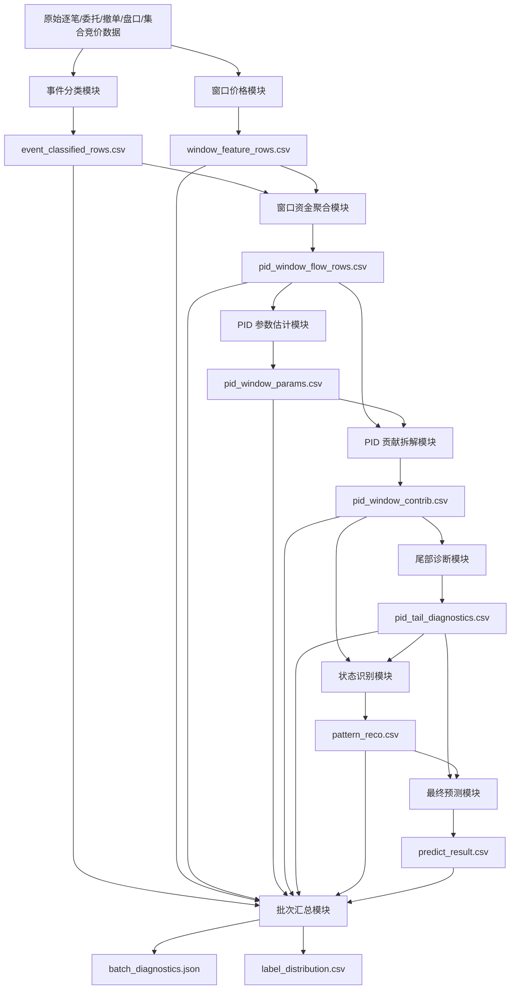

# 基于状态空间辨识的三类行为代理贡献拆解算法

算法设计说明书

文档版本：V1.7  
文档状态：正式版本  
修订日期：2026-07-11  
依据文档：

- [统一资金类型判断规范.md](</e:/2026OPC大赛/自动化交易/比赛设计文档/统一资金类型判断规范.md>)
- [PID原理与实现.md](</e:/2026OPC大赛/自动化交易/比赛设计文档/PID原理与实现.md>)

## 1. 文档目标

本文定义比赛系统中三类行为代理贡献的算法口径，用于把窗口级行为流与价格变化解释为：

1. 游资行为代理外力贡献：`capital_ch`
2. 量化行为代理外力贡献：`capital_q`
3. 散户行为代理外力贡献：`capital_retail`
4. 当期未解释扰动：`eps`

本文强调：

> 游资、量化、散户是“行为代理类型”，不是账户身份识别结果。

> 规则层输出的是锚点和种子流，PID 层输出的 `capital_ch / capital_q / capital_retail` 是由 `beta_* U_*` 计算得到的正式外力贡献字段；`phi / theta` 是市场系统响应，不再反解为资金身份。

如本文与历史讨论稿冲突，以《统一资金类型判断规范.md》和《PID原理与实现.md》为准。

## 2. 总体流程

算法固定按以下顺序执行：

1. 读取逐笔成交、逐笔委托、撤单、盘口快照和集合竞价成交结果。
2. 按统一资金类型判断规范完成事件级三分类：
   - `hot_money`
   - `quant`
   - `retail`
3. 聚合为窗口级规则流：
   - `CH_rule_t`
   - `Q_rule_t`
   - `R_seed_t`
4. 对窗口级净额执行预处理：
   - 有符号净额求和
   - 1% 缩尾
   - 缺失补零
   - EWMA 自适应标准化
5. 形成 PID 输入：
   - `baseline_4d`：`U_ch = CH_rule`，`U_mix = Q_rule + R_seed`
   - `full_5d / diag_5d`：`U_ch = CH_rule`，`U_q = Q_rule`，`U_retail = R_seed`
6. 运行状态空间模型，估计 `phi / beta_* / theta`。
7. 计算一级 PID 贡献：
   - `c_p`
   - `c_i`
   - `c_d`
   - `eps`
8. 通过外力加载项计算：
   - `capital_ch`
   - `capital_q`
   - `capital_retail`
9. 输出噪声、解释力、规则锚点误差和模式诊断字段。

## 3. 规则层三类行为流

### 3.1 三类定义

规则层必须把每个有效事件归入三类之一。

| 类型 | 规则标签 | 行为含义 |
| --- | --- | --- |
| 游资 | `hot_money` | 主动塑造价格路径，表现为主动吃单/砸盘、明显跨价、短时集中冲击 |
| 量化 | `quant` | 主动但未达游资塑价标准，或被动成交且委托存活时间不超过 5 分钟 |
| 散户 | `retail` | 被动成交且委托存活时间超过 5 分钟，更偏跟随已有走势 |

### 3.2 连续竞价分类

连续竞价按以下优先级执行：

1. 主动塑价优先判为 `hot_money`。
2. 主动成交但未达游资标准，判为 `quant`。
3. 被动成交且 `order_age_minutes <= 5`，判为 `quant`。
4. 被动成交且 `order_age_minutes > 5`，判为 `retail`。
5. 主动成交但攻击性细节缺失时，按金额阈值低置信回退：
   - `order_amount > active_fallback_hot_amount` -> `hot_money`
   - `order_amount <= active_fallback_hot_amount` -> `quant`
6. 被动成交但盘口细节缺失时，仍按 `passive_survival_minutes` 拆分量化/散户，并记录 `fallback_reason`。

默认参数：

| 参数 | 默认值 | 含义 |
| --- | --- | --- |
| `active_fallback_hot_amount` | `100000` | 主动成交攻击性细节缺失时的游资回退金额阈值 |
| `passive_survival_minutes` | `5` | 被动成交量化/散户拆分阈值 |
| `buy_aggressive_ticks` | `3` | 强攻击性买入最小跨价档数 |
| `sell_aggressive_ticks` | `3` | 强攻击性卖出最小砸盘档数 |

### 3.3 集合竞价分类

集合竞价单独处理，不沿用连续竞价的主动/被动链路。

规则如下：

1. 仅统计集合竞价阶段实际成交委托。
2. 未成交委托不进入 `CH_rule / Q_rule / R_seed` 主统计，可作为 `trial_probe / fake_order_signal / auction_noise` 诊断信号。
3. 若 `delta_auction > auction_up_down_eps`：
   - `P_order > P_auction_trade` -> `hot_money`
   - `P_order <= P_auction_trade` -> `quant`，其中等价事件为低置信
4. 若 `delta_auction < -auction_up_down_eps`：
   - `P_order < P_auction_trade` -> `hot_money`
   - `P_order >= P_auction_trade` -> `quant`，其中等价事件为低置信
5. 若集合竞价平盘，默认按 `quant` 低置信处理。
6. 集合竞价阶段默认不单独识别散户，`R_seed` 记为 `0`。

### 3.4 事件输出

事件级输出应遵循以下字段契约：

| 字段 | 含义 |
| --- | --- |
| `event_time` | 事件发生时间 |
| `order_time` | 委托时间，可为空 |
| `side` | 买入或卖出 |
| `scene` | 连续竞价或集合竞价 |
| `signed_amount` | 带符号成交金额，买入为正、卖出为负 |
| `order_amount` | 委托金额 |
| `order_age_minutes` | 委托存活时间，可为空 |
| `capital_type_rule` | 规则层类型标签 |
| `confidence_score` | 置信分数 |
| `confidence_level` | 置信等级 |
| `fallback_reason` | 回退原因，可为空 |
| `reason_codes` | 规则原因码列表 |

### 3.5 窗口聚合

对每个 5 分钟窗口 `t` 聚合：

\[
CH_t^{rule} = buy\_ch\_anchor_t + sell\_ch\_anchor_t
\]

\[
Q_t^{rule} = buy\_q\_anchor_t + sell\_q\_anchor_t
\]

\[
R_t^{seed} = buy\_retail\_seed_t + sell\_retail\_seed_t
\]

其中：

1. 买入恒为正。
2. 卖出恒为负。
3. 同一事件只能进入一个主标签。
4. `low_fallback` 事件同样参与窗口聚合，但必须保留低置信标记。

## 4. PID 状态模型

### 4.1 一级闭合关系

窗口级价格变化满足：

\[
\Delta P_t = C_{P,t} + C_{I,t} + C_{D,t} + \varepsilon_t
\]

其中：

| 字段 | 含义 |
| --- | --- |
| `c_p` | 当前行为流对价格的直接推进贡献 |
| `c_i` | 惯性、延续和残差记忆贡献 |
| `c_d` | 价格变化率差分驱动的阻尼/反转贡献 |
| `eps` | 当期未解释扰动 |

### 4.2 4 维基线模式

\[
\psi_t^{(4)} = [\phi_t,\ \beta_{ch,t},\ \beta_{mix,t},\ \theta_t]^T
\]

\[
x_t^{(4)} = [\Delta P_{t-1},\ U_{ch,t-1},\ U_{mix,t-1},\ D\_driver_t]^T
\]

\[
U_{mix,t}=Q_t^{rule}+R_t^{seed}
\]

说明：`U_mix` 只是状态维度压缩输入，不是规则层第四类标签。

### 4.3 5 维增强模式

\[
\psi_t^{(5)} = [\phi_t,\ \beta_{ch,t},\ \beta_{q,t},\ \beta_{retail,t},\ \theta_t]^T
\]

\[
x_t^{(5)} =
[\Delta P_{t-1},\ U_{ch,t-1},\ U_{q,t-1},\ U_{retail,t-1},\ D\_driver_t]^T
\]

默认：

\[
D\_driver_t = \Delta P_{t-1} - \Delta P_{t-2}
\]

若盘口字段稳定，可在验证通过后扩展为 `book_recovery / spread_converge / cancel_replenish / pressure_reversal` 等增强驱动；增强项未通过有效性验证前，不得让 `theta` 主导价格闭合诊断。无论是否通过验证，`theta` 都不参与三类资金身份拆分。

### 4.4 状态转移

采用随机游走：

\[
\psi_t = \psi_{t-1} + \eta_t,\quad \eta_t \sim \mathcal{N}(0,Q)
\]

正式实现建议使用卡尔曼滤波 + RTS 平滑；盘中在线模式可只使用滤波估计。

## 5. 三类外力贡献计算

PID 层先计算一级贡献：

\[
C_{P,t},\quad C_{I,t},\quad C_{D,t}
\]

其中 `C_P` 是三类行为代理流的外部冲击总和，`C_I / C_D` 是市场系统响应项，不归属于某一类资金。因此正式算法不再使用 `C_P / C_I / C_D` 的三方程反解来生成三类资金贡献。

### 5.1 `full_5d / diag_5d`

\[
capital\_ch_t = \beta_{ch,t} U_{ch,t-1}
\]

\[
capital\_q_t = \beta_{q,t} U_{q,t-1}
\]

\[
capital\_retail_t = \beta_{retail,t} U_{retail,t-1}
\]

\[
C_{P,t}=capital\_ch_t+capital\_q_t+capital\_retail_t
\]

### 5.2 `baseline_4d`

\[
capital\_ch_t = \beta_{ch,t} U_{ch,t-1}
\]

\[
capital\_mix_t = \beta_{mix,t} U_{mix,t-1}
\]

`baseline_4d` 中 `U_mix = Q_rule + R_seed` 是量化与散户的合成输入。若需要输出 `capital_q / capital_retail`，按规则流在混合输入中的绝对权重做诊断性分摊：

\[
w_{q,t}=\frac{|Q_t^{rule}|}{|Q_t^{rule}|+|R_t^{seed}|+\delta}
\]

\[
w_{retail,t}=\frac{|R_t^{seed}|}{|Q_t^{rule}|+|R_t^{seed}|+\delta}
\]

\[
capital\_q_t=w_{q,t} \cdot capital\_mix_t,\quad
capital\_retail_t=w_{retail,t} \cdot capital\_mix_t
\]

工程字段映射：

| 贡献量 | 输出字段 | 含义 |
| --- | --- | --- |
| \(\beta_{ch}U_{ch}\) | `capital_ch` | 游资行为代理外力贡献 |
| \(\beta_qU_q\) 或混合分摊 | `capital_q` | 量化行为代理外力贡献 |
| \(\beta_{retail}U_{retail}\) 或混合分摊 | `capital_retail` | 散户行为代理外力贡献 |

注意：

1. `capital_ch / capital_q / capital_retail` 不得由 `CH_rule / Q_rule / R_seed` 直接覆盖。
2. `Q_rule` 与 `R_seed` 是规则流和校验锚点，不是最终模型外力贡献。
3. `phi / theta` 只用于市场惯性、阻尼和模式诊断，不参与三类资金身份拆分。
4. `rule_base` 模式不输出模型外力贡献字段；如需展示规则近似值，只能使用 `capital_ch_rule_approx / capital_q_rule_approx / capital_retail_rule_approx`。

## 6. 运行模式

| 模式 | 触发条件 | 处理方式 | 模型贡献输出 |
| --- | --- | --- | --- |
| `rule_base` | schema 不稳定、方向不可恢复、代理流无法形成 | 仅输出规则层三类流和近似字段 | `is_structural_output = false` |
| `baseline_4d` | 规则锚点稳定，需要低维稳健运行 | 使用 `U_ch / U_mix` | `is_structural_output = true` |
| `diag_5d` | 5 维输入可用，但 D 项尚未通过完整验证 | 使用 5 维输入，`theta` 主要做诊断 | `is_structural_output = true` |
| `full_5d` | 种子流质量、D 驱动、可辨识性均通过 | 完整使用 5 维状态和三类外力贡献 | `is_structural_output = true` |

模式切换必须记录 `mode_name`、触发原因和关键诊断指标。

### 6.1 文件级实现冻结

为保证 `baseline_4d` 与 `diag_5d / full_5d` 的实现边界长期清晰，PID 处理结构冻结为以下四层：

| 层级 | 职责 | 约束 |
| --- | --- | --- |
| 入口层 | 模式选择入口；提供模式归一化、实例创建与统一调用口 | 不承载 4D / 5D 具体状态方程 |
| PID 公共层 | 公共骨架：输入提取、归一化、RTS 平滑、结果封装、公共诊断 | 不写模式专属观测向量与外力拆分公式 |
| 4D 层 | `baseline_4d` 独立实现 | 只处理 `U_ch / U_mix` 路径 |
| 5D 层 | `diag_5d / full_5d` 独立实现 | 只处理 `U_ch / U_q / U_retail` 路径 |

统一调用原则：
1. 上层调度、市场聚合、状态特征和导出模块只能依赖统一入口。
2. 4D 与 5D 的内部状态方程、观测向量、`c_p` 与 `capital_*` 计算逻辑必须分别维护，不得回退到单文件内部分支混写。
3. 新增 PID 模式时，优先新增独立实现单元，再在选择入口注册，不直接在统一入口中堆叠条件分支。

## 7. 诊断指标

### 7.1 噪声占比

\[
noise\_ratio_t = \frac{|\varepsilon_t|}{\max(|\Delta P_t|,\delta)}
\]

\[
explain\_ratio_t = 1 - \min(noise\_ratio_t, 1)
\]

建议分层：

| 区间 | 含义 |
| --- | --- |
| `< 0.4` | 结构解释有效 |
| `0.4 - 0.6` | 中等可信 |
| `>= 0.6` | 低可信或规则兜底 |

### 7.2 规则一致性误差

\[
capital\_anchor\_error_t =
\frac{|CH_t^{rule} - capital\_ch_t|}
{\max(|CH_t^{rule}|, |capital\_ch_t|, \delta)}
\]

建议同步输出：

1. `capital_anchor_error`
2. `rule_error_q`
3. `rule_error_retail`

这些字段用于判断规则流与模型外力贡献是否冲突，不用于直接替换模型贡献。

### 7.3 残差白噪声检查

正式验收前应检查 `eps_t` 是否接近白噪声。建议使用 Ljung-Box 检验或等价残差自相关诊断。

## 8. 输出字段

每个窗口建议至少输出：

| 字段 | 含义 |
| --- | --- |
| `phi` | 惯性/延续系数 |
| `theta` | 阻尼/反转系数 |
| `beta_ch` | 游资代理流加载系数 |
| `beta_q` / `beta_mix` | 量化或合成代理流加载系数 |
| `beta_retail` | 散户代理流加载系数 |
| `c_p` | P 项推进贡献 |
| `c_i` | I 项惯性贡献 |
| `c_d` | D 项阻尼贡献 |
| `eps` | 未解释扰动 |
| `capital_ch` | 游资外力贡献 |
| `capital_q` | 量化外力贡献 |
| `capital_retail` | 散户外力贡献 |
| `capital_ch_rule_approx` | 规则兜底展示近似值 |
| `capital_q_rule_approx` | 规则兜底展示近似值 |
| `capital_retail_rule_approx` | 规则兜底展示近似值 |
| `noise_ratio` | 噪声占比 |
| `explain_ratio` | 解释力 |
| `capital_anchor_error` | 游资规则锚点与模型外力贡献误差 |
| `rule_error_q` | 量化规则流与模型外力贡献误差 |
| `rule_error_retail` | 散户规则流与模型外力贡献误差 |
| `mode_name` | 当前运行模式 |
| `is_structural_output` | 是否输出模型外力贡献结果 |

### 8.1 工程兼容字段迁移

当前代码中若仍存在历史字段，应按以下方式迁移，不得作为新增设计口径继续扩散：

| 历史字段 | 新口径 | 处理要求 |
| --- | --- | --- |
| `signed_large_active_amount` | `CH_rule_t` | 可作为旧数据兼容输入，进入内部后统一改名为 `CH_rule_t` |
| `signed_mix_qr_amount` | `Q_rule_t + R_seed_t` | 仅用于兼容旧基线；正式规则层必须拆成 `Q_rule_t / R_seed_t` |
| `delta_ch / delta_q / delta_retail` | `capital_ch / capital_q / capital_retail` | 若表示模型外力贡献，统一改为 `capital_*`；若表示展示分摊，不得参与主判断 |
| `enhanced_5d` | `diag_5d` 或 `full_5d` | 依据 D 驱动和可辨识性验证结果选择正式模式名 |

迁移原则：

1. 对外提交字段不受影响。
2. 内部主字段必须使用本文定义的正式字段。
3. 兼容字段只能在读取层或适配层出现，不能穿透到模型判断层。

## 9. Task 输出使用口径

### 9.1 Task 2

`capital_type` 的正式主口径为：

1. 若 `is_structural_output = true`，优先取 `capital_ch / capital_q / capital_retail` 外力贡献绝对值最大的类别，并结合符号判断买卖方向。
2. 若 `mode_name = rule_base`，只能使用 `capital_*_rule_approx` 形成低置信兜底结果。
3. 若模型外力贡献与规则锚点误差过大，应降低 `capital_confidence`，不得直接把规则值覆盖到模型贡献字段。

### 9.2 Task 1

模式识别可引用：

1. 窗口级主导类别序列
2. `phi / beta_* / theta` 日内分布
3. `noise_ratio / explain_ratio`
4. `capital_anchor_error / rule_error_q / rule_error_retail`

细粒度意图如 `吸筹 / 试盘 / 对倒` 不由本算法单独强行输出，必须结合规则层或额外微观结构证据。

## 10. 参数配置

所有阈值必须配置化，不允许散落硬编码。

```yaml
window_minutes: 5
winsorize_pct: 0.01
normalize_before_pid: true
missing_fill_value: 0.0
active_fallback_hot_amount: 100000
passive_survival_minutes: 5
buy_aggressive_ticks: 3
sell_aggressive_ticks: 3
auction_up_down_eps: 0.0001
pid_default_mode: baseline_4d
allow_rule_base_fallback: true
confidence_high_min: 0.80
confidence_medium_min: 0.60
confidence_low_min: 0.40
```

## 11. 语言无关的中间文件与公式口径

### 11.1 48 个时间窗口的 `data_P`

`data_P` 指 PID 观测序列中的窗口级价格变化，即中间字段中的 `delta_p`。正式口径为 48 个 5 分钟窗口构成的长度固定序列，索引范围为 `0..47`：

| 交易时段 | 窗口编号 | 说明 |
| --- | --- | --- |
| 09:30 <= time < 11:30 | `0..23` | 上午 24 个窗口 |
| 13:00 <= time < 15:00 | `24..47` | 下午 24 个窗口 |
| time >= 15:00 | `47` | 收盘后边界归入最后一个窗口 |

工程上 `data_P` 有两条来源路径：

1. 原始 Level2 或逐笔数据路径：按窗口记录开盘价、收盘价，优先使用相邻有效窗口收盘价计算价格冲击；无有效价格时补 `0`。
2. 参考特征路径：读取窗口字段 `pi_max_price_impact_pct / price_impact` 作为 `data_P[t]`，并根据是否存在显式规则锚点决定是否保留原符号。

### 11.2 中间文件契约

为了让后续处理只依赖中间结果，而不是重复扫描原始数据，任一实现都必须按相同字段输出并归档同一组中间文件。每个交易日、每只股票形成一组独立文件；后续任一阶段只读取上一阶段中间文件，不直接回读原始逐笔数据。

#### 11.2.1 中间文件清单

| 阶段 | 文件 | 粒度 | 主要字段 | 下游用途 |
| --- | --- | --- | --- | --- |
| 事件层 | `event_classified_rows.csv` | 逐事件 | `trade_date / symbol / event_id / event_time / window_id / side / signed_amount / capital_type_rule / confidence_score / reason_codes` | 作为规则层可追溯明细，聚合生成窗口级三类规则流 |
| 窗口价格层 | `window_feature_rows.csv` | 逐窗口 | `trade_date / symbol / window_id / window_start / window_end / open_price / close_price / vwap / deal_amount / data_P / data_P_source` | 固定 48 窗口价格口径，给 PID 输入层读取 |
| 窗口资金层 | `pid_window_flow_rows.csv` | 逐窗口 | `trade_date / symbol / window_id / deal_amount / signal_deal_buy_amount / signal_deal_sell_amount / CH_rule_t / Q_rule_t / R_seed_t / data_P` | PID 主输入文件，生成 `U_ch / U_q / U_retail / Delta P` 数组 |
| 参数层 | `pid_window_params.csv` | 逐窗口 | `trade_date / symbol / window_id / mode_name / phi / beta_ch / beta_q / beta_retail / beta_mix / theta / covariance_diag` | 保存卡尔曼滤波与 RTS 平滑后的参数轨迹 |
| 贡献层 | `pid_window_contrib.csv` | 逐窗口 | `trade_date / symbol / window_id / c_p / c_i / c_d / eps / capital_ch / capital_q / capital_retail / capital_mix / closure_error` | 保存 PID 闭合拆解和三类外力贡献 |
| 诊断层 | `pid_tail_diagnostics.csv` | 股票日 | `trade_date / symbol / mode_name / tail_window_id / noise_ratio / explain_ratio / dominant_capital / confidence_level / fuse_status` | 保存尾部窗口、噪声、熔断和主导资金诊断 |
| 模式层 | `pattern_reco.csv` | 股票日 | `trade_date / symbol / market_state / pattern_label / pattern_confidence / reason_codes` | 识别市场状态和形态标签 |
| 预测层 | `predict_result.csv` | 股票日 | `trade_date / symbol / dominant_capital / next_trend / confidence_level / fuse_status / final_reason` | 形成最终提交或展示结果 |
| 批次诊断层 | `batch_diagnostics.json` | 批次 | `batch_id / config_hash / input_files / output_files / warning_count / error_count / degraded_symbols` | 固化运行配置、输入输出摘要、异常和降级原因 |
| 标签分布层 | `label_distribution.csv` | 批次 | `trade_date / label_name / label_count / coverage_ratio / confidence_mean` | 检查标签覆盖率和规则层质量 |

#### 11.2.2 中间文件处理流程

| 步骤 | 输入文件 | 处理 | 输出文件 | 必须校验 |
| --- | --- | --- | --- | --- |
| 1. 事件分类 | 原始逐笔成交、委托、撤单、盘口和集合竞价数据 | 按统一资金类型判断规范生成事件级标签、方向、金额和置信度 | `event_classified_rows.csv` | `signed_amount` 买入为正、卖出为负；同一事件只能有一个主标签 |
| 2. 窗口构造 | 原始价格数据或参考特征 | 固定映射到 48 个 5 分钟窗口，计算 `data_P` | `window_feature_rows.csv` | `window_id` 范围为 `0..47`；缺失价格窗口补 `0` 或标记来源 |
| 3. 窗口聚合 | `event_classified_rows.csv` + `window_feature_rows.csv` | 按 `trade_date / symbol / window_id` 聚合三类规则流并合并价格响应 | `pid_window_flow_rows.csv` | 每只股票进入 PID 前必须扩展为 48 行；缺失资金流补 `0` |
| 4. 参数估计 | `pid_window_flow_rows.csv` | 构造 `Z_t` 和 `Delta P_t`，执行滤波和平滑 | `pid_window_params.csv` | 状态维度与 `mode_name` 一致；参数序列窗口数与输入一致 |
| 5. 贡献拆解 | `pid_window_flow_rows.csv` + `pid_window_params.csv` | 计算 `c_p / c_i / c_d / eps` 和 `capital_*` | `pid_window_contrib.csv` | `Delta P_t = c_p + c_i + c_d + eps` 可闭合 |
| 6. 尾部诊断 | `pid_window_contrib.csv` | 计算尾部窗口噪声、解释度、主导资金和熔断状态 | `pid_tail_diagnostics.csv` | 噪声阈值、闭合误差和降级原因必须可追溯 |
| 7. 状态识别 | `pid_window_contrib.csv` + `pid_tail_diagnostics.csv` | 结合贡献序列和诊断输出市场状态 | `pattern_reco.csv` | 状态标签、置信度和原因码必须同时输出 |
| 8. 最终预测 | `pid_tail_diagnostics.csv` + `pattern_reco.csv` | 汇总主导资金、市场状态、趋势判断和熔断状态 | `predict_result.csv` | 最终结论必须能追溯到贡献层和诊断层 |
| 9. 批次汇总 | 全部中间文件 | 汇总配置、文件摘要、标签分布、异常和降级记录 | `batch_diagnostics.json` + `label_distribution.csv` | 配置哈希、输入输出文件清单和异常计数必须落盘 |

#### 11.2.3 复算与比较规则

1. 从 `event_classified_rows.csv` 之后的任一阶段开始复算时，只读取该阶段所需的中间文件，不回原始逐笔数据。
2. `pid_window_flow_rows.csv` 是 PID 计算的主输入边界；只要该文件一致，参数估计和贡献拆解应得到一致结论。
3. 若结果不一致，按文件链路从前到后定位：先比 `event_classified_rows.csv`，再比 `window_feature_rows.csv`，再比 `pid_window_flow_rows.csv`，最后比 `pid_window_params.csv / pid_window_contrib.csv`。
4. 比较时优先检查字段语义、窗口编号、补零规则、方向符号、归一化参数和 `mode_name`，不得通过修改后续模型来掩盖上游中间文件差异。
5. 每个中间文件都必须保留生成时间、配置版本或配置哈希，以保证后续复算可以复现同一条处理链。

#### 11.2.4 文件驱动处理流程

系统采用文件驱动的流水线。每个流程模块只有一个明确职责，消费固定输入文件，生产固定输出文件；除批次诊断层外，不跨层修改其他模块的输出文件。任一模块的输出文件完整写入并通过校验后，该模块即处理结束；最终输出文件完整写入并通过校验后，系统处理结束。



| 顺序 | 流程模块 | 只读输入 | 只写输出 | 完成条件 |
| --- | --- | --- | --- | --- |
| 1 | 事件分类模块 | 原始逐笔、委托、撤单、盘口、集合竞价数据 | `event_classified_rows.csv` | 所有事件写入完成，主标签、方向、金额和置信度校验通过 |
| 2 | 窗口价格模块 | 原始价格数据或参考特征 | `window_feature_rows.csv` | 48 个窗口价格口径写入完成，`data_P` 来源和缺失处理校验通过 |
| 3 | 窗口资金聚合模块 | `event_classified_rows.csv`、`window_feature_rows.csv` | `pid_window_flow_rows.csv` | 每只股票扩展为 48 个窗口，三类规则流与 `data_P` 合并完成 |
| 4 | PID 参数估计模块 | `pid_window_flow_rows.csv` | `pid_window_params.csv` | 全部窗口的状态参数轨迹写入完成，状态维度与 `mode_name` 校验通过 |
| 5 | PID 贡献拆解模块 | `pid_window_flow_rows.csv`、`pid_window_params.csv` | `pid_window_contrib.csv` | 全部窗口贡献写入完成，闭合公式校验通过 |
| 6 | 尾部诊断模块 | `pid_window_contrib.csv` | `pid_tail_diagnostics.csv` | 尾部窗口、噪声占比、熔断状态和主导资金诊断写入完成 |
| 7 | 状态识别模块 | `pid_window_contrib.csv`、`pid_tail_diagnostics.csv` | `pattern_reco.csv` | 市场状态、形态标签、置信度和原因码写入完成 |
| 8 | 最终预测模块 | `pid_tail_diagnostics.csv`、`pattern_reco.csv` | `predict_result.csv` | 最终主导资金、趋势判断、置信等级和熔断状态写入完成 |
| 9 | 批次汇总模块 | 全部已完成中间文件 | `batch_diagnostics.json`、`label_distribution.csv` | 批次摘要、配置哈希、输入输出清单、异常和标签分布写入完成 |

处理边界约束：

1. 每个输出文件只有一个生产模块，可以被多个下游模块读取。
2. 下游模块只能在上游输出文件完整写入并通过校验后启动。
3. 模块不得在内存中绕过中间文件直接把结果传给下游模块。
4. 模块失败时保留已经完成的上游文件，下次从失败模块的输入文件继续处理。
5. `predict_result.csv`、`batch_diagnostics.json` 和 `label_distribution.csv` 均完成后，本批次处理结束；此后不得再修改本批次中间文件。

### 11.3 公式流程的实现边界

本文公式描述的是 5 维增强模型：

\[
X_t = [\phi_t,\ \beta_{ch,t},\ \beta_{q,t},\ \beta_{retail,t},\ \theta_t]^T
\]

实际实现分两类：

1. `diag_5d / full_5d` 与该 5 维公式基本一致，观测向量为：

\[
Z_t=[\Delta P_{t-1}, U_{ch,t-1}, U_{q,t-1}, U_{retail,t-1}, D\_driver_t]
\]

2. `baseline_4d` 不按上述 5 维公式执行，而是使用：

\[
X_t^{(4)}=[\phi_t,\ \beta_{ch,t},\ \beta_{mix,t},\ \theta_t]^T
\]

\[
Z_t^{(4)}=[\Delta P_{t-1}, U_{ch,t-1}, U_{mix,t-1}, D\_driver_t]
\]

其中：

\[
U_{mix,t}=Q_t^{rule}+R_t^{seed}
\]

所以，不能把 `baseline_4d` 的输出解释为完整 5 维三资金模型；它只能输出 `capital_ch` 与 `capital_mix`，`capital_q / capital_retail` 是基于混合输入权重的诊断分摊。

此外，正式口径不再使用 `C_P / C_I / C_D` 三方程反解来生成 `CH / Q / R`。三类资金贡献必须来自：

\[
capital\_ch_t=\beta_{ch,t}U_{ch,t-1}
\]

\[
capital\_q_t=\beta_{q,t}U_{q,t-1}
\]

\[
capital\_retail_t=\beta_{retail,t}U_{retail,t-1}
\]

`C_I / C_D` 是系统响应项，只能用于趋势惯性、阻尼和噪声诊断，不得反解成资金身份。

### 11.4 实现无关的比较原则

若后续新增任一实现，只需遵守以下原则即可，无需在算法层重复写实现对照章节：

1. 公式定义保持不变。
2. 中间文件字段保持不变。
3. 窗口编号保持不变。
4. 输出字段保持不变。
5. 比较时只比中间文件，不回原始数据重算。
6. 若中间文件不一致，先定位到最早出现差异的阶段，再判断是规则分类、窗口聚合、参数估计还是贡献拆分的问题。

## 12. 验收要求

正式提交或联调前至少检查：

1. 同一事件不能进入多个互斥主标签。
2. 买入为正，卖出为负。
3. `CH_rule / Q_rule / R_seed` 与 PID 输入映射一致。
4. `Delta P_t = c_p + c_i + c_d + eps` 可闭合。
5. `full_5d / diag_5d` 下满足 `capital_ch + capital_q + capital_retail = c_p`。
6. `baseline_4d` 下满足 `capital_ch + capital_mix = c_p`，其中 `capital_q / capital_retail` 为混合项诊断分摊。
7. `rule_base` 模式下 `is_structural_output = false`，且模型贡献字段为空或不输出。
8. 近似字段与模型贡献字段不混用。
9. 残差白噪声、可辨识性和多起点稳定性检查通过，未通过时降级到更保守模式。

## 13. 禁止口径

工程实现中禁止：

1. 把 `Q_rule` 直接当作 `capital_q`。
2. 把 `R_seed` 直接当作 `capital_retail`。
3. 把 `U_mix` 当作独立规则分类标签。
4. 在 `rule_base` 中复用 `capital_ch / capital_q / capital_retail` 承载规则近似值。
5. 将卖出方向先写成正数，再在模型层修正。
6. 重新引入带账户身份暗示的混合术语。
7. 为追求单日拟合效果临时修改字段语义。

## 14. 工程分层边界

算法实现建议按职责分为以下层级：

| 层级 | 职责 | 输出契约 |
| --- | --- | --- |
| 数据层 | 读取原始文件、处理编码、构造 48 个 5 分钟窗口 | `window_id / deal_amount / data_P` |
| 规则层 | 事件级三分类 | `CH_rule / Q_rule / R_seed` |
| PID 入口层 | 模式选择与统一调用入口 | `mode_name / is_structural_output` |
| PID 公共层 | 维护公共骨架与诊断 | `noise_ratio / explain_ratio / closure_error` |
| PID-4D 层 | 运行 `baseline_4d` 状态空间模型 | `capital_ch / capital_mix / c_p / c_i / c_d / eps` |
| PID-5D 层 | 运行 `diag_5d / full_5d` 状态空间模型 | `capital_ch / capital_q / capital_retail / c_p / c_i / c_d / eps` |
| 状态特征层 | 整理规则层、PID 层与诊断字段 | 状态标签、主导资金类型、置信等级 |

重构验收顺序：

1. 先保证旧输入可通过兼容适配生成 `CH_rule / Q_rule / R_seed`。
2. 再验证 `Delta P_t = c_p + c_i + c_d + eps` 闭合。
3. 再验证 `capital_*` 与 `beta_* U_*` 外力贡献计算一致。
4. 最后再让资本贡献模型层与模式识别模型层使用新字段升级模型。

## 15. 修订记录

| 版本 | 日期 | 说明 |
| --- | --- | --- |
| V1.2 | 2026-07-09 | 统一三类规则流、PID 输入和模型贡献主口径 |
| V1.3 | 2026-07-10 | 补充工程兼容字段迁移、代码重构分层边界与实现验收顺序 |
| V1.4 | 2026-07-10 | 将三类资金贡献口径修正为 `beta_* U_*` 外力贡献，`phi / theta` 仅作为系统响应诊断 |
| V1.5 | 2026-07-11 | 将算法口径改为语言无关的中间文件与公式描述，保留 48 窗口 `data_P` 定义 |
| V1.6 | 2026-07-11 | 明确中间文件清单、处理流程、复算边界和逐阶段校验规则 |
| V1.7 | 2026-07-11 | 增加文件驱动处理流程，明确模块输入输出、完成条件和系统结束边界 |

## 16. 一句话总结

规则层负责把逐笔行为压缩为 `CH_rule / Q_rule / R_seed` 三类锚点流；PID 层负责用这些输入解释窗口级价格变化，并通过 `beta_* U_*` 计算 `capital_ch / capital_q / capital_retail` 三类外力贡献；`phi / theta` 仅用于市场系统响应诊断，二者边界必须清晰、字段不得混用。

